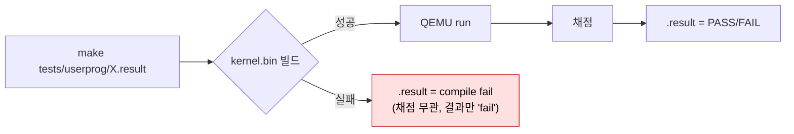
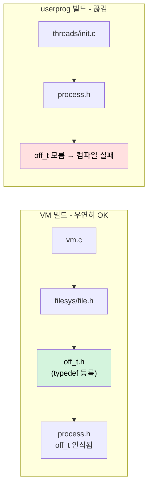
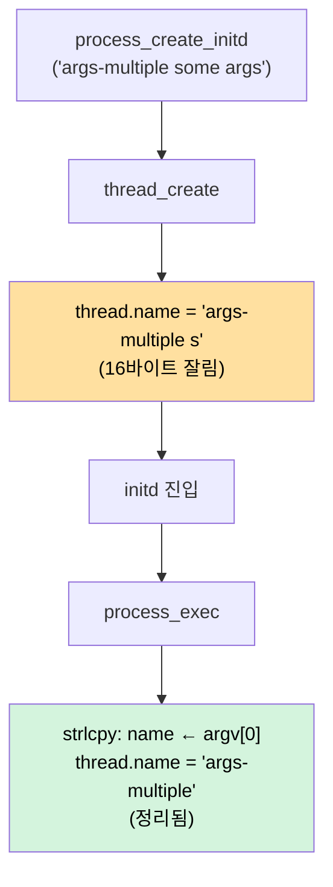
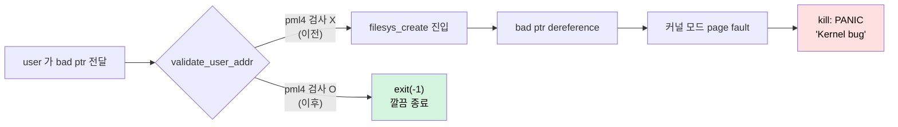
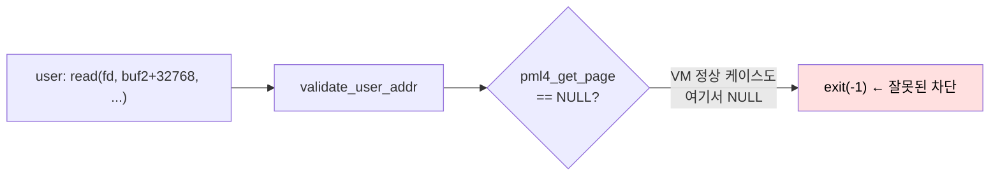
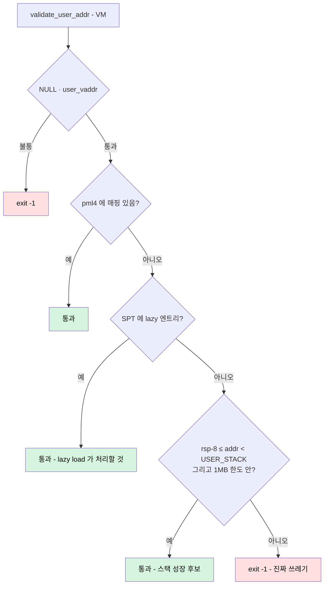
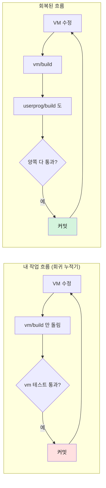

# Pintos Project 3 — VM 작업이 일으킨 userprog 회귀 추적

> Project 3 (VM) 작업을 한참 진행한 뒤 **userprog 회귀를 다시 돌려 보니
> 97개 중 50여 개가 한꺼번에 fail** 하는 상태였다. 사실은 "테스트가 실패"
> 한 게 아니라 **빌드 자체가 깨져 있어서 한 줄도 실행되지 못한** 상황.
> 그 위에 exec 계열·bad-ptr 계열·wait-killed 가 따로따로 막혀 있었고,
> 마지막에는 "userprog 에서는 막아야 하지만 VM 에서는 통과시켜야 하는"
> 포인터 검증의 모순까지 드러났다.
>
> 한쪽 빌드에서만 검증하던 코드가 어떻게 다른 쪽 빌드에서 누적된
> 회귀로 굳어졌는지 — 그리고 그것을 빌드 모드별로 정리하기까지의 회고.
>
> | 섹션 | 주제 | 무게중심 |
> |---|---|---|
> | §1 | 증상 — "52개 전부 fail" 의 진짜 의미 | `.result` 가 컴파일 실패 흔적이라는 것 |
> | §2 | Bug 0 — 빌드 자체가 깨진 두 군데 | `off_t` 누락 · 무가드 `spt` 참조 |
> | §3 | Bug A — `exec` 계열의 이름 어긋남 | strlcpy 모순 · `process_create_initd` 의 thread name |
> | §4 | Bug B — `validate_user_addr` 의 매핑 검사 누락 | 커널 모드 fault 패닉의 진원지 |
> | §5 | Bug B 의 재발 — VM 의 `pt-grow-stk-sc` 충돌 | lazy load / stack 성장과의 정합성 |
> | §6 | `#ifdef VM` 으로 두 빌드를 화해시키기 | SPT · 스택 성장 후보까지 인정 |
> | §7 | 결과와 남은 7건 | rox · multi-recurse · syn-remove |
> | §8 | 메타 교훈 — 양쪽 빌드를 함께 보지 않으면 | 주석은 의도, 코드는 사실 |

---

## 1. 증상 — "52개 전부 fail" 의 진짜 의미

VM 작업이 어느 정도 자리잡은 뒤, userprog 회귀를 처음부터 다시 돌렸다.

```
$ make -C pintos/userprog/build tests/userprog/wait-bad-pid.result
... gcc -c ../../threads/init.c ...
../../include/userprog/process.h:16:5: error: unknown type name 'off_t'
make: *** [../../Make.config:38: threads/init.o] Error 1
```

`args-none` 부터 `wait-*` 까지 결과가 줄줄이 FAIL 로 찍히는데, 그 안에
실제 실행 흔적이 하나도 없었다. 즉 — `.result` 파일은 "테스트가 실패" 한
기록이 아니라 **make 가 컴파일 단계에서 멈춘 흔적** 이었다. Pintos 의 테스트
규칙은 `tests/<name>.result` 를 만들기 위해 커널 빌드 → QEMU 실행 → 채점을
한 줄로 묶는데, 가장 앞 단의 빌드가 실패하면 그 자리에서 멈추고 빈/오류
result 가 남는다. **그래서 "52개 전부 fail" 처럼 보였던 것** 이다.



여기서 첫 교훈 한 줄 — **한 줄로 "FAIL" 만 나와도 그게 실행 결과인지
빌드 결과인지부터 갈라봐야 한다.** make 출력을 끝까지 읽지 않으면 둘이
구분되지 않는다.

---

## 2. Bug 0 — 빌드 자체가 깨진 두 군데

VM 빌드에서는 통과하지만 userprog 빌드에서는 컴파일이 안 되는 코드가
두 군데 누적돼 있었다.

### 2.1 `include/userprog/process.h` — `off_t` 미해결

```c
/* lazy_load_segment에 전달할 파일 정보 */
struct lazy_load_aux {
    struct file *file;
    off_t offset;        ← off_t 가 어디서 왔는지?
    size_t read_bytes;
    size_t zero_bytes;
};
```

`off_t` 는 `filesys/off_t.h` 에 있는 `typedef int32_t off_t` 다.
VM 빌드에서는 `vm.c` 가 더 앞에서 `filesys/file.h` 를 끌어와서 우연히
`off_t.h` 가 미리 들어가 있었고, 그래서 통과했다. 하지만 **userprog 빌드의
`threads/init.c` → `process.h` 경로** 에서는 그 우연이 성립하지 않는다.



수정은 **헤더가 자기 자신을 다 갖추는 원칙** — `process.h` 자신이 `off_t.h`
를 직접 include 하게:

```c
#include "threads/thread.h"
#include "filesys/off_t.h"   /* off_t — lazy_load_aux 가 사용 */
```

> 일반 규칙: **헤더가 정의에서 쓰는 모든 타입은 그 헤더가 직접 include
> 해야 한다.** "어딘가에서 먼저 들어왔겠지" 에 기대면 빌드 순서/경로가
> 바뀌는 순간 깨진다. 여기서는 VM 빌드와 userprog 빌드가 정확히 그렇게
> 갈렸다.

### 2.2 `userprog/syscall.c` — 무가드 `spt` 참조

SYS_READ 핸들러에 추가했던 "writable 페이지인지 SPT 로 확인" 블록.

```c
struct page *p = spt_find_page(&thread_current()->spt, pg_round_down((void *)buffer));
if (p == NULL) {
    uintptr_t cur_rsp = thread_current()->user_rsp;
    if ((uintptr_t)buffer < cur_rsp - 8) { ... }
} else if (!p->writable) { ... }
```

여기서 `thread_current()->spt` 는 `struct thread` 의

```c
#ifdef VM
    struct supplemental_page_table spt;
#endif
```

블록 안에만 존재한다. VM 빌드에서는 OK. userprog 빌드에서는
`-DVM` 이 빠지므로 **`struct thread' has no member named 'spt'`**.

수정은 그 블록을 `#ifdef VM` 으로 감싸는 것. **이 검사 자체가 lazy load /
RO 페이지 판별 때문에 의미가 있는 코드** 이고, userprog 모드에는 그런
페이지가 없으니 검사 자체가 불필요하다. 따라서 가드를 친 결과로 의미가
약화되지 않는다.

```c
#ifdef VM
    struct page *p = spt_find_page(&thread_current()->spt, ...);
    /* ... writable 검사 ... */
#endif
    f->R.rax = file_read(file, buffer, size);
```

> 일반 규칙: **VM-only 자료구조를 참조하는 코드는 반드시 `#ifdef VM` 안에
> 둔다.** 한쪽 빌드만 돌리면 알 수 없는 회귀가 침투한다.

### 2.3 빌드 진단 중에 내가 만든 잘못된 `init.o`

수정 검증 중에 `make threads/init.o` 만 단독으로 실행해 본 적이 있다.
그 target 은 **상위 makefile 의 `-DUSERPROG -DFILESYS` 정의를 못 받는다.**
그래서 그 시점 `init.o` 에는 `-f` (포맷) / `-q` (정상 종료) 같은
`#ifdef FILESYS` / `#ifdef USERPROG` 옵션 파싱이 빠져 있었고,
**그 잘못된 `init.o` 가 그대로 링크돼서** 첫 재테스트에서

```
PANIC at threads/init.c:231 in parse_options(): unknown option `-f'
```

가 나왔다. 정상 target (예: `tests/userprog/X.result`) 으로 다시 만들면
되지만 — **단독 `.o` 빌드는 매크로 누락의 위험이 있다** 는 점은 기억해
둘 만하다.

---

## 3. Bug A — `exec` 계열의 이름 어긋남

빌드가 통과한 뒤 처음 보인 진짜 테스트 실패는 exec 계열이었다.

```diff
- exec-once: exit(81)        ← 기대값
+ child-simple: exit(81)     ← 실제 출력

- exec-arg: exit(0)
+ child-args: exit(0)

- exec-missing: exit(-1)
+ no-such-file: exit(-1)
```

전부 **종료 메시지에 새 프로그램 이름이 찍히는 패턴**. `process_exit` 의
출력 한 줄이 원흉이다:

```c
printf ("%s: exit(%d)\n", curr->name, curr->exit_status);
```

즉 `thread_current()->name` 이 새 프로그램 이름으로 바뀌고 있다는 뜻.
범인을 찾으니 `process_exec` 안에 — **주석은 비활성화하라고 외치는데
정작 코드는 살아 있는** 모순 상태였다.

```c
/* 스레드 이름 갱신 코드를 비활성화한 이유:
 *   exec("child") 는 "현재 프로세스의 이미지를 child 로 교체" 하는 것이지,
 *   "현재 스레드 이름을 child 로 바꾸는" 게 아니다. 부모 프로세스가 exec 로
 *   자식 이미지를 로드해도 process_exit 의 종료 메시지에는 원래 프로세스
 *   이름이 찍혀야 한다. 이 strlcpy 를 살리면 exec-once 같은 테스트에서
 *   종료 메시지의 프로세스 이름이 바뀌어 fail. */
strlcpy (thread_current ()->name, argv[0],
         sizeof thread_current ()->name);   ← 그런데 살아 있다
```

이 한 줄이 강력한 무게중심을 가진다 — 그냥 지워도 될까?

### 3.1 그냥 지울 수 없는 이유 — `process_create_initd`

지우는 순간 args 계열이 깨진다. 왜인지를 보려면 initd 가 만들어지는
순간으로 가야 한다.

```c
tid_t
process_create_initd (const char *file_name) {
    ...
    /* file_name 은 "user-prog arg1 arg2" — cmdline 전체 */
    tid = thread_create (file_name, PRI_DEFAULT, initd, fn_copy);
}
```

`thread_create` 의 첫 인자가 thread name 으로 그대로 들어간다.
`struct thread` 의 `name` 은 16바이트로 잘리므로 — `args-multiple some args`
같은 cmdline 은 `"args-multiple s"` 같은 잘린 문자열이 들어간다.
그 뒤 `process_exec` 의 `strlcpy(name, argv[0], …)` 이 **이 잘린 cmdline 을
깔끔한 argv[0] 로 정리** 해 줬기 때문에 args 계열이 통과하고 있었다.



그 의존이 강하다 — strlcpy 한 줄을 빼면 initd 출력이 망가지고,
살리면 SYS_EXEC 출력이 망가진다. **두 호출 지점이 한 함수의 같은 한 줄을
정반대로 요구하는 모순.**

### 3.2 해결 — name 정리를 **호출 측** 으로 옮긴다

가장 깔끔한 분리는 "name 은 만든 사람이 책임진다" 로 가는 것.

- `process_create_initd` 가 **자기가 만들 thread 의 name 으로 argv[0] 를
  직접 추출** 해서 넘긴다.
- `process_exec` 는 **이미 부모/initd 가 세팅한 name 을 손대지 않는다.**
  (exec 의 의미: 이미지 교체. 이름이 아니라.)

```c
/* process_create_initd 안 */
char thread_name[16];
strlcpy (thread_name, file_name, sizeof thread_name);
char *sp = strchr (thread_name, ' ');
if (sp != NULL) *sp = '\0';
tid = thread_create (thread_name, PRI_DEFAULT, initd, fn_copy);
```

그러고서 `process_exec` 의 `strlcpy(name, argv[0], …)` 한 줄을 제거.
주석은 새 상황에 맞춰 갱신 — "initd 경로에서도 호출자가 미리 argv[0] 만으로
name 을 세팅하므로 여기서 별도 갱신이 필요 없다."

> 일반 규칙: **"두 호출 지점이 같은 한 줄에 정반대를 요구하면, 그 한
> 줄은 호출자에게 옮긴다."** 함수 내부에서 호출 맥락을 분기시키는 것보다
> 책임 분리가 깔끔하다.

---

## 4. Bug B — `validate_user_addr` 의 매핑 검사 누락

bad-ptr 계열은 더 무거웠다. `create-bad-ptr` / `open-bad-ptr` /
`read-bad-ptr` / `write-bad-ptr` / `exec-bad-ptr` 가 전부 **커널 패닉** 으로
넘어간다. 그리고 `wait-killed` / `exec-missing` 까지 같은 패턴으로 끌려
들어갔다 (cascade).

```
PANIC at exception.c:98 in kill(): Kernel bug - unexpected interrupt in kernel
... filesys_create → page_fault → kill (패닉)
```

해석: 유저가 넘긴 *유효하지 않은 포인터* 가 그대로 `filesys_create` 로
들어가서, 커널이 그 주소를 dereference 하다가 **커널 모드에서 page fault**
가 났고, Pintos 의 `kill` 은 커널 모드 fault 를 "버그" 로 보고 패닉한다.

원인은 `validate_user_addr` 의 검사 한 단계가 빠져 있던 것:

```c
/* 주석에는 3단계 라고 적혀 있다 */
/*   1) NULL                                            */
/*   2) !is_user_vaddr                                  */
/*   3) pml4_get_page == NULL ← 매핑 없는 페이지       */
/*      이 검사가 없으면 dereference 시 커널 fault       */

/* 실제 코드 */
if (uaddr == NULL || !is_user_vaddr(uaddr)) {  ← 3단계가 빠져 있다
    thread_current()->exit_status = -1;
    thread_exit();
}
```

**주석은 의도, 코드는 사실** — 주석은 분명히 3단계를 요구하는데, 코드는
2단계만 한다. 옛 검토에서 3단계가 들어 있었다가 어느 시점에 빠지고 주석만
남은 흔적으로 보인다.

수정은 단순:

```c
if (uaddr == NULL || !is_user_vaddr(uaddr)
    || pml4_get_page(thread_current()->pml4, uaddr) == NULL) {
    thread_current()->exit_status = -1;
    thread_exit();
}
```

이 한 줄로 bad-ptr 5종이 모두 통과. 그리고 — `wait-killed` 와 `exec-missing`
의 cascade 패닉도 같이 사라진다. (그 두 테스트의 패닉이 정확히 어디서
시작됐는지는 backtrace 만으로는 불확실했지만, validate 가 진짜로 잘못된
포인터를 잘라내는 순간 더 이상 재현되지 않는다.)



---

## 5. Bug B 의 재발 — VM 의 `pt-grow-stk-sc` 충돌

여기서 끝났으면 좋았겠지만, **VM 빌드에서 `pt-grow-stk-sc` 가 fail** 로
돌아왔다. 이 테스트는 유저가 syscall 의 인자로 **아직 매핑되지 않은 스택
영역의 포인터** 를 넘기는 경우를 검증한다.

```c
char buf2[65536];     /* 64KB — 현재 rsp 와 한참 떨어진 영역 */
read (handle, buf2 + 32768, slen);
```

`buf2 + 32768` 은 유저 스택 깊은 곳, **아직 페이지 폴트가 한 번도 안
일어난 자리** 이다. VM 의 정상 동작은 이걸 받아서 **스택을 자라게** 하거나
(스택 성장), 또는 lazy load 된 영역이면 fault 시점에 SPT 에서 끌어다
매핑한다. 그런데 내가 추가한 `pml4_get_page == NULL` 검사는 이걸 **"매핑이
없는 쓰레기 포인터"** 로 잘못 보고 `exit(-1)`.



즉 **userprog 에서는 매핑 없으면 잘라야 한다** (커널 fault 패닉 방지)
인데, **VM 에서는 매핑 없어도 정상일 수 있다** (lazy load / stack growth).
한 함수가 두 빌드에 동시에 봉사하려면 검사 정책 자체가 달라야 한다.

---

## 6. `#ifdef VM` 으로 두 빌드를 화해시키기

해법은 매핑 검사 단계만 빌드 모드별로 갈라치는 것.

```c
static void
validate_user_addr (const void *uaddr) {
    /* 공통: NULL · 커널 영역 차단 */
    if (uaddr == NULL || !is_user_vaddr(uaddr)) {
        thread_current()->exit_status = -1;
        thread_exit();
    }
#ifndef VM
    /* Project 2: 매핑 없는 주소는 그 자리에서 잘라낸다.
     * 안 그러면 dereference 시점에 커널 모드 fault → kill 패닉. */
    if (pml4_get_page(thread_current()->pml4, uaddr) == NULL) {
        thread_current()->exit_status = -1;
        thread_exit();
    }
#else
    /* Project 3: pml4 에 없어도 SPT 에 lazy 엔트리가 있거나,
     * 스택 성장 후보일 수 있다. 셋 다 부정일 때만 잘라낸다. */
    if (pml4_get_page(thread_current()->pml4, uaddr) != NULL)
        return;
    if (spt_find_page(&thread_current()->spt, (void *) uaddr) != NULL)
        return;
    uintptr_t rsp = thread_current()->user_rsp;
    if ((uintptr_t) uaddr >= rsp - 8
        && (uintptr_t) uaddr <  (uintptr_t) USER_STACK
        && (uintptr_t) uaddr >= (uintptr_t) USER_STACK - (1 << 20))
        return;
    thread_current()->exit_status = -1;
    thread_exit();
#endif
}
```

세 가지 "통과 사유" 를 명시적으로 둔다:



세 가지 모두 부정인 경우에만 진짜로 잘라낸다. 그러면 `pt-grow-stk-sc` 의
`buf2+32768` 은 **스택 성장 후보** 로 인식돼서 통과되고, 진짜 쓰레기
포인터(예: `0x12345`) 는 여전히 `exit(-1)` 로 잘려 커널 패닉을 막는다.

`(uintptr_t) uaddr >= rsp - 8` 의 `-8` 은 PUSH 명령어의 8바이트 아래 영역을
허용하기 위함. x86-64 에서 PUSH 는 rsp 를 먼저 8 감소시키고 거기 쓰므로,
하드웨어 fault 가 보이는 주소는 (현재 rsp) - 8 인 경우가 있다. 이미
`vm_try_handle_fault` 에서도 같은 -8 로직을 쓰고 있어 정합성을 맞췄다.

> 일반 규칙: **한 함수가 두 빌드 모드를 동시에 만족시켜야 할 때, "모드별
> 다른 정책" 은 함수 안에서 명시적으로 분기한다.** 정책이 같은 척 한 줄로
> 묶으면, 한쪽이 깨질 때 반대편이 침묵한다.

---

## 7. 결과와 남은 7건

빌드 회복 + 위 세 묶음 수정 이후:

```
userprog 빌드: 97개 중 90 pass
VM 빌드: pt-grow-stk-sc 포함 핵심 회귀 모두 pass
```

남은 7개는 별도 기능 결손 — 빌드/검증 회귀가 아니라 각자의 미구현이다.

| 테스트 | 카테고리 | 필요한 구현 |
|---|---|---|
| `rox-simple` / `rox-child` / `rox-multichild` | rox (read-only executable) | 실행 중 ELF 에 `file_deny_write` 적용 |
| `multi-recurse` | 재귀 exec 안정성 | fd / 메모리 누수 점검 |
| `no-vm/multi-oom` | OOM 처리 | 자원 한도 + 복귀 경로 |
| `stage0/wait-blocks` | wait 동기화 | 조건변수 / 세마포어 순서 |
| `filesys/base/syn-remove` | filesystem 동기화 | inode 제거 race |

이건 다음 회고의 주제. 지금 회고의 핵심은 "**왜 빌드가 깨졌고, 검증이
어디서 어긋났는가**" 이지 이 7개의 기능 구현이 아니다.

---

## 8. 메타 교훈

### 8.1 양쪽 빌드를 함께 보지 않으면

Pintos 는 프로젝트별로 별도 빌드 디렉터리 (`userprog/build` / `vm/build`)
를 둔다. **VM 작업 중 한 줄을 고쳤을 때 그게 userprog 에서 깨지는지를
확인하려면 명시적으로 다른 디렉터리에서 빌드를 다시 돌려야 한다.** 그걸
빠뜨리는 순간 — `off_t` 누락 / 무가드 `spt` / strlcpy 모순 / pml4 검사 누락
처럼 **"VM 에서는 통과하는 코드"** 가 누적된다.



체크리스트로 굳히자면 — **수정 후 두 디렉터리에서 적어도 `make` 한 번씩,
대표 테스트 두세 개 정도는 돌려본다.** 비용이 크지 않고 회귀 추적 비용이
훨씬 크다.

### 8.2 주석은 의도, 코드는 사실 — 둘이 어긋날 때

이번 디버깅에서 **세 번이나** 같은 패턴이 나왔다.

- `process_exec` 의 strlcpy: 주석은 "비활성화" 라고 외치는데 코드는 활성.
- `validate_user_addr` 의 3단계 주석: 주석은 매핑 검사를 약속하는데 코드는 2단계.
- `process.h` 의 `off_t`: 주석은 lazy load 의 핵심 정보라고 설명하는데
  헤더는 그 타입을 가져오지 않음.

세 가지 모두 **"한때 정합이 맞았다가 어느 시점에 한쪽만 바뀐"** 흔적이다.
이걸 줄이는 한 가지 약속 — **주석을 자체로 신뢰하지 말고, 첫 디버깅
스텝에서 주석의 약속과 코드의 동작을 한 번 정렬해 본다.** 어긋난다면
실제 의도가 어느 쪽인지부터 정해야 한다.

### 8.3 "전부 fail" 을 만나면 — 컴파일부터 의심

오늘의 가장 큰 시간 절약은 **빌드 출력을 끝까지 본 것**. 처음에는
"왜 args 까지 다 fail 이지?" 라고 시작했지만, 두 번째 줄에서 빌드 에러를
발견하는 순간 진단의 방향이 완전히 바뀌었다. 통계적으로도 — **테스트
50개가 동시에 같은 모드로 실패할 확률 < 빌드 한 군데가 깨질 확률** 이다.
"많이 fail" 은 보통 "공통 원인" 의 신호.

---

## 변경 파일 한눈에

```
pintos/include/userprog/process.h   ← off_t.h include 추가
pintos/userprog/process.c           ← process_create_initd 의 thread name
                                       정리, process_exec 의 strlcpy 제거
pintos/userprog/syscall.c           ← SYS_READ 의 SPT 블록 #ifdef VM 가드,
                                       validate_user_addr 빌드 모드 분기,
                                       mmu.h include 추가
```

다음 회고 — 남은 7건의 기능 결손 (rox · multi-* · syn-remove) 을
하나씩.
