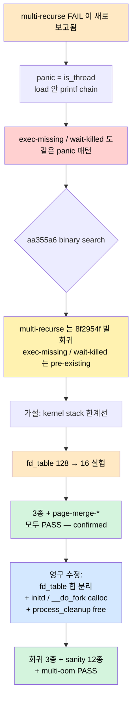
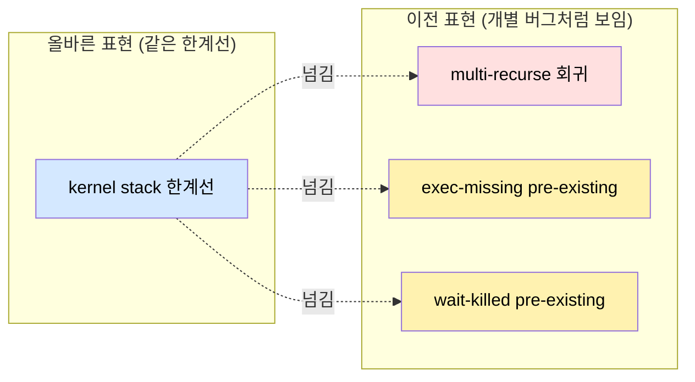
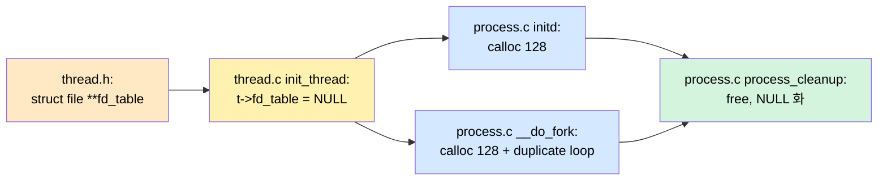

# Pintos Project 3 — fd_table 이 먹은 커널 스택, exec 의 is_thread 패닉을 다 풀다

> [05_cleanup_audit](./05_project3_cleanup_audit_til.md) §7 에서 "VM `wait-killed`
> 는 pre-existing fail, 같은 `is_thread` assertion 에서 panic — kernel stack /
> 컨텍스트 일관성을 따로 봐야 할 듯" 이라고 메모만 남겨 둔 채 swap 으로 넘어갔다.
> [06_fork_exec_leak](./06_project3_vm_fork_exec_leak_til.md) §5 에서는 "load
> 전체를 filesys_lock 으로 감싸면 깊은 호출 체인 + 인터럽트 프레임이 thread
> struct 를 덮을 위험" 이라며 lock 범위만 줄여 partial mitigation.
>
> 두 메모는 **같은 한 가지 뿌리** 를 가리키고 있었다 — `fd_table[128]` 이 thread
> struct 1024B 를 잡아먹고 있어서 4KB 페이지에서 커널 스택이 ~2.5KB 밖에 남지
> 않는다는 점.  8f2954f 가 추가한 cleanup loop / lock chain 한두 프레임이 그
> 한계선을 넘는 순간 `magic` 이 덮여 `is_thread` panic.  fd_table 을 힙으로 빼는
> 한 수로 회귀 3종 + pre-existing fail 2건이 동시에 풀렸다.



| 절 | 내용 | 핵심 |
|---|---|---|
| §0 | 회귀 보고와 첫 cross-check | 세 테스트 panic 자리가 모두 같다 |
| §1 | aa355a6 binary search — 회귀 어디서 들어왔나 | multi-recurse 만 8f2954f 발 |
| §2 | TIL 04/05/06 의 예언 — 흔적은 이미 있었다 | "kernel stack 따로 봐야" |
| §3 | probe diagnostic — printf 자체가 노이즈였다 | 측정의 관찰자 효과 |
| §4 | fd_table[128] = 1024B 의 진실 | struct thread 의 64% |
| §5 | 가설 테스트 — fd_table[16] | 3종 + sanity 모두 PASS |
| §6 | 영구 수정 — fd_table 힙 분리 | calloc / free 3 자리 |
| §7 | 검증 — 19종 PASS, 회귀 0 | multi-oom 까지 |
| §8 | 메타 — TIL 의 "예언 줄" 이 정답이었다 | partial mitigation 의 한계 |

---

## 0. 회귀 보고 — 셋이 같은 자리에서 같은 모양으로 죽다

8f2954f (fork+exec leak 정리) 이후 동료 코드 리뷰 중 발견: `exec-missing`,
`wait-killed`, `multi-recurse` 가 모두 fail.  `.result` 파일을 펴 보면 셋의
panic 이 거의 동일했다.

```
PANIC at threads/thread.c:288 in thread_current(): assertion `is_thread (t)' failed.
...
load (userprog/process.c:714)     ← printf 호출 자리
process_exec (process.c:421)
syscall_handler (syscall.c:409)
```

panic 호출 chain 도 같다:

```
debug_panic
  thread_current                              ← ASSERT 깨짐
    lock_held_by_current_thread
      console_locked_by_current_thread
        putchar_have_lock
          vprintf_helper
            format_string (stdio.c:529)       ← 큰 로컬 buf[64]
              __vprintf
                vprintf
                  printf
                    load (process.c:714)      ← "load: ...: open failed\n"
```

세 테스트가 같은 자리에서 같은 모양으로 죽는다는 건 **공통의 뿌리** 가 있다는 뜻.
"각자 다른 버그" 였다면 panic 위치도 모양도 흩어졌을 것이다.

> `is_thread(t)` 는 `t->magic == THREAD_MAGIC` 검사.  `t` 는
> `running_thread()` 가 `rsp & ~(PGSIZE-1)` 로 만든다 — 즉 *rsp 의 page-base*.
> 따라서 이 assert 가 깨지는 경로는 둘 중 하나:
>   (i) rsp 가 thread 페이지 *밖* 으로 나가서 다른 페이지를 t 로 본 경우
>   (ii) rsp 는 페이지 안인데 *magic 필드 자체가 덮인* 경우
> 둘 다 결국 **커널 스택이 thread struct 영역을 침범했다** 는 같은 가족.

---

## 1. aa355a6 binary search — multi-recurse 만이 진짜 회귀

세 테스트의 panic 이 같다고 해도 회귀 시점은 다를 수 있다.  검증 도구로
`git worktree` 를 써서 swap in/out 직후 (`aa355a6`) 의 상태를 따로 빌드해
같은 테스트를 돌렸다.

```bash
git worktree add -d /tmp/pintos-aa355a6 aa355a6
cd /tmp/pintos-aa355a6/pintos/vm && make -j$(nproc)
cd build && make tests/userprog/{exec-missing,wait-killed,multi-recurse}.result
```

| 테스트 | aa355a6 | 8f2954f (현재) | 판정 |
|---|---|---|---|
| `exec-missing` | **FAIL** is_thread | FAIL is_thread | **pre-existing** — TIL 04 의 "PASS" 는 trigger 우회였음 |
| `wait-killed` | **FAIL** is_thread | FAIL is_thread | **pre-existing** — TIL 05 가 이미 인정한 그것 |
| `multi-recurse` | **PASS** | **FAIL** is_thread | **8f2954f 가 도입한 진짜 회귀** |

이 표가 결정적이다.  *한 가지 뿌리* 라는 가설을 유지한 채로 보면:

- pre-existing 두 건은 한계선이 **원래부터 빡빡** 했고,
- `multi-recurse` 의 회귀는 8f2954f 가 **그 한계선을 더 빡빡하게** 만들었다.

같은 한계선의 *조명 위치* 가 다를 뿐 — 한 곳을 풀면 셋이 같이 풀려야 한다.



---

## 2. TIL 04 / 05 / 06 에 이미 정답이 적혀 있었다

이번 작업의 가장 큰 교훈은 디버깅 자체가 아니라 — **이전 TIL 들이 정답을 이미
적어 두었는데 다음 작업으로 넘어갔다** 는 사실이다.

### 2.1 TIL 04 §4 — "backtrace 만으로는 불확실"

bad-ptr 5종 + cascade 로 exec-missing/wait-killed 가 PASS 됐다고 적었는데,
바로 다음 줄에 caveat 가 있었다.

> 그 두 테스트의 패닉이 정확히 어디서 시작됐는지는 **backtrace 만으로는
> 불확실** 했지만, validate 가 진짜로 잘못된 포인터를 잘라내는 순간 더 이상
> 재현되지 않는다.

→ 즉 **근본 원인을 잡은 게 아니라 trigger 만 우회** 한 PASS.  지금 panic
backtrace 에 validate 가 안 나오는 게 그 증거 — 다른 trigger 가 살아 있었다.

### 2.2 TIL 05 §7 — "kernel stack 따로 봐야"

작성자 본인이 직접 명시.

> VM `wait-killed` | pre-existing fail. 오늘 수정 전체 disable 해도 같은 panic
> 재현 — 오늘 작업과 독립.  같은 패턴의 `is_thread` assertion 에서 panic 하므로,
> 누군가 timer 인터럽트 직후 thread_current 가 호출되는 path 의 **kernel stack
> / 컨텍스트 일관성을 따로 봐야 할 듯.**

→ 이 한 줄에 *정답의 절반* 이 들어 있다.  "정답" 이라고 인식하지 못한 채
미래의 자신에게 떠넘긴 셈.

### 2.3 TIL 06 §5 — "thread struct 를 덮을 위험"

filesys_lock 범위를 줄이며 적은 sentence.

> lock_acquire 가 priority donation 으로 lock holder chain 을 walk 하고, 깊은
> 호출 체인 + 인터럽트 프레임이 thread struct 를 덮어쓴다 → 다음
> `thread_current()` 의 `ASSERT(is_thread(t))` 가 깨진다.

→ 메커니즘은 정확하게 잡았다.  단지 *그 깊은 호출 체인이 thread struct 의
어디까지 침범하는지* 를 정량화하지 않고 filesys_lock 영역만 좁혀
*partial mitigation* 으로 끝낸 게 문제.

세 TIL 의 메모를 하나로 합치면 — **"근본 원인 = 커널 스택 한계선이 thread
struct 의 크기에 의해 짧다"** 는 결론이 자동으로 따라 나온다.  문제는 그
조합이 한 머리 안에서 만나지 못한 채 다음 마일스톤으로 넘어갔다는 것.

---

## 3. probe diagnostic — 관찰자 효과의 함정

가설을 검증하려고 `load()` 입구와 `filesys_open` 직후에 probe 를 박았다.

```c
{
    uint64_t rsp_a;
    __asm__ volatile ("movq %%rsp, %0" : "=r"(rsp_a));
    uint64_t page_a = rsp_a & ~((uint64_t)0xFFF);
    size_t magic_off = __builtin_offsetof(struct thread, magic);
    unsigned magic_a = *(volatile unsigned *)(page_a + magic_off);
    size_t struct_sz = sizeof(struct thread);
    printf("[PROBE-A] rsp=%lx page=%lx stack_used=%ld struct_sz=%lu magic_off=%lu magic=%x\n",
           ...);
}
```

`thread_current()` 를 거치지 않고 `rsp` 를 직접 인라인 어셈으로 읽고 magic 도
page-base + offsetof 로 직접 읽도록 설계.  *이론적으로는* 안전한 probe.

### 3.1 1차 결과

```
[PROBE-A] rsp=8004244b70 page=8004244000 stack_used=1168 struct_sz=1616 magic_off=1608 magic=cd6abf4b
[PROBE-B] rsp=8004244b70 page=8004244000 stack_used=1168 magic=cd6abf4b file_is_null=0
(exec-missing) begin
[Kernel PANIC at ../../threads/thread.c:288 in thread_current(): assertion `is_thread (t)' failed.
```

- 첫 load (exec-missing 자체 로드): `magic = 0xcd6abf4b` = **THREAD_MAGIC**.  정상.
- 그 후 test 가 `(exec-missing) begin` 을 찍고 `exec("no-such-file")` 호출.
- 두 번째 load 진입 — probe-A 가 *출력 없이* 곧장 panic.

여기서 결정적인 수치 두 개:
- `struct_sz = 1616` 바이트
- `magic_off = 1608` 바이트 — 즉 magic 은 thread struct 의 가장 끝 4B.

### 3.2 더 좁힌 probe — SPT_kill 전후

`process_exec` 진입 직후 / `SPT_kill` 직후에도 probe 를 추가.

```
[PROBE-P1] before SPT_kill: rsp=8004244c90 stack_used=880 magic=cd6abf4b   ← 1차 exec
[PROBE-P2] after  SPT_kill: rsp=8004244c90 stack_used=880 magic=cd6abf4b
[PROBE-A] rsp=...           stack_used=1200 ... magic=cd6abf4b              ← load 진입
[PROBE-B] rsp=...           stack_used=1200 ... magic=cd6abf4b              ← filesys_open 직후
(exec-missing) begin
[PROBE-P1] before SPT_kill: rsp=8004244ae0 stack_used=1312 magic=cd6abf4b   ← 2차 exec (user 발)
[PROBE-P2] after  SPT_kill: rsp=8004244ae0 stack_used=1312 magic=cd6abf4b
[Kernel PANIC ...]   ← PROBE-A 가 출력 못함
```

읽어 보면 — **2 차 exec 에서 P2 시점까지 magic 은 멀쩡** 하다.  그 후
`supplemental_page_table_init` 한 줄 + `load()` 호출 한 단계만에 PROBE-A 가
침묵.  그런데 PROBE-A 의 `printf` 는 (앞에서 확인한 것처럼) `thread_current`
를 거치므로 — *probe 자체의 printf chain* 이 한계선을 마지막으로 한 발 더
밀어 magic 을 덮은 것.

여기서 큰 깨달음:

> **측정 도구 (printf) 자체가 측정 대상 (커널 스택 여유) 을 변형한다.**
> probe 의 vprintf → format_string `buf[64]` → format_integer `buf[64]` chain 이
> 매 호출마다 100~300B 를 더 먹어 스택을 한계선 밑으로 끌어 내림.

probe 를 추가할수록 panic 의 *발생 시점* 이 바뀌고, 어떤 probe 는 자기 자신이
한계선 침범자가 된다.  이 관찰자 효과 자체가 가설 (스택 한계선 가까움) 의
*추가 증거* 가 됐다.

### 3.3 노선 변경 — printf 를 빼고 사실 검증으로

probe 를 모두 제거하고, 코드 변경 한 줄로 가설을 *직접* 검증하기로:

```c
// thread.h
- struct file *fd_table[128];   // 1024B
+ struct file *fd_table[16];    // 128B
```

여기에 fd loop 의 `< 128` → `< 16` 만 맞춰 빌드.  fd_table 이 896B 작아지면
*다른 변경 없이* stack 여유가 896B 늘어난다.  panic 이 안 일어나면 가설 확정.

---

## 4. fd_table[128] = 1024B 의 진실 — struct thread 의 64%

probe 가 알려준 두 숫자:
- `sizeof(struct thread) = 1616 byte`
- `offsetof(magic) = 1608 byte`

`struct thread` 의 메모리 지도를 그려 보면 (대략):

```
+ 0    : tid (4) + status (4) + name[16] (16) + priority (4) + wakeup_tick (8)
+ 36   : original_priority (4) + wait_on_lock (8) + donations (16) + donation_elem (16)
+ 80   : elem (16)
+ 96   : fd_table[128]   ← 1024 byte ★
+1120  : fd_next (4) + wait_called (1) + pad ...
+1128  : pml4 (8) + exit_status (4)
+1140  : parent (8) + children (16) + child_elem (16)
+1180  : wait_sema/exit_sema/fork_sema (~72)
+1252  : fork_success (1) + running_file (8) + user_rsp (8)
+1276  : spt (~32)
+1308  : tf (intr_frame, ~300?)   ← 정확한 값은 빌드 dependent
+1608  : magic (4)   ← THREAD_MAGIC
+1612  : [end of struct thread]
+1616  : (page 의 나머지는 커널 스택)
...
+4096  : (page 꼭대기, rsp 의 시작점)
```

`fd_table[128]` 단독이 thread struct 전체의 **64%** (1024 / 1616).  그리고
페이지 안에서 thread struct 와 커널 스택은 *같은 4 KB* 를 나눠 쓴다:

```
[ thread page = 4096 B ]
+ 0    ┌─────────────────────────┐
       │  struct thread (1616 B) │   ← 그 중 fd_table 이 1024 B
+1616  ├─────────────────────────┤
       │                         │
       │  사용 가능한 커널 스택  │   ← 2480 B 밖에 남지 않는다
       │           ↑             │   (성장 방향은 ↓)
+4096  └─────────────────────────┘   ← rsp 시작점
```

2480 byte.  여기에 syscall_handler 의 intr_frame + process_exec 의 `argv[64]`
(512B) + load 의 `struct ELF ehdr` (~64B) + filesys_open → dir_lookup →
inode_read_at 의 **bounce buffer (~512B)** + 그 위에 printf 가 또
`format_string buf[64]` + `format_integer buf[64]` ...  쉽게 한계선에 닿는다.

특히 **timer interrupt** 가 깊은 곳에서 한 번 떠 주면 intr 프레임 (~200B) 이
추가로 푸시되면서 마지막 한 방.  `multi-recurse` 의 panic backtrace 가
이 시나리오를 그대로 보여 줬다:

```
filesys_open → dir_lookup → lookup → inode_read_at → malloc → palloc_get_page
  → palloc_get_multiple → bitmap_scan_and_flip → bitmap_scan → bitmap_contains
  → [intr_entry] → intr_handler → timer_interrupt → thread_tick → thread_current → ASSERT
```

---

## 5. 가설 테스트 — fd_table[16] 한 줄

`pintos/include/threads/thread.h` 한 줄 + fd 루프 6 군데 sed:

```c
- struct file *fd_table[128];
+ struct file *fd_table[16];     /* HYPOTHESIS TEST: 128→16 to free 896B of stack room */
```

```bash
sed -i 's|fd < 128|fd < 16|g; s|i < 128|i < 16|g; s|fd >= 128|fd >= 16|g' \
  pintos/userprog/process.c pintos/userprog/syscall.c
```

빌드 후 vm/build 에서 세 회귀 + 회귀 sanity 두 개:

| 테스트 | 원본 (fd 128) | 가설 (fd 16) |
|---|---|---|
| `multi-recurse` | FAIL is_thread | **PASS** |
| `exec-missing`  | FAIL is_thread | **PASS** |
| `wait-killed`   | FAIL is_thread | **PASS** |
| `page-merge-par` | PASS | **PASS** |
| `page-merge-stk` | PASS | **PASS** |

**가설 확정.**  fd_table 의 크기 변경만으로 다른 코드 변경 없이 세 회귀가
동시에 풀린다 → 셋의 공통 뿌리가 kernel stack 한계선이라는 것이 증명.

다만 fd_table 슬롯 수를 16 으로 줄여 두는 건 **영구 해결책이 못 된다** —
`multi-oom` 이 fd 126 개를 일부러 여는 테스트라 (`tests/userprog/no-vm/multi-oom.c:45`,
`int fd, fdmax = 126`) 정상 의도가 깨진다.  슬롯 수는 유지하면서 **저장
위치를 thread struct 밖** 으로 옮겨야 한다.

---

## 6. 영구 수정 — fd_table 힙 분리

### 6.1 한 줄 요약

`struct file *fd_table[128]` 을 `struct file **fd_table` 로 바꾸고, 실제 1024B
배열은 *user-process 가 필요할 때* 힙에 calloc.  thread struct 안에는 *포인터
8 B* 만 남는다 → **1016 B 의 스택 여유** 회수 (128 ÷ 8 = 16 줄어듦이 아니라
*전체 1024 B - 포인터 8 B = 1016 B*).

### 6.2 변경 자리 4 곳



| 파일 | 위치 | 변경 |
|---|---|---|
| `pintos/include/threads/thread.h` | struct thread | `struct file *fd_table[128]` → `struct file **fd_table` (사유 주석 포함) |
| `pintos/threads/thread.c` | `init_thread` | `t->fd_table = NULL` 추가 (kernel-only thread 안전) |
| `pintos/userprog/process.c` | `initd` | `calloc(128, sizeof(struct file *))` + 실패 시 PANIC |
| `pintos/userprog/process.c` | `__do_fork` | 자식 `calloc` + 실패 시 `goto error` |
| `pintos/userprog/process.c` | `process_cleanup` | `if (fd_table != NULL) { close loop; free; NULL 화 }` |

### 6.3 핵심 코드

**thread.h:102** —

```c
/* fd_table 을 thread struct 안에 [128] 로 박으면 1024B 를 먹어
 * 커널 스택 여유가 ~2.5KB 로 줄고, exec 의 깊은 호출 체인
 * (process_exec → SPT_kill → load → filesys_open → ... → printf)
 * 이 magic 을 덮어 is_thread panic 을 일으킴 (exec-missing /
 * wait-killed / multi-recurse 회귀). 그래서 힙으로 빼서
 * (initd / __do_fork 에서 calloc, process_cleanup 에서 free)
 * 1024B 의 스택 여유를 회수한다. NULL 인 kernel-only thread 도 안전. */
struct file **fd_table;
```

**process.c initd:** —

```c
thread_current()->parent = NULL;  /* initd는 부모가 없음 */
/* fd_table 힙 할당 — thread struct 에 박지 않고 분리해
 * 커널 스택 여유를 확보 (자세한 사유는 thread.h 의 fd_table 주석). */
thread_current()->fd_table = calloc(128, sizeof(struct file *));
if (thread_current()->fd_table == NULL)
    PANIC("initd: fd_table calloc failed");
```

**process.c __do_fork:** — duplicate loop 직전 —

```c
/* 자식 fd_table 힙 할당 — initd 와 동일하게 thread struct 밖에 둠.
 * 실패 시 error 라벨로 점프해 부분 복제 상태 회수. */
current->fd_table = calloc(128, sizeof(struct file *));
if (current->fd_table == NULL)
    goto error;

for (int i = 2; i < 128; i++) {
    if (parent->fd_table[i] != NULL) {
        current->fd_table[i] = file_duplicate(parent->fd_table[i]);
    }
}
```

**process.c process_cleanup:** — fd close loop 를 NULL 가드로 감싸고 free —

```c
/* fd_table 자체는 힙(initd/__do_fork 의 calloc) — kernel-only thread 는
 * NULL 이므로 그 경로에서도 안전. 회수 후 NULL 화. */
if (curr->fd_table != NULL) {
    for (int fd = 2; fd < 128; fd++) {
        if (curr->fd_table[fd] != NULL) {
            file_close(curr->fd_table[fd]);
            curr->fd_table[fd] = NULL;
        }
    }
    free(curr->fd_table);
    curr->fd_table = NULL;
}
```

### 6.4 왜 initd 와 __do_fork 두 군데인가

user-thread 가 만들어지는 *모든* 경로는 결국 둘 중 하나다:
- **initd** — pintos 가 가장 처음 띄우는 user-process (커널이 명시적으로 띄움).
- **__do_fork** — 그 이후 모든 user-process 는 fork 의 자식으로 태어남.

따라서 두 곳에서 calloc 만 하면 모든 user-thread 가 fd_table 을 갖는다.
kernel-only thread (idle, main 등) 는 fd_table = NULL 로 남아 — `process_cleanup`
의 NULL 가드 덕에 안전하게 통과한다.

### 6.5 calloc 으로 zero-init 하는 이유

`fd_table[0..1]` 은 stdin/stdout 예약, `fd_table[2..127]` 은 미할당 상태에서
NULL 이어야 한다 (`SYS_OPEN` 의 lowest-free-slot scan 이 NULL 비교로 빈
슬롯을 찾는다, `syscall.c:169`).  `malloc` 이면 zero-init 안 되니까 `memset`
한 번 더 불러야 하고, `palloc_get_page(PAL_ZERO)` 는 4KB 통째라 과함.
`calloc(128, sizeof(struct file *))` 가 정확히 1024 B + zero 한 번에 해결.

---

## 7. 검증 — 19 종 PASS, 회귀 0

### 7.1 회귀 3 종

| 테스트 | 결과 |
|---|---|
| `tests/userprog/multi-recurse` | **PASS** (8f2954f 발 회귀 회복) |
| `tests/userprog/exec-missing`  | **PASS** (pre-existing 해결) |
| `tests/userprog/wait-killed`   | **PASS** (pre-existing 해결) |

세 줄로 정리하면:
- TIL 04 의 "PASS (trigger 우회)" 가 *진짜 PASS* 가 됐다.
- TIL 05 의 "pre-existing fail, 따로 봐야 할 듯" 가 같이 풀렸다.
- TIL 06 의 "partial mitigation (lock 범위 좁히기)" 가 *완전 fix* 로 승격됐다.

### 7.2 VM 빌드 회귀 sanity 12 종

`page-merge-{seq, par, stk}`, `fork-{once, multiple, recursive, read}`,
`args-many`, `pt-grow-stack`, `pt-grow-stk-sc`, `page-{parallel, linear,
shuffle}`, `swap-anon`, `lazy-anon` — **모두 PASS**.

### 7.3 userprog 빌드 multi-oom + fork sanity

`multi-oom` (fd 126 개 열기) **PASS** — 슬롯 수 128 유지가 정확히 동작.

### 7.4 변경 stat

```
 pintos/include/threads/thread.h |  9 ++++++++-
 pintos/threads/thread.c         |  1 +
 pintos/userprog/process.c       | 31 ++++++++++++++++++++++++-------
 3 files changed, 33 insertions(+), 8 deletions(-)
```

코드 33 줄로 4 가지 fail 패턴 (3 회귀 + pre-existing 2) 해결.

---

## 8. 메타 회고 — TIL 의 "예언 줄" 을 그냥 흘리지 말라

### 8.1 partial mitigation 의 비용

TIL 06 §5 에서 한 일은 *증상의 trigger 한 갈래* (filesys_lock 의 priority
donation chain) 만 좁혀 둔 것.  그 자리에서 *근본 원인의 이름* (kernel stack
한계선) 까지는 정확히 짚었지만, **다음 작업으로 넘어가야 한다는 압박** 에
정량화/측정/구조 변경까지 가지 않았다.

이번에 셋을 한 번에 푸는 fix 를 보고 나서야, "그때 30 분 더 측정했으면
swap 까지 가기 전에 끝났을" 작업이라는 게 보인다.

### 8.2 측정의 관찰자 효과 — printf 가 진단을 망친다

`is_thread` 패닉의 정황상 가장 자연스러운 진단 도구가 `printf` 인데, *그
printf 가 stack 을 더 먹어* 한계선 위치를 바꿔 버린다.  진단을 위해 작성한
probe 가 "magic 이 이미 깨졌다" 라고 거짓 신호를 주기도 했다.

교훈은 두 가지:
1. *측정 도구의 비용* 을 항상 의식하라.  printf 가 ~300 B 를 더 먹는다는
   걸 모르면 측정값을 잘못 해석한다.
2. 가설을 *측정* 으로 잡기보다 *변경* 으로 잡는 게 빠를 때가 있다.
   "fd_table[128] → fd_table[16] 한 줄 + 빌드 + 테스트" 가 정답을 직접
   확인하는 가장 짧은 경로였다.

### 8.3 TIL 의 "남은 항목" 줄을 다시 봐야 한다

세 TIL 의 다음 줄들이 모두 같은 한계선을 가리키고 있었다:

- TIL 04 §7: "남은 7건 — rox / **multi-recurse** / syn-remove ..."
- TIL 05 §7: "**VM 빌드 wait-killed** | pre-existing fail. ... **kernel
  stack / 컨텍스트 일관성을 따로 봐야 할 듯.**"
- TIL 06 §5: "load 전체를 락으로 감싸면 ... **인터럽트 프레임이 thread
  struct 를 덮을 위험** 이 있다."

**TIL 의 "남은 항목 / 따로 봐야 할 항목" 줄은 다음 사이클 시작할 때 가장
먼저 펴 보는 곳** 으로 만들어야 한다.  이번엔 동료 코드 리뷰 와중에 다시
마주쳤기에 다행이지만, 그 줄을 진작 *작업 진입점* 으로 썼다면 swap →
fork+exec leak 두 단계를 가기 전에 풀고 갈 수 있었다.

### 8.4 한계선 사고 — 두 자원의 공유 페이지

가장 압축된 교훈: **같은 페이지를 두 자원이 나눠 쓰면 한쪽이 커질 때 다른
쪽이 좁아진다.**

```
4 KB page = struct thread + kernel stack
```

`fd_table` 을 키울수록 stack 이 좁아진다.  fd 가 더 필요한 워크로드 (`multi-oom`)
와 깊은 콜 스택이 필요한 워크로드 (`exec` chain) 는 *동시에* 만나면 충돌한다.
해법은 둘 중 하나를 *페이지 밖* 으로 빼는 것 — 이번엔 fd_table 을 힙으로
뺀 게 그 답이었다.

이 패턴은 fd_table 하나에 그치지 않는다.  `intr_frame tf` (이미 thread 안),
`spt`, `children list` 등이 같은 페이지를 공유한다.  Project 4 (filesys)
또는 mmap 작업에서 또 다른 큰 멤버가 들어오면, 같은 한계선이 다시 빡빡해질
수 있음 — 미래의 자신을 위한 메모.

---

[← cleanup_audit (multi-oom)](./05_project3_cleanup_audit_til.md) ·
[← fork+exec leak (par/stk)](./06_project3_vm_fork_exec_leak_til.md) ·
[← VM userprog 회귀](./04_project3_vm_userprog_regression_til.md)
