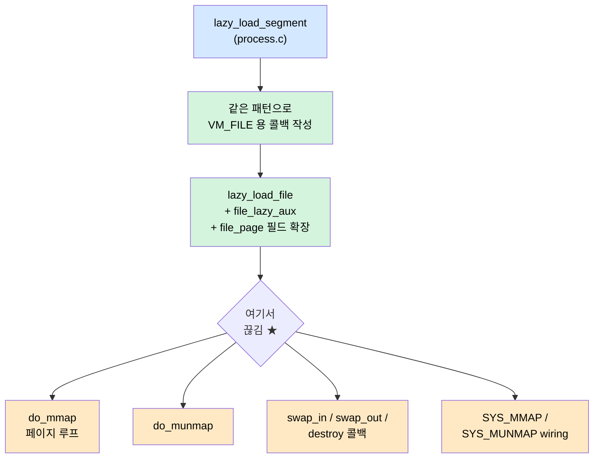

# Pintos Project 3 — mmap 작업 인수인계 (do_mmap 페이지 루프 직전에 끊김)

> 이 TIL 은 **완성 보고가 아니라 인수인계 노트** 다.  `8f2954f` 의 "남은 항목 —
> page-merge-mm (mmap 미구현 — 별도 작업)" 을 풀러 들어갔다가 `do_mmap` 의
> 페이지 루프 작성 직전에 세션이 끊겼다.  다음에 다시 이 자리로 돌아왔을 때
> *어디까지 왜 끝냈는지 / 다음 한 줄은 무엇인지* 를 흐름 잃지 않고 이어 가도록
> 정리한다.
>
> 코드는 미완성 상태로 commit 하지 않았다 (`pintos/vm/file.c`, `pintos/include/vm/file.h`
> 가 working tree 에 unstaged).  이 TIL 도 코드 위에 함께 두고 다음 세션에서
> 같이 읽으면 된다.



| 절 | 내용 |
|---|---|
| §1 | 출발점 — `8f2954f` 의 "남은 항목" 과 `page-merge-mm` |
| §2 | 설계 결정 — `lazy_load_segment` 를 그대로 거울 비추기 |
| §3 | 지금까지 한 것 — `file.h` 확장 + `lazy_load_file` |
| §4 | `do_mmap` — 끊긴 정확한 자리 + 다음 한 줄 |
| §5 | 아직 남은 자리 4 곳 |
| §6 | 다음 세션 진입 체크리스트 |

---

## 1. 출발점 — `8f2954f` 의 "남은 항목" 과 `page-merge-mm`

`8f2954f` 의 commit message 마지막 줄:

> 남은 항목: page-merge-mm (mmap 미구현 — 별도 작업)

`page-merge-par` / `page-merge-stk` 까지 잡고 swap baseline 위에서 fork+exec
누수까지 정리한 그 다음의 자연스러운 다음 발은 **mmap 구현** 이었다.
`page-merge-mm` 은 mmap 된 영역을 여러 자식이 정렬·병합하는 테스트로,
mmap 의 정상 동작 + fork 상호작용 + munmap 의 writeback 까지 *동시에* 본다.
mmap 의 정합성을 만들면 그 자체로 통과해야 하는 마일스톤.

`pintos/tests/vm/` 의 mmap-* 테스트 26 개 가 모두 같은 인터페이스
(`mmap(addr, length, writable, fd, offset)` / `munmap(map)`) 를 친다 —
예를 들어 `mmap-read.c`:

```c
char *actual = (char *) 0x10000000;
handle = open ("sample.txt");
map = mmap (actual, 4096, 0, handle, 0);
/* memcmp(actual, sample, ...) 가 통과해야 함 */
munmap (map);
```

→ 즉 **lazy 한 페이지 폴트** 시점에 파일에서 읽어와서 사용자 메모리에 매핑
하는 흐름이 필요.  완전히 새 패턴이 아니라 — 이미 짜 둔 `lazy_load_segment`
와 *거의 같은 모양* 이다.

---

## 2. 설계 결정 — `lazy_load_segment` 를 그대로 거울 비추기

이번 세션의 **결정적 선택** 은 "새 패턴을 만들지 말고 익숙한 것을 거울로
쓰자" 였다.  `pintos/userprog/process.c:999-1045` 의 `lazy_load_segment` 가
이미 다음을 하고 있다:

```c
static bool
lazy_load_segment (struct page *page, void *aux) {
    ASSERT(page->frame != NULL);
    ASSERT(page->frame->kva != NULL);
    ASSERT(aux != NULL);
    struct lazy_load_aux *info = (struct lazy_load_aux *) aux;
    ASSERT(info->read_bytes + info->zero_bytes == PGSIZE);

    bool held = lock_held_by_current_thread(&filesys_lock);
    if (!held) lock_acquire(&filesys_lock);
    file_seek(info->file, info->offset);
    off_t target = file_read(info->file, page->frame->kva, info->read_bytes);
    if (!held) lock_release(&filesys_lock);

    if (target != info->read_bytes) { /* 실패 경로 */ return false; }
    memset((uint8_t *)page->frame->kva + info->read_bytes, 0, info->zero_bytes);
    /* owns_file 분기 + free(info) */
    return true;
}
```

**거울 비추기 4 가지 일치점:**

| 측면 | `lazy_load_segment` (anon, ELF) | `lazy_load_file` (file, mmap) |
|---|---|---|
| 호출 시점 | 첫 page fault | 첫 page fault (동일) |
| aux 구조 | `lazy_load_aux` | `file_lazy_aux` (이름만 다름) |
| 파일 IO | seek + read | seek + read (동일) |
| 락 패턴 | `held` 검사 + acquire/release | 동일 |
| zero-pad | `memset(kva + read, 0, zero)` | 동일 |

**다른 점 한 가지:**

| 측면 | anon (ELF) | file (mmap) |
|---|---|---|
| 페이지 상태 보존 | 콜백 끝나면 aux free, file 정보 잊음 | **콜백 끝나도 file 정보 보존해야 함** (munmap, swap-out 시 다시 씀) |

이 한 차이가 코드에 반영된 자리 — `lazy_load_file` 콜백이 fault 시점에
`page->file` (struct file_page) 에 *aux 의 file/offset/read_bytes/zero_bytes 를
복사* 한다.  aux 자체는 그 후 free, 정보는 page 안으로 들어가서 swap_out /
destroy 가 나중에 같은 정보로 writeback 할 수 있게.

이 거울-비추기 결정 덕에 *완전히 새로운 디버깅 영역* 을 만들지 않을 수 있다 —
파일 IO 가 잘못되면 anon 쪽도 같이 안 됐을 것이기에 문제 격리가 쉽다.

---

## 3. 지금까지 한 것 — `file.h` 확장 + `lazy_load_file`

### 3.1 `pintos/include/vm/file.h` — 두 가지 추가

```c
/* mmap 페이지의 첫 fault에서 파일 정보를 전달하는 구조체 */
struct file_lazy_aux {
    struct file *file;
    off_t offset;
    size_t read_bytes;
    size_t zero_bytes;
};

struct file_page {
    struct file *file;
    off_t offset;
    size_t read_bytes;
    size_t zero_bytes;
};
```

**왜 두 구조체가 거의 같은데 둘 다 필요한가:**
- `file_lazy_aux` — `vm_alloc_page_with_initializer` 의 `aux` 자리에 넣을
  *전달용* 구조체.  malloc → 콜백에서 free.  생명: page 등록 ~ 첫 fault.
- `file_page` — `struct page` 의 union 안에 박힌 *영구* 저장소.  콜백이
  여기 정보를 복사한 다음 aux 를 free.  생명: 페이지 수명 전체.

`file_page` 와 `file_lazy_aux` 를 *합치고 page->file 만 두면 안 되나?*
→ 안 됨.  `vm_alloc_page_with_initializer` 호출 시점에는 아직 `page` 객체가
없다.  aux 만 만들어 넘긴 뒤, uninit_new 가 page 를 만들고, 첫 fault 때
`file_backed_initializer` 가 page->file 영역을 잡는다.  *그 사이 정보를 임시
보관할 그릇* 이 따로 필요해서 `file_lazy_aux` 가 존재.

### 3.2 `pintos/vm/file.c` — `lazy_load_file` 콜백

전체 모습 (`file.c:32-62`):

```c
static bool
lazy_load_file (struct page *page, void *aux) {
    struct file_lazy_aux *info = (struct file_lazy_aux *) aux;

    /* file_page에 정보 복사 (swap_out, destroy 때 필요) */
    struct file_page *file_page = &page->file;
    file_page->file = info->file;
    file_page->offset = info->offset;
    file_page->read_bytes = info->read_bytes;
    file_page->zero_bytes = info->zero_bytes;

    /* 파일에서 읽기 */
    bool held = lock_held_by_current_thread(&filesys_lock);
    if (!held) lock_acquire(&filesys_lock);
    file_seek(info->file, info->offset);
    off_t target = file_read(info->file, page->frame->kva, info->read_bytes);
    if (!held) lock_release(&filesys_lock);

    if (target != (off_t) info->read_bytes) {
        free(info);
        return false;
    }
    memset((uint8_t *)page->frame->kva + info->read_bytes, 0, info->zero_bytes);
    free(info);
    return true;
}
```

§2 의 거울-비추기 결과물.  특히 두 라인이 차이의 표현:

```c
/* file_page에 정보 복사 (swap_out, destroy 때 필요) */
struct file_page *file_page = &page->file;
file_page->file = info->file;
...
```

이게 anon 쪽과의 한 가지 다른 점 — 파일 정보를 page 안으로 *영속화*.

### 3.3 `do_mmap` — 진입부만 작성 (`file.c:91-108`)

```c
void *
do_mmap (void *addr, size_t length, int writable,
        struct file *file, off_t offset) {

    // 1. file_reopen으로 file 객체 독립 (file_duplicate와 비슷한 의도)
    struct file *f = file_reopen(file);

    // 2. length를 페이지 단위로 나눠서, 각 페이지를 VM_FILE로 SPT에 등록
    //    lazy_load_segment와 같은 패턴 — 첫 fault 때 파일에서 읽음

    // 3. 각 페이지마다 lazy_load_aux 같은 구조체 만들고
    //    vm_alloc_page_with_initializer(VM_FILE, ...)로 등록

    return addr;
}
```

`file_reopen` 한 줄까지가 *결정* 이고, 그 아래 주석 두 개는 *다음 호흡* 이다.
이 자리에서 끊겼다 ⭐.

**왜 `file_reopen` 인가:**
이 fix 의 직전 작업 (`06_..._fork_exec_leak`) §4 가 강하게 가르쳐 준 교훈 —
*ELF 의 running_file 은 부모/자식이 공유하되, mmap 의 파일은 더 강하게
독립시켜야* 한다.  사용자가 mmap 한 뒤 fd 를 close 해도 매핑이 살아 있어야
하기 때문 (`mmap-close` 테스트가 이 의도를 검증).  `file_reopen` 은
*inode 만 공유하고 file struct 는 새로* 만들어서 — 원본 fd 의 close 가
mmap 된 file 객체에 영향을 주지 않는다.

지금 `f` 를 받아 두기만 하고 *아직 어디에도 저장하지 않은* 상태.  다음에
이어서 짤 페이지 루프에서 매 페이지의 `file_lazy_aux->file = f` 로 들어가야
한다.

---

## 4. `do_mmap` — 끊긴 정확한 자리 + 다음 한 줄

코드의 주석 `// 2.` 와 `// 3.` 자리.  의사 코드로 그려 두면:

```c
size_t read_left = file_length(f) - offset < length ? file_length(f) - offset : length;
size_t zero_left = length - read_left;   /* 파일 끝 너머 영역은 0 으로 채울 zero-pad */

uint8_t *upage = addr;
off_t ofs = offset;

while (read_left > 0 || zero_left > 0) {
    size_t page_read = read_left < PGSIZE ? read_left : PGSIZE;
    size_t page_zero = PGSIZE - page_read;

    struct file_lazy_aux *aux = malloc(sizeof *aux);
    if (aux == NULL) { /* 실패 회수 — 이미 등록한 페이지들 dealloc */ }
    aux->file = f;
    aux->offset = ofs;
    aux->read_bytes = page_read;
    aux->zero_bytes = page_zero;

    if (!vm_alloc_page_with_initializer(VM_FILE, upage, writable,
                                         lazy_load_file, aux)) {
        free(aux);
        /* 실패 회수 — 이미 등록한 페이지들 dealloc */
        return NULL;
    }

    read_left -= page_read;
    zero_left -= page_zero;
    upage += PGSIZE;
    ofs += page_read;
}
return addr;
```

**다음 세션의 첫 한 줄은 이 의사 코드를 실제 코드로 옮기는 것.**  주의할
부분 세 가지:

1. **실패 회수**: 루프 도중 `vm_alloc_page_with_initializer` 가 실패하면,
   *이미 등록된 페이지들을 모두 dealloc* 해야 한다.  부분 매핑 상태로
   리턴하면 안 됨 (`mmap` 의 의미: 전체 성공 또는 전체 실패).
2. **`file_length` vs `length` 처리**: 파일 길이가 length 보다 작으면
   나머지는 zero-pad — `mmap-zero` 테스트가 이 동작을 명시적으로 검증.
3. **`f` 의 owner**: 페이지 등록이 모두 성공해도, *do_mmap 안에서는 f 를
   close 하면 안 된다*.  munmap 이 마지막 페이지를 destroy 할 때 close.
   (다중 매핑 시 inode 만 공유하므로 file_close 는 마지막 unmap 에서.)

---

## 5. 아직 남은 자리 4 곳

### 5.1 `do_munmap` — 빈 함수 (`file.c:111-113`)

```c
void
do_munmap (void *addr) {
}
```

해야 할 일:
- `addr` 부터 시작하는 mmap 영역의 *모든 페이지* 를 SPT 에서 찾아
  `dirty bit` 가 1 이면 **파일에 writeback**.
- 각 페이지를 `spt_remove_page` (또는 직접 destroy 호출) 로 회수.
- 마지막 페이지에서 `file_close` (do_mmap 의 file_reopen 짝).

**다중 매핑 처리:** `addr` 하나로 어디까지가 한 mmap 영역인지 알려면, page 에
*mmap 시작 표시* 또는 *영역 길이* 가 있어야 한다.  현재 `struct file_page` 는
이 정보가 없으니 추가 필요.  대안 두 가지:
- (A) `struct file_page` 에 `is_head: bool` + `length` 추가 → head 페이지만
  자기 영역 전체 크기를 안다.  munmap 은 head 부터 length/PGSIZE 만큼 회수.
- (B) thread 에 `struct list mmap_list` — 각 mmap 마다 (addr, length, file)
  레코드.  do_munmap 은 list 검색 → 페이지 회수 → list 제거.

(B) 가 더 깔끔하지만 thread struct 가 또 커진다 — *07 의 한계선 사고* 가
다시 떠오르는 자리.  list_elem 1 개 추가 정도면 OK 지만 신경 써서 검토.

### 5.2 `file_backed_swap_in` / `swap_out` — 빈 본문, return 없음 (`file.c:74-83`)

현재 컴파일은 통과해도 (반환문 없음 경고 정도) 런타임에 동작 안 함.

- **swap_in**: file 에서 다시 읽기.  `lazy_load_file` 의 read 부분만 똑같이
  하면 됨 (page->file 의 file/offset/read/zero 를 사용).
- **swap_out**: anon 과 다르게 *swap disk 가 아니라 원본 file 에 writeback*
  (단, dirty 일 때만).  clean 이면 그냥 매핑만 끊으면 됨 (다시 fault 시
  swap_in 이 file 에서 읽어옴).

여기서 anon 과의 가장 큰 차이가 드러난다 — file-backed page 는 *swap disk 를
쓰지 않는다*.  pintos 의 swap 파티션 슬롯을 소비하지 않고, 원본 파일이
백킹 스토어 역할을 한다.

### 5.3 `file_backed_destroy` — 빈 함수 (`file.c:86-89`)

페이지 회수 시 호출.  dirty 면 writeback, frame 회수, file_page 의 file 은
*마지막 페이지에서만* close (또는 do_munmap 이 책임).  page_destructor 의
`list_remove(&frame_elem)` + `free(frame)` 패턴 (`vm/vm.c:28-43`) 과
공존해야 함.

### 5.4 SYS_MMAP / SYS_MUNMAP wiring — `syscall.c` 에 아직 없음

```bash
grep -n "SYS_MMAP\|SYS_MUNMAP\|mmap\|munmap" pintos/userprog/syscall.c
# (출력 없음)
```

`syscall_handler` 의 `switch` 에 두 case 추가 필요.  user 측 `mmap(addr,
length, writable, fd, offset)` / `munmap(map)` 인자 5 개 / 1 개.  fd 검증 후
`do_mmap` / `do_munmap` 호출.  실패 시 `MAP_FAILED` (대개 `(void*)-1` 또는
`NULL`) 반환 — `tests/vm/mmap-bad-fd.c` 류가 이 음수 경로를 강하게 본다.

---

## 6. 다음 세션 진입 체크리스트

세션 재개 시 *순서 그대로*:

1. **현재 상태 복기 30 초**
   ```bash
   git status
   git diff -- pintos/vm/file.c pintos/include/vm/file.h
   ```
   `lazy_load_file` 까지 작성, `do_mmap` 의 `file_reopen` 한 줄까지 작성.

2. **§4 의 의사 코드를 `do_mmap` 본문으로 옮기기**.  이게 첫 작업.
   `vm_alloc_page_with_initializer` 호출 시 `VM_FILE` 타입 사용.

3. **빌드 + 가장 간단한 mmap 테스트로 1차 sanity**:
   ```bash
   cd pintos/vm && make -j$(nproc)
   cd build && make tests/vm/mmap-read.result
   ```
   PASS 면 lazy load 경로 OK.  FAIL 이면 fault → lazy_load_file 진입까지의
   chain 을 의심.

4. **`file_backed_swap_in` 채우기** (다음 단순한 단계 — `lazy_load_file` 의
   read 부분만 떼서 재사용).  `mmap-read` 가 swap 까지 안 가도 동작은 해야
   하지만, 일관성 차원에서 같이.

5. **`do_munmap` + dirty writeback + file_close**.  여기서 §5.1 의 (A)/(B)
   결정.

6. **`file_backed_swap_out` + `file_backed_destroy`** — dirty 시 file write.

7. **SYS_MMAP / SYS_MUNMAP wiring** — syscall.c 에 두 case 추가.  fd 검증,
   addr alignment 검증 (`mmap-misalign` 검증) 등 가드 줄.

8. **테스트 grow-out** — `mmap-read`, `mmap-zero`, `mmap-close`,
   `mmap-misalign`, `mmap-bad-*`, `mmap-unmap`, `mmap-write`, `mmap-clean`,
   ..., 마지막으로 **`page-merge-mm`** (= 8f2954f 의 marker).  중간에 회귀
   sanity (`page-merge-{seq,par,stk}`) 도 가끔.

각 단계는 *독립적으로 테스트 가능* 하므로 한 번에 다 짜고 디버깅하기보다
1 → 2 → 3 → ... 단계마다 한 번씩 빌드하고 sanity 돌리는 게 빠를 것.

---

## 7. 메타 — 왜 *지금 시점에* TIL 을 쓰나

코드가 미완성인데 TIL 을 먼저 쓰는 게 어색해 보일 수 있다.  하지만
- 세션이 끊긴 자리가 **딱 한 번의 "다음 한 줄"** 이라 잊으면 비싸다.
- 이번에 결정한 *설계 두 가지* (① `lazy_load_segment` 거울 비추기,
  ② `file_reopen` 사용) 가 코드에 글자로 안 적혀 있고 머릿속에만 있다.
- 07 의 메타 회고가 강조한 것 — **"남은 항목" 줄은 다음 사이클 진입점**.
  미래의 자신이 §6 의 체크리스트만 따라 가도 같은 자리에서 같은 호흡으로
  이어 가도록.

다음 세션에서 이 TIL §6 부터 펴면 된다.

---

[← fork+exec leak (par/stk)](./06_project3_vm_fork_exec_leak_til.md) ·
[← fd_table stack overflow](./07_project3_fd_table_stack_overflow_til.md)
