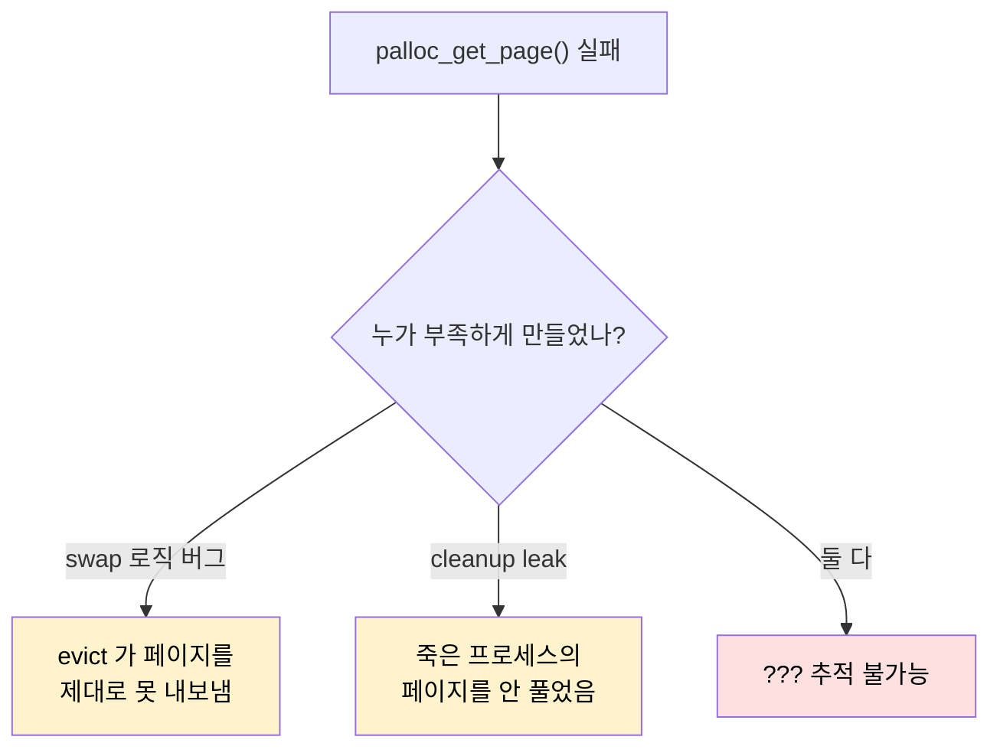
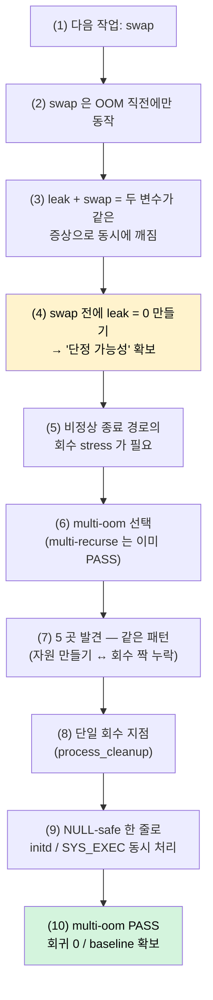
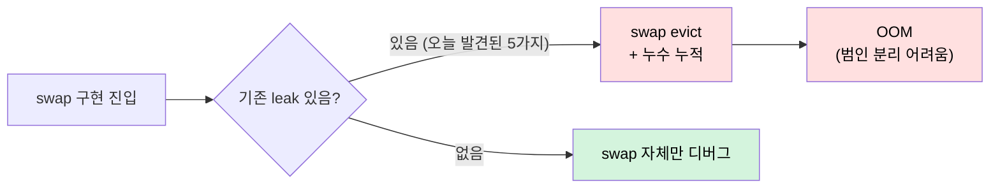
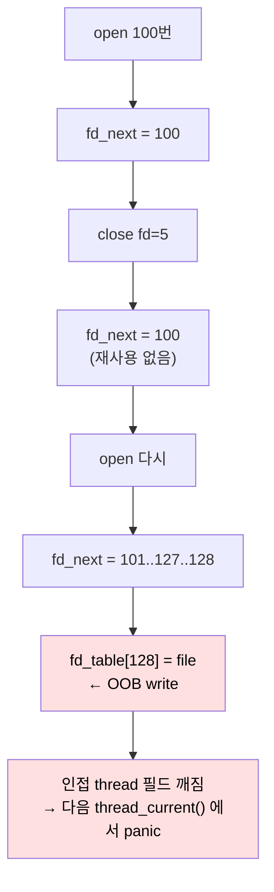
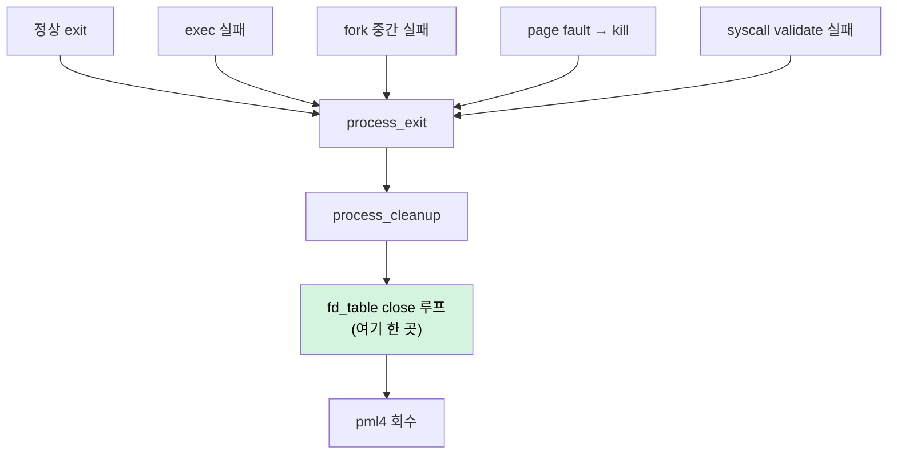
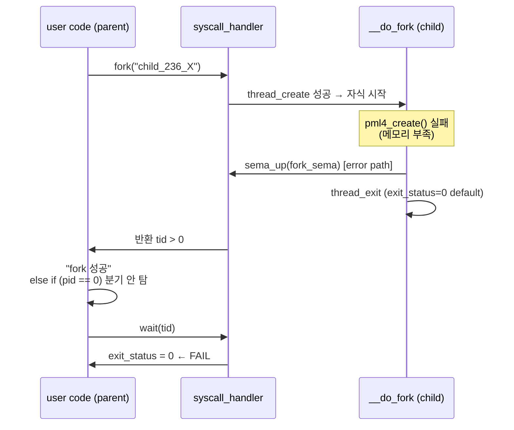

# Pintos Project 3 — swap 진입 전 process_exit cleanup audit (multi-oom 통과)

> Project 3 (VM) 의 다음 큰 산이 swap 인데, swap 의 가장 흔한 디버깅 함정이
> "swap 자체가 깨졌나, 아니면 그 밑에 누수가 있나" 가 헷갈리는 상황이다.
> swap evict 정책이 정확하든 말든, process_exit 의 작은 자원 누수가 있으면
> 그게 "PANIC: out of pages" 로 직격해서 두 변수가 동시에 깨진다.
>
> 그래서 swap 코드 한 줄 짜기 전에 — **`process_exit` cleanup 을 audit 해서
> baseline 을 깨끗하게 만들어 두기로** 했다. 목표 테스트는 처음엔
> `multi-recurse` 였지만 돌려 보니 이미 통과하길래 (이전 회귀 정리의
> 부산물), 진짜 cleanup stress 인 **`multi-oom`** 으로 옮겼다.
>
> 결과: audit 에서 5가지 누수/wire-up 누락을 찾아 고쳤고, multi-oom 이
> fail → pass 로 넘어갔다. 회귀 0. swap 작업의 baseline 이 잡혔다.
>
> | 섹션 | 주제 | 무게중심 |
> |---|---|---|
> | §0 | 커밋 reference + 확장된 "왜" | 작업 전체를 한 번에 다시 잡고 싶을 때 |
> | §1 | 왜 swap 직전에 audit 인가 | "두 변수가 동시에 깨질 위험" 차단 |
> | §2 | `multi-recurse` 가 이미 통과 → `multi-oom` 으로 pivot | 두 테스트가 검증하는 게 어떻게 다른가 |
> | §3 | Bug 1 — `SYS_OPEN` fd 할당 OOB | 가장 가시적인 크래시 |
> | §4 | Bug 2 — `process_cleanup` 의 fd 닫기 누락 | exit 마다 새는 single point |
> | §5 | Bug 3 · 4 — `load()` 성공 분기의 두 leak | running_file · old_pml4 |
> | §6 | Bug 5 — `fork_success` 가 wire 안 됨 ("`child_236_X: exit(0)`" 추적) | 가장 미묘한 한 줄 |
> | §7 | 결과와 남은 항목 | rox · syn-remove · VM wait-killed |
> | §8 | 메타 교훈 | "swap 전에 회수 경로 1개 만들기" |

---

## 0. 한눈에 보기 — 커밋 reference 와 확장된 "왜"

> 이 audit 가 *왜* 필요했고 *무엇을* 고쳤는지를 한 화면에 정리한 reference.
> §1–§8 은 발견 순서대로 따라가는 회고이고, 본 §0 은 "코드 변경만 한 번에
> 훑고 싶을 때" 의 카드.

### 0.1 두 개의 커밋

| 커밋 | 종류 | 내용 |
|---|---|---|
| `ef3fd9d` | fix | 5가지 누수/wire 누락을 한 번에 정리. `process.c` +43/-4, `syscall.c` +41/-7 |
| `a99d286` | docs | 본 TIL 추가 (465 줄) |

코드 변경은 `ef3fd9d` 한 커밋에 다 들어 있다. 건드린 파일은 둘 —
`pintos/userprog/process.c`, `pintos/userprog/syscall.c` — 뿐이고, **새 함수/
구조체/필드를 추가하지 않는다.** 본질적으로 이 audit 가 한 일은 *기존 코드의
"회수 짝이 빠진 자리" 를 채운 것* 이다.

### 0.2 왜 swap 직전이어야 했는가 — 확장

§1 이 "두 변수가 동시에 깨질 위험" 으로 한 줄 요약했지만, swap 의 동작 원리상
누수와 동시에 활성화되면 디버깅이 거의 불가능에 가까워진다 — 이걸 더
구체적으로 본다.

**swap 이 활성화되는 조건:** `palloc_get_page()` 가 "줄 페이지 없음" 으로 NULL
을 반환할 때, swap 의 evict 로직이 호출돼 *안 쓰는 사용자 페이지를 디스크로
보내고* 그 자리를 새 요청자에게 준다. 즉 **swap 코드는 OOM 직전 경로에서만
실행된다.** 평상시 디버깅으로는 그 경로가 안 돌아가서 안 보인다.



누수 + swap 이 동시에 활성화되면 세 가지가 동시에 깨진다:

1. **증상이 같다** — 두 원인 모두 결국 `PANIC: out of pages` 로 끝난다.
   콜스택만 봐서는 leak 인지 evict 버그인지 구분 불가.
2. **재현이 비결정** — swap 은 OOM 직전에만 실행되므로, 누수가 있으면 풀이
   *너무 빨리* 마르고 swap 이 트리거되는 시점/조건이 매번 달라진다.
   "같은 입력 → 같은 panic 위치" 가 안 됨.
3. **기준선 부재** — 누수 페이지 수가 회차마다 다르면 "swap 이 N 장을 회복해야
   한다" 의 N 자체가 비결정. 정상/비정상 판단의 anchor 가 없음.

오늘 5개 누수가 0 으로 정리된 결과 — **앞으로 OOM 이 뜨면 그건 swap 코드
문제다** 라는 단정이 가능해졌다. 디버깅이 *두 변수 가운데 하나가 사라져* 한
변수가 된 것.

### 0.3 의사결정의 논리 회로

이 audit 가 *왜 필요했고*, *왜 그 답을 채택했는지* 의 사고 흐름. 코어타임이나
후일 본인이 다시 설명해야 할 때 아래 단계를 순서대로 따라가면 막힘 없이
이어진다. §0.2 가 "왜 swap 전" 의 한 단면이라면, 본 절은 그 결론에서 시작해
*무엇을 어떤 방식으로 고칠지* 까지의 전체 경로.

**(1) 전제 — 다음 작업은 swap.**
Project 3 의 다음 마일스톤은 swap (anonymous 페이지를 disk 와 주고받는
메커니즘). 이건 결정된 사실이고, 본 audit 의 출발점.

**(2) swap 의 동작 시점은 OOM 직전 으로 제한된다.**
swap evict 가 호출되는 트리거는 `palloc_get_page()` 가 NULL 을 반환하는
순간 — 메모리 풀이 거의 다 차서 더 줄 페이지가 없을 때. 평소엔 swap 코드가
잠자고 있다가 풀이 마를 때만 깨어난다.
→ **swap 코드의 디버깅이 가능하려면 "풀이 마르는 시점" 이 결정적·재현
가능해야 한다.**

**(3) leak 이 있으면 (2) 가 깨진다.**
- 누수가 있으면 풀이 원래보다 빨리 마름 → swap 이 *언제* 호출되는지가
  매번 달라짐 (비결정적 재현).
- swap 의 결과로 OOM panic 이 떴을 때, 그게 swap 의 evict 버그인지 누수
  누적인지 *증상이 같다* (`PANIC: out of pages`) → 콜스택만으로 분리 불가.
- 누수 페이지 수가 회차마다 다르면 "swap 이 N 장을 회복해야 한다" 의 N
  자체가 비결정 → 정상/비정상 anchor 부재.
→ **leak + swap 동시 활성화 = 두 변수가 같은 증상으로 동시에 깨짐 → 디버깅
불가.**

**(4) 따라서 — swap 코드 한 줄 짜기 전에 leak 을 0 으로 만든다.**
시간차 분리. 누수를 먼저 처리하면 swap 디버깅이 *한 변수* 가 됨. OOM 이
뜨면 "swap 코드 문제" 라고 단정 가능. **이 "단정 가능성" 이 audit 의 진짜
산출물.**

**(5) leak 을 어떻게 검증할 것인가 — 회수 stress 테스트가 필요.**
정상 종료의 누수는 가벼운 테스트도 잡지만, 비정상 종료 (page fault kill /
fork 실패 / exec 실패 / 커널 포인터 deref) 의 누수는 *의도적으로 자원을 짜낸
뒤* 에야 드러난다.
→ **"fork·exec·exit 의 비정상 경로를 모조리 친 다음 그걸 N 번 반복" 의
모양이 필요.**

**(6) 검증 도구 선택 — multi-recurse 가 아닌 multi-oom.**
- 처음엔 `multi-recurse` 가 목표였는데 돌려보니 이미 PASS (이전 회귀 정리의
  부산물 — §2 참조).
- 두 테스트의 성격이 달랐다. `multi-recurse` 는 *결과값 정합성* 검증,
  `multi-oom` 은 *회수 깨끗함* 검증. cleanup audit 의 진짜 검증 대상은 후자.
→ **multi-oom 으로 pivot. 10 회 반복으로 매번 같은 깊이 도달을 강제 =
"누수 0" 의 엄격한 검증 도구.**

**(7) 5 곳의 누수가 드러남 — 다 같은 패턴.**
multi-oom 의 stress 아래 발견된 다섯:
- fd 슬롯 OOB (단조 증가 카운터, §3)
- fd_table 닫지 않고 exit (§4)
- 이전 `running_file` 누수 (load 성공 분기, §5)
- 이전 `old_pml4` 누수 (load 성공 분기, §5)
- `fork_success` 신호 wire 부재 (필드 선언만, §6)

본질이 동일하다 — **자원을 만드는 코드는 있는데 회수의 짝이 없거나 wire 가
안 된 것.** 다섯 케이스는 같은 구조의 누락이 다섯 자리에서 반복된 것.

**(8) 해결 패턴 채택 — 단일 회수 지점 (single point of recovery).**
다섯 경로마다 "각 자리에서 각자 회수" 를 짜는 대신, `process_cleanup` 한
곳으로 모든 종료 경로를 흐르게 했다. 정상 exit, exec 실패 후 thread_exit,
fork 중간 실패, kill(-1) 등이 전부 `process_cleanup` 으로 모이므로, 회수
코드를 한 곳에 넣으면 다섯 경로가 동시에 막힘.
→ **새 자원이 추가돼도 회수 코드 한 곳만 갱신.** 누수가 다섯 경로에 분산돼
새지 않고 한 자리에 집중.

**(9) 보조 패턴 — NULL-safe 분기 통합.**
`load()` 성공 분기의 `if (t->running_file != NULL) file_close(...)` 와
`if (old_pml4 != NULL && old_pml4 != t->pml4) pml4_destroy(...)` 가 핵심 예.
initd 의 첫 진입에서는 두 값이 NULL 이라 no-op, SYS_EXEC 진입에서는 정확히
회수. **한 코드 경로로 두 케이스 (initd / SYS_EXEC) 를 동시에 만족** 시키는
형태를 일관적으로 적용. 분기를 늘리는 대신 *조건이 자연스럽게 갈리는 한 줄*
로 처리.

**(10) 결과 — multi-oom PASS, 회귀 0.**
검증의 끝. 이제 swap 코드를 짜고 OOM 이 뜨면 그건 swap 책임이다 — 라고
*단정* 가능한 baseline 확보. (4) 의 산출물이 실제로 달성됨.

---

이 10 단계가 본 audit 의 의사결정 전부. 외부에 설명할 때는 (1)→(2)→(3)→(4)
의 **네 단계만 짚어도 의사결정의 정당성이 선다** — 나머지 (5)–(10) 은 그
결정의 *실행 디테일* 이다.



### 0.4 무엇을 고쳤는가 — 파일/함수 reference

| # | 파일 | 함수/위치 | 한 줄 |
|---|---|---|---|
| 1 | `userprog/syscall.c` | `SYS_OPEN` 핸들러 | `fd_next++` 단조 증가 → `[2,128)` 최저 빈 슬롯 scan. 슬롯 없으면 방금 연 `file_close` 후 `-1` |
| 2 | `userprog/process.c` | `process_cleanup` | `fd_table[2..128)` 의 모든 열린 file 을 `file_close` (모든 종료 경로의 단일 회수 지점) |
| 3 | `userprog/process.c` | `load()` 성공 분기 (`done:`) | 이전 `running_file` 을 `file_close` (NULL-safe — initd 첫 진입 안전) |
| 4 | `userprog/process.c` | `load()` 성공 분기 (`done:`) | `old_pml4` 를 `pml4_destroy` (NULL-safe — initd 첫 진입 안전) |
| 5 | `userprog/process.c` `__do_fork` 의 성공/error 라벨 + `userprog/syscall.c` `SYS_FORK` | — | `fork_success` 양방향 set/read 추가, `TID_ERROR` 분기, error 라벨에서 `exit_status=-1` 방어선 |

각 변경의 *상세 맥락* (왜 그 한 줄로 풀리는가, race-safe 보장은 어떻게
되는가) 은 §3–§6 본문에 있다. §0 의 표는 "어디를 봐야 하는지" 만.

#### 다섯 케이스의 공통 패턴

모두 본질적으로 같은 구조의 누락이다 — **"자원을 만드는 곳" 은 있는데
"회수의 짝" 이 없거나 wire 가 안 됨.**

| 자원 | 만드는 곳 | (이전) 회수 위치 | (오늘 추가) 회수 위치 |
|---|---|---|---|
| fd 슬롯 | `SYS_OPEN` | 없음 (단조 증가) | `[2,128)` 최저 빈 슬롯 재사용 |
| 열린 `struct file` 들 | `SYS_OPEN` | `SYS_CLOSE` 만 (유저가 호출해야) | `process_cleanup` 의 일괄 close |
| 이전 `running_file` | `load()` 성공 시 새것 set | 없음 | `load()` 성공 분기에서 이전 것 close |
| 이전 `old_pml4` | `load()` 진입 시 백업 | 실패 분기에만 | 성공 분기에도 `pml4_destroy` |
| `fork_success` 신호 | 필드 선언/초기화만 | 어디서도 set/read 안 함 | `__do_fork` 양방향 set, `SYS_FORK` 에서 read |

§8.2 의 "한 곳에서 회수" 패턴이 다섯 케이스에 그대로 매핑된다.

### 0.5 결과 scorecard

| 항목 | Before | After |
|---|---|---|
| `multi-oom` | FAIL | **PASS** |
| `multi-recurse` | PASS | PASS (이전 회귀 정리의 부산물) |
| 다른 userprog 테스트 90 개 | PASS | PASS (회귀 0) |
| 잔여 userprog FAIL | rox·3 / stage0/wait-blocks / syn-remove | 동일 (모두 pre-existing) |
| VM `wait-killed` | pre-existing FAIL | pre-existing FAIL (오늘 작업과 독립) |
| swap 진입의 디버깅 가능성 | "측정 불가" | **"OOM = swap 책임" 단정 가능** |

코드 면 — `process.c` +43/-4, `syscall.c` +41/-7, 두 파일 약 84 줄 추가. 작은
변경이지만 *swap 작업 전체의 디버깅 가능성을 확보* 한 audit.

### 0.6 미래의 본인을 위한 한 줄

> "**swap 짜기 전, 5개 자원의 회수 짝을 맞췄다.** `process_cleanup` 이 모든
> 종료 경로의 단일 회수 지점이 되도록 fd close 루프를 넣었고, `load()` 성공
> 분기에 이전 `running_file` 과 `old_pml4` 의 회수를 추가했고, `fork_success`
> 를 wire 해서 `__do_fork` 실패가 부모에게 -1 로 전달되도록 했다.
> `multi-oom` 이 이 작업의 검증 도구였다 — fork·exec·exit 의 모든 비정상
> 경로에서 자원이 회수되는지 10 회 반복으로 압박. 결과 multi-oom PASS,
> 회귀 0, OOM 이 더 이상 swap 코드 문제와 섞이지 않게 됨."

이 한 단락이 §0 의 진짜 요약. swap 작업 들어가다가 "내가 그때 뭘 해뒀더라"
싶을 때 여기로.

---

## 1. 왜 swap 직전에 audit 인가

swap 을 짜기 시작하면 디버깅이 어렵다 — evict 가 잘 도는지, swap-in 의
타이밍이 맞는지, 페이지 권한이 그대로 유지되는지, 여러 변수가 동시에
변한다. 그런데 그 위에 *process_exit 의 메모리 누수* 가 더해지면, 증상이
**"swap 이 만들어 둔 공간을 다 써도 OOM"** 처럼 보인다. 둘이 합쳐 보이면
원인을 추적하기 어렵다.



"baseline 을 깨끗하게" 라는 한 줄로 표현되지만, 실질적으로는 **swap 단독
변수 디버깅이 가능한 상태로 만드는** 작업이다.

---

## 2. `multi-recurse` 가 이미 통과 → `multi-oom` 으로 pivot

처음 목표는 `multi-recurse`. 15단계 재귀 fork+exec+wait 가 정확한 값을
chain 으로 올려보내는지 검증한다. 단독으로 돌려 보니 — **이미 PASS.**
이전의 userprog 회귀 정리 (validate_user_addr / exec name) 가 끝나는
과정에서 부수적으로 풀렸던 것.

그래서 두 테스트의 성격을 다시 정렬했다.

| 테스트 | 검증하는 것 | 누수 stress 강도 |
|---|---|---|
| `multi-recurse` | exec 후 exit code chain 의 *정합성* | 약 (15단계, 일정한 패턴) |
| `multi-oom` | fork 실패 직전까지 자원을 짜내고, **그걸 N번 반복하면서 depth 가 안 줄어드는지** | 강 (≥10회 반복, 한 번이라도 leak 있으면 depth 감소) |

`multi-recurse` 는 "올바른가" 를 보고, `multi-oom` 은 "회수가 깨끗한가" 를
본다. cleanup audit 의 진짜 검증 대상은 후자라 자연스럽게 pivot 됐다.

`multi-oom` 이 검증하는 시나리오:

- 자원 한도까지 fork 를 누적 → 최대 depth 기록
- 같은 짓을 10회 반복 → 매번 같은 (이상의) depth 가 나와야 함
- 일부 자식은 의도적으로 **비정상 종료** (NULL 쓰기, 커널 주소 deref,
  syscall 에 커널 포인터) — 이걸 wait 하면 -1 이 나와야 함
- 일부 자식은 **fd 를 잔뜩 열고 닫지 않은 채 종료** — 커널이 알아서 회수해야 함

즉 *모든 비정상 경로의 cleanup* 이 stress 대상이다.

---

## 3. Bug 1 — `SYS_OPEN` fd 할당 OOB

multi-oom 의 첫 실행에서 즉시 **커널 page fault** 가 떴다. backtrace 가
`syscall_handler` → `filesys_open` 직후. 원인이 syscall.c 의 한 줄:

```c
thread_current()->fd_table[thread_current()->fd_next] = file;
f->R.rax = thread_current()->fd_next;
thread_current()->fd_next++;
```

**`fd_next` 가 단조 증가**. close 후 슬롯을 재사용 못 하고, 무엇보다
`fd_next == 128` 일 때 `fd_table[128]` 은 배열 밖. struct thread 의 인접
필드를 덮어쓴다 → 그 뒤 어떤 thread 필드를 읽는 순간 커널 fault.



수정은 **lowest-free-slot scan**:

```c
struct thread *t = thread_current();
int fd = -1;
for (int i = 2; i < 128; i++) {
    if (t->fd_table[i] == NULL) { fd = i; break; }
}
if (fd == -1) {
    file_close(file);   /* 슬롯 없음 → 방금 연 file 도 닫는다 */
    f->R.rax = -1;
    lock_release(&filesys_lock);
    break;
}
t->fd_table[fd] = file;
f->R.rax = fd;
```

세 개의 작은 결정이 들어 있다:

1. **`[2, 128)` 의 최저 빈 슬롯** — close 후 즉시 재사용 가능. fd_next 의
   monotonic 함정 자체가 사라짐.
2. **슬롯이 없으면 방금 연 `file` 도 `file_close`** — 안 그러면 -1 반환과
   함께 struct file 한 개가 자동으로 leak. multi-oom 은 이 경로도 친다.
3. **lock 안에서 처리** — `filesys_lock` 을 잡은 채로 끝까지 가야 race-free.

> 일반 규칙: **고정 크기 배열에 monotonic counter 로 인덱싱하면, 그 카운터는
> "언젠가 반드시 배열 크기를 넘는다"** 가 디폴트다. 재사용 정책을 코드에
> 명시적으로 박지 않으면 정확히 그렇게 깨진다.

---

## 4. Bug 2 — `process_cleanup` 의 fd 닫기 누락

Bug 1 을 고쳐 즉시 크래시는 사라졌는데, multi-oom 은 여전히 fail. 이유:
exit 시점에 **열린 fd 들이 닫히지 않아** struct file + inode 참조가 매번
누적. 깊이 30~40 즈음에 가서 filesys 가 더 못 버틴다.

`process_cleanup` 의 기존 코드는 `running_file` 만 닫고 `pml4` 만 풀고
있었다. `fd_table` 은 손도 대지 않음.

```c
for (int fd = 2; fd < 128; fd++) {
    if (curr->fd_table[fd] != NULL) {
        file_close(curr->fd_table[fd]);
        curr->fd_table[fd] = NULL;
    }
}
```

`process_cleanup` 이 단일 회수 지점이 되도록 위치를 잡았다. 정상 종료,
exec 실패 후 thread_exit, fork 중간 실패, page fault 로 kill, syscall
검증 실패의 모든 경로가 결국 여기로 모이므로 — fd 누수가 다섯 경로에서
새지 않고 **한 곳** 에서 막힌다.



> 일반 규칙: **자원 회수는 single point** — "다섯 경로 끝에 각자 회수"
> 보다 "다섯 경로가 한 cleanup 으로 모이는" 구조가 훨씬 안전하다. 한 경로
> 빠뜨려도 누수 안 남고, 자원이 늘어나도 한 곳에서 처리.

---

## 5. Bug 3 · 4 — `load()` 성공 분기의 두 leak

`process_exec` 가 새 ELF 로 이미지를 교체할 때, 호출 전 상태가 다 매달려
있다. load 의 done: 분기를 보면 **실패 경로만** new pml4 폐기와 file_close
를 한다. **성공 경로** 는 그냥 `t->running_file = file` 한 줄.

```c
} else {
    t->running_file = file;   /* 이전 running_file 어디 갔지? */
    /* old_pml4 도 그냥 버려진다 */
}
```

두 가지가 함께 leak:

### 3. 이전 `running_file`

`process_create_initd` 의 첫 진입 후, `t->running_file` 은 첫 ELF 의 핸들을
들고 있다. 그 프로세스가 `exec("Q")` 하면 load 가 Q.elf 를 열고 새 file 을
받아온다. 이때 `t->running_file = file` 로 덮어쓰면 — **이전 ELF 핸들이
그 자리에서 사라진다** (참조를 잃음). struct file + deny_write 설정 + inode
참조가 한 셋트로 매번 leak.

### 4. 이전 `old_pml4`

`load()` 는 진입 시 `old_pml4 = t->pml4` 로 백업하고, `new_pml4` 를 만들어
임시 활성화한다. 실패 시 `pml4_destroy(t->pml4); t->pml4 = old_pml4` 로
원래 페이지 테이블을 복원하는데 — **성공 시에는 old_pml4 가 그냥 매달려
있다.** exec 마다 페이지 테이블 4-5단 + 매핑된 사용자 페이지가 통째로
회수 안 됨.

수정:

```c
} else {
    /* 이전 running_file 닫고 새것으로 교체. initd 첫 진입에서는 NULL —
     * file_close(NULL) 안전. */
    if (t->running_file != NULL)
        file_close (t->running_file);
    t->running_file = file;

    /* SYS_EXEC 진입의 경우 old_pml4 는 이전 유저 주소공간 전체. 안 풀면
     * exec 한 번마다 pml4 + 그 안의 모든 사용자 페이지 leak.
     * initd 첫 진입은 old_pml4 == NULL — pml4_destroy(NULL) 안전. */
    if (old_pml4 != NULL && old_pml4 != t->pml4)
        pml4_destroy (old_pml4);
}
```

**두 케이스에서 모두 NULL-safe** 인 점이 중요하다. initd 의 첫 load 는
old_pml4 도 NULL, running_file 도 NULL — 두 분기 다 no-op. SYS_EXEC 경로만
실제 회수를 한다. 한 코드 경로로 양쪽을 만족.

> 일반 규칙: **"성공 분기에 cleanup 이 빠져 있다"** 는 패턴은 굉장히 자주
> 보인다. 실패 분기는 명시적으로 "되돌리기" 를 짜기 때문에 cleanup 이 잘
> 들어가지만, 성공 분기는 "그냥 진행" 으로 끝나는 게 자연스러워 보여서
> 빠지기 쉽다. **성공 분기에서도 *이전 상태가 끝났음* 을 누가 회수하는지
> 명시적으로 답해야 한다.**

---

## 6. Bug 5 — `fork_success` 가 wire 안 됨

위 4가지를 고치고 multi-oom 을 다시 돌렸더니, 이번엔 **depth 236 에서**
한 자식이 `exit(0)` 으로 죽으면서 fail:

```
child_232_X: exit(-1)
child_233_X: exit(-1)
child_234_X: dying due to interrupt 0x0e (#PF Page-Fault Exception).
child_234_X: exit(-1)
child_235_X: exit(-1)
child_236_X: exit(0)                                    ← 이 한 줄
(multi-oom) crashed child should return -1.: FAILED
```

multi-oom 의 `_X` 자식은 **반드시 비정상 종료해야** 한다 (NULL deref / 커널
deref / 커널 포인터로 open). 그래서 부모가 `wait(_X_pid)` 하면 -1 이
나와야 정상. 여기서는 0 이 나왔다.

### 미스터리: 자식이 죽지도 않고 exit(0) 으로 끝남

`consume_some_resources_and_die` 의 5 case 를 다 살펴봐도 — 0~3 은 page
fault, 4 는 `exit(-1)`. 어느 경로로도 exit(0) 이 안 된다. 함수 끝의
`return 0` 도 도달하면 `fail("Unreachable")` → `exit(1)` 로 막힌다.
exit(0) 이 나올 수 있는 길이 *없다*.

답은 한 단계 위에 있었다.

```c
} else if (pid == 0) {
    consume_some_resources_and_die();
    fail ("Unreachable");
}
```

이 `else if (pid == 0)` 분기는 **fork 가 정말 자식을 만들었을 때** 만
들어가야 한다. 부모는 `pid > 0` 분기로 가서 wait. 그런데 만약 자식이
실제로는 **`__do_fork` 중간에 실패해서 죽었는데, 부모는 valid 한 tid 를
받고 자식이 살아 있다고 믿는** 상태라면?

### `__do_fork` 의 실패 경로

```c
current->pml4 = pml4_create();
if (current->pml4 == NULL) goto error;
...
if (!pml4_for_each (parent->pml4, duplicate_pte, parent)) goto error;
...
sema_up(&parent->fork_sema);
if_.R.rax = 0;
do_iret(&if_);

error:
    sema_up(&parent->fork_sema);
    thread_exit();
```

`error:` 도 sema_up 을 한다 (부모를 영원히 블록시키지 않기 위해). 즉 부모는
*어쨌든* sema 에서 깨어난다. 하지만 그 자식이 *성공인지 실패인지를
구분할 수단이 없다.* 그래서 syscall.c SYS_FORK 는

```c
tid_t tid = process_fork(name, f);
sema_down(&thread_current()->fork_sema);
f->R.rax = tid;
```

— **그냥 tid 를 반환**. tid 는 `thread_create` 가 성공했으면 양수다 (실제
스레드는 그 후에 죽었어도). 그래서 부모의 user-side fork() 도 **양수**.
유저 코드는 "fork 성공" 으로 믿고 `wait(tid)` 호출.

`wait` 는 자식 thread struct 의 `exit_status` 를 읽는다. 그런데 죽은 자식의
exit_status 는 **세팅된 적이 없어** default 0. 그래서 wait 가 0 을 반환.



깊이 236 즈음에서 메모리가 빠듯해져 `pml4_create()` 가 NULL 을 반환하면
정확히 이 경로. multi-oom 의 fail 신호가 이걸 정확히 잡아낸 거였다.

### `fork_success` 필드는 *이미 있었다*

확인해 보니 `struct thread` 에 `bool fork_success` 가 선언돼 있고
`init_thread` 에서 `false` 로 초기화도 되어 있었다. **그런데 어디에서도
세팅하거나 읽지 않는다** — 선언만 있고 wire 안 된 상태.

세 군데를 연결:

```c
/* SYS_FORK 핸들러 */
thread_current()->fork_success = false;          /* 1) reset */
tid_t tid = process_fork(name, f);
if (tid == TID_ERROR) { f->R.rax = -1; break; } /* thread_create 실패 */
sema_down(&thread_current()->fork_sema);
f->R.rax = thread_current()->fork_success ? tid : -1;  /* 3) 검사 */

/* __do_fork 성공 직전 */
parent->fork_success = true;                     /* 2a) 성공 */
sema_up(&parent->fork_sema);
...

/* __do_fork error 라벨 */
parent->fork_success = false;                    /* 2b) 명시적 false */
thread_current ()->exit_status = -1;             /* 방어선: 혹시 부모가
                                                     wait 까지 갔어도 -1 회수 */
sema_up(&parent->fork_sema);
thread_exit ();
```

작은 코드인데 race-safe 가 중요한 디테일:

- 부모는 sema_down 안에서 블록 상태. 자식이 sema_up 하기 *전에* 부모의
  `fork_success` 를 세팅하므로, 부모가 깨어나서 그 값을 읽을 땐 이미
  업데이트돼 있다.
- 이전 fork 의 잔재값을 막기 위해 SYS_FORK 진입 시 **명시적 reset**.
- 자식의 `exit_status = -1` 은 방어선. fork_success 검사 한 줄을 누가
  나중에 실수로 빼더라도, wait 결과는 적어도 -1 로 돌아가게.

### 결과

depth 236 까지 가던 multi-oom 이 이 한 wire 로 통과. 메모리 부족으로 fork
가 깨져도 — 부모가 -1 받고, "crashed child should return -1" 검사 자체가
*이 시나리오를 다 포함하는 의미* 가 된다.

> 일반 규칙: **"플래그가 선언만 돼 있고 set/read 가 없으면 그건 미완성
> 코드의 흔적"** — 옛 검토에서 wire 가 빠진 채 남았을 가능성이 크다.
> 발견 즉시 *누가 set 하고 누가 read 하는지* 라는 한 줄 인터페이스를
> 못박는 게 깔끔하다.

---

## 7. 결과와 남은 항목

| 항목 | 상태 |
|---|---|
| `multi-oom` | **PASS** (목표) |
| `multi-recurse` | 이미 PASS — 이전 회귀 정리의 부산물 |
| 회귀 | **0** (다른 90개 모두 통과) |
| userprog 빌드 잔여 fail | rox-* (3) · stage0/wait-blocks · syn-remove — 모두 pre-existing |
| VM 빌드 `wait-killed` | pre-existing fail. 오늘 수정 전체 disable 해도 같은 panic 재현 — 오늘 작업과 독립 |

VM 의 `wait-killed` 는 swap 작업 들어가기 전에 별도 항목으로 보면 좋겠지만,
**swap 진행을 직접 막지는 않는다.** 같은 패턴의 `is_thread` assertion 에서
panic 하므로, 누군가 timer 인터럽트 직후 thread_current 가 호출되는 path
의 kernel stack / 컨텍스트 일관성을 따로 봐야 할 듯.

### 변경 파일
```
pintos/userprog/syscall.c
  - SYS_OPEN: fd_next++ → lowest-free-slot scan, OOB 케이스에서 file_close + -1
  - SYS_FORK: fork_success reset / 확인 / TID_ERROR 분기
pintos/userprog/process.c
  - process_cleanup: fd_table[2..128) close 루프 추가
  - load() 성공 분기: 이전 running_file file_close, old_pml4 pml4_destroy
  - __do_fork: 성공 직전 parent->fork_success=true,
              error 라벨에서 parent->fork_success=false + current->exit_status=-1
```

---

## 8. 메타 교훈

### 8.1 swap 의 baseline 이라는 작업 자체

**"swap 시작 전에 누수 0 만들기"** 가 한 줄 결론. 오늘 발견한 5가지가
swap 의 evict 압박 아래에서는 OOM 패닉으로 더 빨리, 더 자주 터졌을
것이다. 누수 + swap = "범인 분리 불가" 의 합. 둘을 분리해서 처리하면 swap
디버깅이 *한 변수* 가 된다.

### 8.2 "한 곳에서 회수" 패턴

오늘 다섯 가지 모두 본질적으로 같은 패턴이었다 — **자원을 만든 곳과
회수하는 곳이 불일치**.

| 자원 | 만드는 곳 | (오늘 이전) 회수가 어디서? |
|---|---|---|
| fd 슬롯 | SYS_OPEN | (없음) |
| struct file × 126개 | SYS_OPEN | (없음) |
| running_file (exec 후 옛 것) | load() 성공 | (없음) |
| old_pml4 (exec 후 옛 것) | load() 성공 | (없음) |
| fork_success 신호 | __do_fork | (없음) |

다섯 항목 다 — **만드는 코드는 있는데 짝이 되는 회수 코드가 없거나
명시적 set/read 의 짝이 없는** 상태였다. cleanup audit 이라는 작업이
실질적으로 하는 일은 *모든 자원에 대해 "누가 만들고 누가 풀고 누가 읽나"
의 짝을 정렬* 하는 것.

> 일반 규칙: **새 자원을 추가할 때 회수 코드를 같은 PR 에 넣어라.** 만드는
> 코드와 회수 코드의 시간차가 늘어날수록, 그 자원은 "이미 회수되겠지" 의
> 가정 아래 leak 으로 머문다.

### 8.3 "이미 통과하는" 의 의미

`multi-recurse` 가 이미 통과한다는 사실을 처음에 알아챈 게 컸다. 그
순간에 — 작업 target 을 `multi-oom` 으로 옮길지가 결정됐고, **검증
강도가 한 단계 올라갔다.** "당연히 fail 일 거" 라는 가정으로 작업을
시작하기 전에 *지금 상태를 한 번 측정* 하는 비용이 거의 0 인데, 가끔
범위를 바꿔 줄 만큼 정보가 크다.

### 8.4 발견 순서를 신뢰

오늘 작업 순서는: 즉시 크래시 (Bug 1) → 자원 누수 (Bug 2-4) → 미묘한
wire 누락 (Bug 5). 후자로 갈수록 디버깅이 어렵고 핵심에 가깝다. **"증상이
바뀔 때마다 한 층 더 깊은 곳" 이라고 받아들이면** 자연스럽게 흐름이
짜인다. Bug 5 가 가장 학습 가치가 컸는데, 앞의 4가지를 다 풀어야 그게
드러나는 구조였다.

다음 회고 — swap (anon → disk, 단순 clock policy) 부터.
