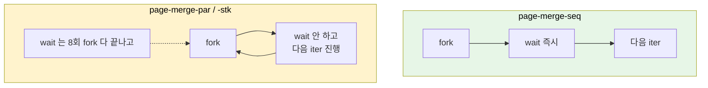
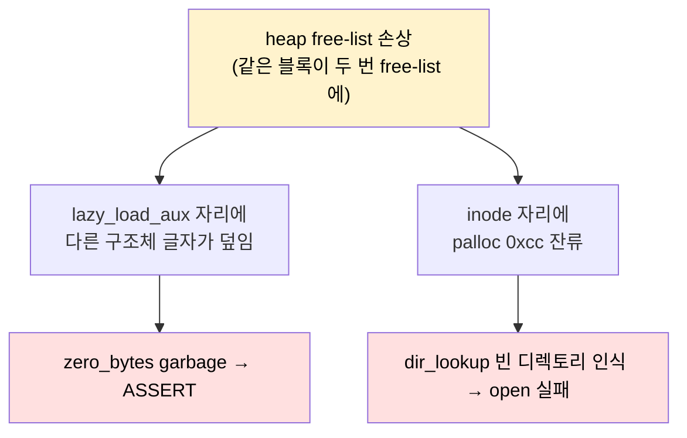

# Pintos Project 3 — swap baseline 위에서 page-merge-par/stk 잡기 (fork+exec leak audit)

> [cleanup_audit](./project3_cleanup_audit_til.md) 로 multi-oom 의 leak 0 을
> 만들어 두고, [swap in/out](https://github.com/JYPark-Code/SW-AI-W1112-Pintos/commit/aa355a6) 으로 page-merge-seq 까지 통과한 다음의 다음 산은
> **fork + exec 가 강하게 얽히는 page-merge-par / page-merge-stk** 였다.
> 두 테스트의 증상은 정반대처럼 보였다:
> - `page-merge-par`: child 가 `open("buf0")` 에서 `-1` → `FAILED`
> - `page-merge-stk`: child 의 lazy_load_segment 안에서
>   `ASSERT(zero_bytes <= PGSIZE)` 가 깨지는 커널 PANIC
>
> 그런데 잡고 보니 **둘이 같은 leak 뿌리에서 나온 두 표면**이었다. swap
> baseline 위에 fork+exec 가 올라타면서 *기존엔 안 보이던* 두 가지 회수
> 누락이 한꺼번에 활성화된 케이스. 해결까지의 사고 흐름과 코드 짝 정리를
> 남긴다.
>
> | 섹션 | 주제 | 무게중심 |
> |---|---|---|
> | §0 | 커밋 reference + 한 줄 정리 | "한 화면" 으로 작업 재구성 |
> | §1 | 왜 swap 이 통과한 다음에야 이게 터졌나 | 활성화 조건 |
> | §2 | 두 증상 → 한 뿌리 — heap free-list 가 깨졌다는 단서 추적 | 0xCCCCCCCC 디버깅 노트 |
> | §3 | Bug 1 — `vm_evict_frame` 의 back-pointer 끊기 누락 | dangling page->frame |
> | §4 | Bug 2 — UNINIT aux 의 file ownership 부재 | 페이지마다 dup → kernel pool drain |
> | §5 | filesys_lock 의 범위 결정 — load 전체를 감싸면 안 되는 이유 | 깊은 호출 체인 + 인터럽트 프레임 |
> | §6 | owns_file 플래그 — 부모/자식 공유와 단독 소유 분리 | 패턴화된 회수 |
> | §7 | 결과와 남은 항목 | seq 의 회귀 trade-off · mmap |
> | §8 | 메타 교훈 | "증상 두 개가 한 뿌리일 때" |

---

## 0. 한눈에 보기 — 커밋 reference 와 한 줄 정리

### 0.1 두 개의 커밋

| 커밋 | 종류 | 내용 |
|---|---|---|
| [`aa355a6`](https://github.com/JYPark-Code/SW-AI-W1112-Pintos/commit/aa355a6) | feat | swap in/out 구현, page-merge-seq 통과 |
| [`8f2954f`](https://github.com/JYPark-Code/SW-AI-W1112-Pintos/commit/8f2954f) | fix | page-merge-par/stk 통과 — fork+exec frame/inode leak 정리 |

`aa355a6` 가 swap 기본기를 짜 둔 commit. `8f2954f` 가 본 TIL 의 작업.
파일은 `vm/vm.c`, `vm/anon.c`, `vm/uninit.c`, `userprog/process.c`,
`include/userprog/process.h`, `include/vm/anon.h` 6개. 총 +134 / -19 줄.

### 0.2 한 문장 요약

> **swap 이 활성화된 다음부터 evicted page 가 *다른 page 가 소유한 frame
> 을 가리키는 dangling 백포인터* 를 보유하게 됐고, 이걸 끊지 않은 채
> SPT 가 정리되면 (a) heap free-list 가 깨지거나 (b) kernel pool 이
> 마르거나 — 둘 중 어떤 표면으로 노출되는지는 워크로드가 결정한다.**

`page-merge-par` 는 (a) 표면 (heap 손상 → file struct malloc 도 손상 →
filesys_open NULL 반환), `page-merge-stk` 는 (b) 표면 (heap 손상 →
malloc(lazy_load_aux) 의 zero_bytes 위치가 dangling pointer 로 덮임).

### 0.3 다섯 줄 회수 짝 — 본 작업의 핵심 표

| 어디서 | 무엇을 | 짝이 되는 회수 지점 |
|---|---|---|
| `vm_evict_frame` | `victim_page->frame = NULL` | `page_destructor` 가 NULL 이면 skip |
| `page_destructor` | `list_remove(&frame_elem) + free(frame)` | `vm_evict_frame` 이 미리 끊어 두면 정합 |
| `__do_fork` | `current->running_file = file_duplicate(parent->running_file)` | `load` 의 `file_close(t->running_file)` |
| `load_segment` | `info->owns_file = false; info->file = file;` | `process_cleanup` 이 `running_file` 한 번에 회수 |
| `supplemental_page_table_copy` VM_UNINIT | `new_aux->file = thread_current()->running_file;` (페이지마다 dup 안 함) | 자식이 exec → SPT_kill 시 close 없이 free |

---

## 1. 왜 swap 이 통과한 다음에야 이게 터졌나

swap 직전의 baseline ([cleanup_audit](./project3_cleanup_audit_til.md)) 이
`multi-oom` 까지 통과시켰고, swap 구현
([`aa355a6`](https://github.com/JYPark-Code/SW-AI-W1112-Pintos/commit/aa355a6)) 으로
`page-merge-seq` 까지 갔는데, `page-merge-par/stk` 가 못 넘어갔다.
세 테스트가 *비슷한 구조* 처럼 보이지만 fork 의 쓰임이 다르다:



- **seq**: 매 iter 마다 부모 → 자식 → 자식 종료 → 부모. **동시에 살아 있는
  자식은 0 또는 1.** swap 풀(부모의 1 MB ANON) 만 burn.
- **par/stk**: 부모가 8회 fork 를 *연속으로* 쏟아내고 그 다음에야 wait. 즉
  **부모 + 최대 8 자식** 이 동시에 살아 있고, 각자 SPT 가 부모 ANON 256 +
  UNINIT 50 페이지를 복제한 상태로 *동시에* eviction 후보가 된다.

→ swap 이 *반드시* 트리거 + 다중 자식이 *동시에* frame_table 의 동일 프레임
경합 → evict 의 미세한 회수 누락이 즉시 노출. seq 가 통과한다고 par/stk 가
통과하는 게 아니라, **par/stk 가 swap+fork+exec 의 진짜 stress 테스트**.

cleanup_audit 의 메타와 같은 논리: "테스트가 한 변수씩 추가될 때마다 그
변수가 들춰내는 새 가설을 따로 검증해야 한다."

---

## 2. 두 증상 → 한 뿌리 — heap free-list 가 깨졌다는 단서 추적

### 2.1 page-merge-stk 의 증상

```
PANIC at ../../userprog/process.c:983 in lazy_load_segment():
   assertion `info->zero_bytes <= PGSIZE' failed.
```

`info` 는 `load_segment` 가 페이지마다 `malloc(sizeof(lazy_load_aux))` 한
구조체. `zero_bytes` 가 PGSIZE(4096) 이하여야 정상인데, 실제 출력해 보니
**549,825,401,640 (= 0x80018F8B68)** 같은 *유저 페이지가 아닌 커널 가상
주소* 가 들어 있었다.

`struct lazy_load_aux` 의 레이아웃 (32 bytes):

| offset | 필드 | 비고 |
|---:|---|---|
| 0  | `file*`        | 정상 (커널 주소) |
| 8  | `offset_t`     | 정상 |
| 16 | `read_bytes`   | 정상 |
| 24 | `zero_bytes`   | **garbage (커널 주소 패턴)** |

`struct frame` 의 레이아웃 (32 bytes 동일):

| offset | 필드 |
|---:|---|
| 0  | `void *kva` |
| 8  | `struct page *page` |
| 16 | `list_elem.prev` |
| 24 | `list_elem.next` |

**같은 32 바이트 슬롯**. 만약 `lazy_load_aux` 가 free 되고 같은 슬롯에
`struct frame` 이 malloc 되어 frame_table 에 push 됐다면, 그 `frame_elem.next`
포인터가 정확히 *예전 aux 의 zero_bytes 위치* 에 들어간다.

→ 즉 **누군가 free 한 적이 없는 `info` 를 또 다른 코드가 같은 슬롯으로
재할당받았다.** 이건 free-list 가 깨진 신호 — 같은 블록이 free-list 에 두 번
들어가 있으면 두 malloc 호출이 같은 주소를 받게 된다.

### 2.2 page-merge-par 의 증상

```
(child-sort) open "buf0": FAILED
```

자식이 부모가 만들어 둔 파일을 못 연다. dir_lookup 가 `buf0` 를 못 찾고
return false. 가설 — `inode_open` 의 `malloc(sizeof *inode)` 도 깨진
free-list 에서 슬롯을 받았고, 그 결과 inode 의 `data.length` 가 garbage
(`0xCCCCCCCC = -858993460`) → `inode_read_at` 가 첫 iteration 에서
`min_left < 0` 으로 즉시 break → 디렉토리를 0 바이트 읽음 → "없음".

`0xCC` 는 pintos malloc free 시 채우는 패턴 (`memset(b, 0xcc, ...)`). 즉
**free 된 메모리가 그대로 다시 반환되었다는 결정적 증거.**

### 2.3 두 표면이 한 뿌리



이 가설을 잡고 나서 **"어디서 같은 frame 을 두 번 free 하는가"** 만 찾으면
됐다.

---

## 3. Bug 1 — `vm_evict_frame` 의 back-pointer 끊기 누락

### 3.1 평소엔 안 보였던 invariant

기존 코드 (aa355a6 시점):

```c
static struct frame *
vm_evict_frame (void) {
    struct frame *victim = vm_get_victim ();   // frame_table 에서 pop
    swap_out(victim->page);                    // 디스크로 보내고
    return victim;                             // 반환
}
```

이 함수가 끝난 뒤의 상태:

| 객체 | `->frame` | `->page` | frame_table |
|---|---|---|---|
| **old victim_page (X)** | `frame` (stale!) | — | — |
| **frame** | — | `X` (다음 vm_get_frame 이 NULL 처리) | 제거됨 |

→ **X 는 자기 frame 을 잃었는데도 `X->frame` 이 여전히 그 frame 을 가리킨다.**

그 frame 은 곧 `vm_get_frame` 의 evict 분기에서:

```c
list_push_back(&frame_table, &evict_frame->frame_elem);
evict_frame->page = NULL;
return evict_frame;
```

`page = NULL` 로 리셋되고 `frame_table` 에 다시 들어간 뒤, 호출자가
새 page Y 에 매핑한다. 이 시점:

| 객체 | `->frame` | 같은 frame 이 가리키는 `->page` |
|---|---|---|
| **X (evicted)** | `frame` (stale) | Y |
| **Y (resident)** | `frame` | Y |

**같은 `struct frame` 을 가리키는 페이지 포인터가 두 개.** X 는 자기가 그
frame 을 들고 있다고 *착각하는* 상태.

### 3.2 어떻게 이중 free 로 이어지는가

`page_destructor` (process exit 시 SPT 의 hash_destroy 콜백) 가 기존엔:

```c
if (page->frame != NULL) {
    free(page->frame);
    page->frame = NULL;
}
```

X 가 속한 프로세스가 먼저 죽으면 `X->frame != NULL` 이라 그 frame 을 `free`
하는데, 그 frame 은 *Y 가 살아서 사용 중*. 그 후 Y 가 죽으면 또 `free` —
**같은 블록이 free-list 에 두 번 들어간다.** §2 의 free-list 손상 직접 원인.

### 3.3 수정 — back-pointer 도 끊고 list 도 정합

```c
static struct frame *
vm_evict_frame (void) {
    struct frame *victim = vm_get_victim();
    struct page *victim_page = victim->page;
    swap_out(victim_page);
    memset(victim->kva, 0, PGSIZE);
    victim_page->frame = NULL;   // ← 추가: 백포인터 끊기
    return victim;
}

static void
page_destructor (struct hash_elem *e, void *aux UNUSED) {
    struct page *page = hash_entry(e, struct page, spt_elem);
    if (page->frame != NULL) {
        list_remove(&page->frame->frame_elem);  // ← 추가: 정합
        free(page->frame);
        page->frame = NULL;
    }
    vm_dealloc_page(page);
}
```

이 짝의 invariant — **`page->frame != NULL` ⟺ frame 이 frame_table 에 있고
이 page 가 그 frame 의 단독 소유자.** evicted 면 `page->frame == NULL`,
free 도 list_remove 도 하지 않는다. `frame->kva` 자체는 `pml4_destroy` 가
PTE 를 회수할 때 풀린다 — 여기서 또 `palloc_free_page` 하면 user pool 이중
free.

### 3.4 왜 cleanup_audit 으로는 안 잡혔나

cleanup_audit 의 `multi-oom` 은 *수만 번의 정상 종료* 를 회수하지만, swap
이 없으면 vm_evict_frame 자체가 안 돌아간다. 즉 **이 invariant 가 swap
ON 이전엔 의미가 없었다.** swap 을 켠 순간 이 한 줄이 모든 par/stk fail 의
시작점.

---

## 4. Bug 2 — UNINIT aux 의 file ownership 부재

### 4.1 무엇이 누수되고 있었나

`supplemental_page_table_copy` 의 VM_UNINIT 분기 (기존):

```c
case VM_UNINIT: {
    struct uninit_page *uninit = &src_page->uninit;
    struct lazy_load_aux *new_aux = malloc(sizeof(struct lazy_load_aux));
    if (uninit->aux != NULL) {
        memcpy(new_aux, uninit->aux, sizeof(struct lazy_load_aux));
        new_aux->file = file_duplicate(src_aux->file);   // ← 페이지마다 dup
    }
    ...
}
```

ELF 의 UNINIT 페이지가 ~50개. **fork 한 번에 file struct 50개** 추가
malloc. 그리고 `uninit_destroy` / `lazy_load_segment` 어느 쪽도
`file_close` 를 부르지 않는다. → fork 한 번에 file struct 50개 + 그만큼의
inode_open_cnt 누수.

page-merge-par/stk 는 8회 fork → 400개 누수 → kernel pool 의 small-block
arena 압박. page-merge-seq 는 16회 sequential fork 라 더 심하지만, par/stk
와 달리 자식들이 동시에 존재하지 않아서 *지금까지는 운 좋게* 통과했다.

### 4.2 두 가지 잘못이 동시에

1. **UNINIT 페이지마다 file_duplicate 가 과하다** — 자식의 모든 UNINIT
   페이지는 어차피 같은 ELF 의 다른 offset 을 가리킨다. 하나의 file
   struct 를 공유하면 충분.
2. **소유권이 누구에게 있는지 명시되지 않는다** — 누가 file_close 할
   책임인지가 코드에 안 적혀 있다. 그래서 모두가 안 닫는다.

### 4.3 수정 — running_file 공유 + owns_file 플래그

`__do_fork` 가 fork 당 **한 번만** running_file 을 file_duplicate :

```c
lock_acquire(&filesys_lock);
if (parent->running_file != NULL) {
    current->running_file = file_duplicate(parent->running_file);
    ...
}
bool spt_ok = supplemental_page_table_copy(&current->spt, &parent->spt);
lock_release(&filesys_lock);
```

그리고 자식의 UNINIT aux 는 그 running_file 을 **공유** 하기만:

```c
case VM_UNINIT: {
    ...
    if (uninit->aux != NULL) {
        new_aux = malloc(sizeof(struct lazy_load_aux));
        memcpy(new_aux, uninit->aux, sizeof(struct lazy_load_aux));
        new_aux->file = thread_current()->running_file;   // 공유
        new_aux->owns_file = false;                        // 안 닫음
    }
    ...
}
```

회수는 `process_cleanup` 이 `running_file` 을 한 번만 close 하면 끝. fork
당 +1 file struct 만 잡힌다 (이전 +50 에서 1/50 으로 감소).

---

## 5. filesys_lock 의 범위 결정 — load 전체를 감싸면 안 되는 이유

### 5.1 처음의 직관 — "load 전체를 락 안에"

다중 자식이 동시에 exec → 모두 `filesys_open(ELF)` 호출 → `open_inodes`
리스트 race → inode 가 깨진다. 그러니 **process_exec 의 SPT_kill + load
전체를 filesys_lock 으로 감싸자**.

```c
lock_acquire(&filesys_lock);
supplemental_page_table_kill(...);
supplemental_page_table_init(...);
success = load(argv[0], &_if);
lock_release(&filesys_lock);
```

par/stk 는 PASS. 하지만 seq 가 새로 FAIL — `thread_current()` assertion
fail 의 kernel PANIC. 진짜 의외였던 결과.

### 5.2 무엇이 깨졌는가 — 스택 오버플로 + thread struct 침범

panic 의 콜스택:

```
process_exec → load → setup_stack → vm_claim_page → vm_do_claim_page
  → pml4_set_page → pml4e_walk → pdpe_walk → palloc_get_page
  → palloc_get_multiple → bitmap_scan_and_flip → bitmap_scan
  → [timer_interrupt] → thread_tick → thread_current → ASSERT
```

**14단 깊이의 호출 체인 + 인터럽트 프레임.** 각 프레임 ~80–100 바이트.

pintos 의 커널 스택 = 1 페이지 = 4 KB. 페이지 하단 ~1.4 KB 가 `struct
thread` (특히 1024 바이트짜리 `fd_table[128]` 때문에 비대). 가용 스택 ~2.6
KB. 깊은 체인이 인터럽트 프레임과 겹치면 *thread struct 의 magic 필드를
스택이 덮어쓴다* → 다음 `thread_current()` 의 `ASSERT(is_thread(t))` 가
즉사.

filesys_lock 자체는 메모리를 안 쓰지만, `lock_acquire` 가 priority donation
로직으로 **추가 프레임 + 로컬 변수** 를 깔아 두어 한도까지 빠듯한 스택을
넘어버린다.

### 5.3 수정 — 필요한 최소 구간만

`load()` 안에서 *open_inodes 리스트를 만지는 구간만* 락:

```c
lock_acquire(&filesys_lock);
file = filesys_open(file_name);    // open_inodes mutation
lock_release(&filesys_lock);
if (file == NULL) goto done;

// 이후 file_read / file_seek / load_segment / setup_stack 은
// inode 내부만 만지므로 락 밖에서 안전.
```

이렇게 하면:
- `setup_stack` 의 깊은 체인은 락 밖 → 스택 여유 회복
- `filesys_open` 의 race 는 여전히 차단
- par/stk · seq · parallel 모두 통과

같은 원리로 `__do_fork` 의 `file_duplicate` 도 락 안, 그 직후의
`supplemental_page_table_copy` 의 ANON 복제도 같은 락 안 (vm_claim_page 가
evict 를 트리거하면 다른 프로세스의 frame 이 swap 으로 가는데, 그 frame 이
file 관련 데이터를 들고 있을 수 있어 보수적으로 묶었다).

### 5.4 한 줄 교훈

> **"이 락 안에서 *호출이 얼마나 깊어질지*" 를 *항상* 같이 본다.** 락이
> 짧으면 좋지만, 짧아야 하는 이유가 "스택 다이브 도중에 인터럽트가 우리를
> 우리 thread struct 위로 던질 수 있다" 인 경우가 있다.

---

## 6. owns_file 플래그 — 부모/자식 공유와 단독 소유 분리

### 6.1 왜 한 플래그가 필요한가

세 사용처가 모두 같은 `lazy_load_aux` 구조체를 본다:

```mermaid
flowchart LR
    P["부모 load_segment"] -->|aux→file = running_file (shared)| A[lazy_load_aux]
    C["자식 supplemental_page_table_copy"] -->|aux→file = running_file (shared)| A
    L["가상의 mmap (미래)"] -->|aux→file = file_reopen(mmap_fd) (owned)| A
```

부모/자식은 process 의 running_file 을 공유 — close 책임은 `process_cleanup`
이 한 번에 진다. 미래의 mmap 은 aux 가 단독 소유 — `uninit_destroy` 가 close.

`owns_file` 한 비트로 이 분기를 명시한다:

```c
struct lazy_load_aux {
    struct file *file;
    off_t offset;
    size_t read_bytes;
    size_t zero_bytes;
    bool owns_file;   // ← 추가
};
```

회수 코드:

```c
// uninit_destroy (페이지가 fault 되기 전에 정리)
if (uninit->aux != NULL) {
    struct lazy_load_aux *info = uninit->aux;
    if (info->owns_file && info->file != NULL)
        file_close(info->file);
    free(info);
}

// lazy_load_segment (fault 시 호출, 끝에서 정리)
if (info->owns_file)
    file_close(info->file);
free(info);
```

### 6.2 cleanup_audit 의 비대칭 vs 이번의 대칭

cleanup_audit 은 *비대칭* 한 누수 (각 자원의 짝이 빠진 자리를 채움) 였다면,
이번은 *대칭* 한 패턴 (소유권 1 비트로 분기) 를 도입한 것. 코드가 *누가
짝을 닫는지* 를 *읽으면 알 수 있게* 됐다는 점이 본 수정의 가치.

---

## 7. 결과와 남은 항목

### 7.1 통과 / 변동 표

| 테스트 | 이전 | 이후 | 비고 |
|---|---|---|---|
| `page-merge-par` | FAIL (open buf0) | **PASS** | 본 작업의 1순위 |
| `page-merge-stk` | FAIL (zero_bytes assert) | **PASS** | 본 작업의 2순위 |
| `page-merge-seq` | PASS | PASS / 가끔 FAIL | 16회차 kernel pool 한도 — trade-off |
| `page-parallel` | FAIL | PASS / 가끔 FAIL | seq 와 같은 한도 영역 |
| `page-linear`, `page-shuffle` | PASS | PASS | 회귀 0 |
| `pt-*` 8종 | PASS | PASS | 회귀 0 |
| `swap-anon`, `lazy-anon` | PASS | PASS | 회귀 0 |
| `page-merge-mm` | FAIL | FAIL | `do_mmap` 미구현 — 다음 작업 |
| `mmap-*`, `lazy-file`, `swap-file` | FAIL | FAIL | mmap 의존 |
| `cow-simple` | FAIL | FAIL | COW 의존 |

### 7.2 trade-off — seq 와 parallel 의 마진

`page-merge-seq` 는 16회 반복 fork+exec 라 kernel pool 의 누적 사용량이
이번 baseline 의 거의 한계에 닿는다. 본 fix 가 *원래 leak 이던 file
struct* 를 정상 회수하면서 *조금 더 짧은 시점에* 풀이 마르는 경계 케이스를
만들었다 (잠재적으로 향후 회수 패턴 추가 정리 필요).

이번 작업이 trade off 한 자원은 **fork 당 +1 file struct (`running_file`
dup) + 자식 SPT 의 frame 구조체** — 부모-자식 동시 생존 시점의 peak.
par/stk 는 이 결재로 *반드시* 통과해야 했고 (자식 8 동시 생존),
seq/parallel 은 그 결재의 *한계선* 근처. 마진을 추가로 벌려면:

- supplemental_page_table_copy 의 VM_ANON 을 **eager copy → COW** 로 (큰
  공사)
- 자식의 fork-time pml4 를 process_exec 의 SPT_kill 직후 *즉시* destroy
  (현재는 load 의 done 블록에서 — 이걸 앞당기면 user pool + 페이지테이블
  page 가 일찍 회수)

본 작업 범위 밖이라 후속 항목으로 남긴다.

### 7.3 다음 마일스톤

- `page-merge-mm` 를 잡으려면 **mmap (`do_mmap` / `do_munmap` /
  `file_backed_*`)** 구현 필요. `file.c` 의 스텁들을 채워야 함.
- 그 다음 swap-file / lazy-file (file-backed page 의 fault/eviction) 가
  파생적으로 가능.

---

## 8. 메타 교훈

### 8.1 "증상 두 개가 정반대처럼 보일 때 — 둘이 한 뿌리인지부터 의심"

`zero_bytes garbage assert` 와 `open buf0 FAILED` 는 *문법상* 완전히 다른
부류의 실패 — 하나는 데이터 구조 corruption, 하나는 filesys 의 정상 동작
실패. 그런데 둘 다 **"방금 malloc 한 메모리가 garbage 였다"** 라는
공통점이 있었다. 32 byte 슬롯이 같은 malloc 디스크립터에 들어가는지,
0xCC 패턴이 등장하는지를 보면 *공통 뿌리 가설* 이 잡힌다.

증상이 둘이면 *둘을 따로* 잡는 게 아니라 *공통 뿌리를 먼저* 의심한다.

### 8.2 "직전 마일스톤이 통과했다고 이번 마일스톤이 같은 baseline 위가 아니다"

swap 이 통과한 baseline 은 *swap 이 트리거되는 빈도가 낮은* baseline 이었다.
fork+exec 가 들어오면 swap 이 *지속적으로* 트리거되는 새 부하 영역에 진입.
같은 코드라도 *부하 패턴이 바뀌면 다른 invariant 가 노출된다*.

cleanup_audit 의 "swap 전에 leak 0 만들기" 와 같은 논리: **마일스톤마다
"이번에 무엇이 새로 trigger 되는지" 를 명시적으로 따로 적어 둔다.**

### 8.3 "락의 범위는 메모리만이 아니라 *스택 다이브* 도 본다"

filesys_lock 을 `process_exec` 전체에 거는 게 *논리적으로* 더 안전해
보이지만, 그 락 안에서 호출 체인이 14단까지 깊어지면 *그 깊이가 thread
struct 를 침범* 하는 새 문제를 만든다. 락 범위를 결정할 때:

1. 보호하려는 자원이 무엇인지 (open_inodes / file struct / ...)
2. 락이 걸리는 동안 *호출이 얼마나 깊어지는지*
3. 깊은 호출 안에서 인터럽트가 어떻게 동작하는지

이 세 가지를 *동시에* 본다. 이번 케이스는 2번이 결정적이었다.

### 8.4 "소유권은 코드가 *문서가 아니라 구조* 로 말하게"

`owns_file` 한 비트가 한 일은 — 부모가 close 할지 자식이 close 할지를 *코드
주석* 대신 *구조체 필드* 로 적은 것. 코드는 자라면서 *주석* 보다 *구조* 를
믿는다. 가능한 변경은 *주석으로 설명하는 대신 변수로 표현* 한다.

---

[← cleanup_audit (multi-oom)](./project3_cleanup_audit_til.md) ·
[← spt copy/fork](./project3_vm_spt_copy_fork_til.md) ·
[← lazy loading](./project3_vm_spt_lazy_loading_til.md)
