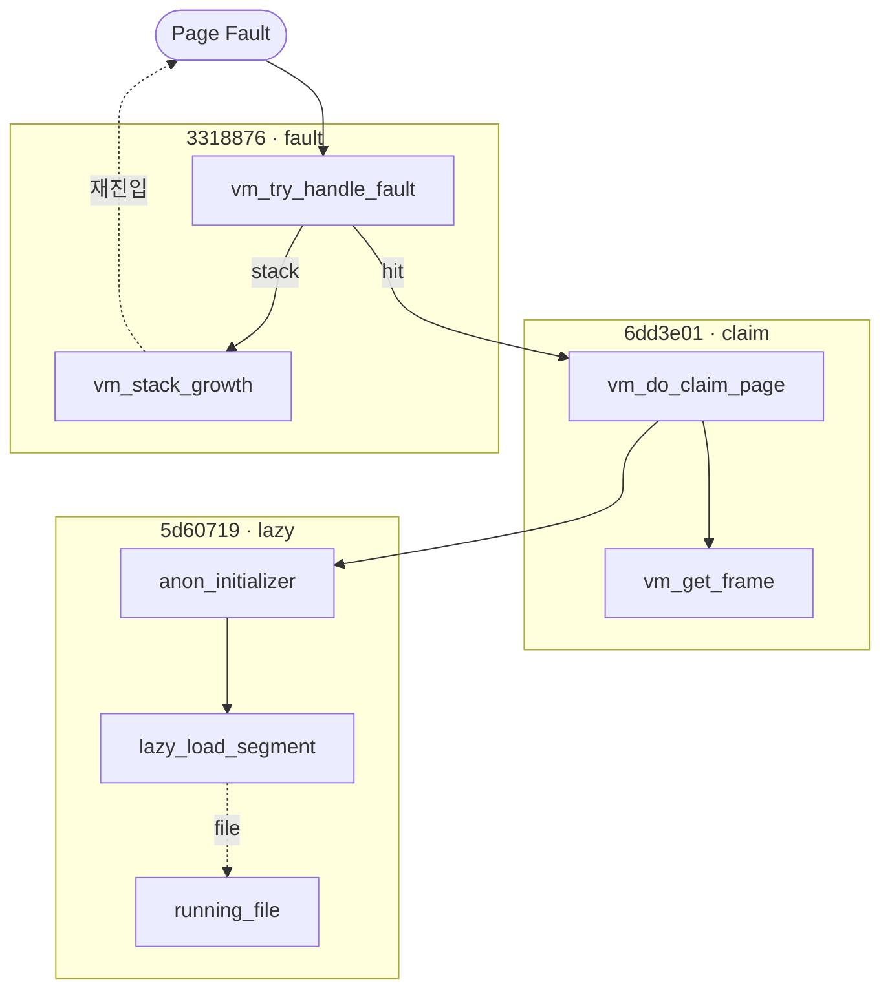

# Pintos Project 3 — Page Fault 처리와 Lazy Loading 동작 경로 완성

> KAIST 64bit Pintos Project 3 — Virtual Memory 두 번째 단계 회고.
> 어제까지 SPT 해시테이블과 `spt_find_page` 까지 만들어 두었고,
> 오늘 드디어 **page fault 를 받아 실제로 페이지를 올려놓는 흐름**을 끝까지
> 잇는 작업을 했다. `lazy_load_segment` → `vm_try_handle_fault` →
> `vm_do_claim_page` 까지 한 줄로 연결됐고, stack growth 도 같이 붙였다.
> 흐름 자체보다도, 모든 테스트가 통째로 실패하던 **두 개의 미묘한 버그**
> 를 잡는 과정에서 더 많이 배웠다.
>
> | 섹션 | 주제 | 무게중심 |
> |---|---|---|
> | §1 | 오늘 한 작업 요약 | 커밋 3개가 만든 변화 + 통과한 테스트 |
> | §2 | 흐름 전체 그림 | "등록 → fault → 매핑 → 로드" 한 장면 |
> | §3 | `lazy_load_segment` 구현 | aux 구조체, file_seek/read, zero fill |
> | §4 | `load_segment` 의 aux 전달 패턴 | 함수 포인터 + 클로저 흉내 |
> | §5 | `vm_try_handle_fault` — 분기 설계 | "lazy load 인가, 스택 확장인가, 진짜 사망인가" |
> | §6 | `setup_stack` — 스택만 eager 인 이유 | 첫 push 가 fault 안 나야 한다 |
> | §6.5 | `page->writable` — 언제 정해지고 어디서 쓰이는가 | 호출자가 한 번 박는 값, 스택은 항상 true |
> | §7 | 버그 1: `file_close` 타이밍 — **모든 테스트가 실패하던 근본 원인** | lazy 와 자원 수명의 충돌 |
> | §8 | 버그 2: `anon_initializer` 의 누락된 `return true` | `&&` 단락평가가 lazy_load 를 통째로 건너뛴다 |
> | §9 | `uint8_t *` 캐스팅 한 줄 — 포인터 산술의 형식적 규칙 | `void *` 산술이 왜 금지인가 |
> | §10 | 핵심 깨달음 정리 | 한 줄 요약 모음 |
> | §11 | 다음에 할 일 | SPT 복제, exit(-1) 보완, swap |

---

## 1. 오늘 한 작업 요약

오늘 세 번에 나눠 커밋했다. 각 단계마다 의도적으로 끊은 이유가 있다.

| # | 커밋 | 한 일 |
|---|---|---|
| 1 | [`6dd3e01`](../../../commit/6dd3e01) — *vm_get_frame, vm_do_claim_page, vm_claim_page 구현* | 물리 프레임 확보 + frame/page 양방향 연결 + pml4 등록. **즉시 매핑** 경로의 베이스. |
| 2 | [`3318876`](../../../commit/3318876) — *vm_try_handle_fault 및 vm_stack_growth 구현* | fault handler 의 분기 설계. SPT 조회 후 lazy 호출, 없으면 스택 확장 휴리스틱. |
| 3 | [`5d60719`](../../../commit/5d60719) — *lazy loading, page fault 처리, stack growth 구현* | `lazy_load_segment` 본체, `load_segment` 의 aux 전달, `setup_stack` 의 eager 매핑, 그리고 **버그 두 개** (file_close 분리, anon_initializer return) 수정. |

### 1.1 통과한 테스트

```
pass tests/vm/pt-grow-stack       ← 스택 확장
pass tests/vm/pt-big-stk-obj      ← 큰 스택 객체 (다중 페이지 확장)
pass tests/vm/pt-bad-read         ← 잘못된 주소 page fault → 종료
pass tests/vm/page-linear         ← 선형 lazy loading
pass tests/vm/page-shuffle        ← 무작위 순서 lazy loading
```

- `pt-bad-read` 가 **page fault 분기의 부정 경로**를 검증 (NULL/커널 주소 →
  fault handler 가 false 반환 → 프로세스 종료).
- `page-linear`, `page-shuffle` 이 lazy load 의 핵심 정상 경로.
- `pt-grow-stack` / `pt-big-stk-obj` 가 스택 확장 휴리스틱 검증.

### 1.2 변경 파일 한눈에

```
pintos/vm/vm.c                    ← vm_get_frame, vm_do_claim_page,
                                     vm_claim_page, vm_try_handle_fault,
                                     vm_stack_growth, page->writable 저장
pintos/userprog/process.c         ← lazy_load_segment, load_segment(aux),
                                     setup_stack, file_close 분리,
                                     running_file 도입
pintos/vm/anon.c                  ← anon_initializer return true
pintos/include/vm/vm.h            ← page->writable 필드
pintos/include/threads/thread.h   ← thread->running_file 필드
pintos/threads/thread.c           ← running_file = NULL 초기화
```

### 1.3 세 커밋의 흐름 도식



- **C1** 매핑 베이스, **C2** fault 분류기, **C3** lazy 실체 + 버그 수정.
- `G → PF` 점선은 *재진입*: vm_stack_growth 는 alloc 만, 다음 fault 에서
  claim.
- setup_stack(C3) 은 프로세스 시작 시 한 번 eager 로 claim — 위 경로와 분리.

---

## 2. 흐름 전체 그림

이 한 장이 오늘 머릿속에 깔끔하게 그려진 게 가장 큰 수확이다.

```
[ELF 로딩 시점 — load_segment]
   │
   │ vm_alloc_page_with_initializer(VM_ANON, upage, ...,
   │     lazy_load_segment, aux={file, ofs, read, zero})
   │     └─ uninit_new() 가 init 와 aux 만 page 안에 저장
   │     └─ spt_insert_page()  ← SPT 에만 등록, 물리 프레임/매핑 없음
   │
   ▼ (return from load_segment, 프로세스 실행 시작)
   │
   │ 프로세스가 코드/데이터 페이지의 첫 바이트 접근
   │     예) mov rax, [code_base]
   │
   ▼
[page fault — exception.c → vm_try_handle_fault]
   │
   ├─ NULL? 커널 주소? → return false (kill)
   ├─ not_present 아님? (RW 위반) → return false
   ├─ spt_find_page(addr)
   │     │
   │     ├─ 있음  ─────────────┐
   │     │                     │
   │     └─ 없음               │
   │          │                │
   │          └─ addr >= rsp-8 │  ← 스택 확장 휴리스틱
   │               │           │
   │               ├─ yes      │
   │               │   vm_stack_growth(addr) ← VM_ANON|VM_MARKER_0 alloc
   │               │   return true
   │               │           │
   │               └─ no → return false (kill)
   │                           │
   ▼                           ▼
[vm_do_claim_page]
   │
   ├─ vm_get_frame() ── palloc_get_page(PAL_USER)
   ├─ frame ↔ page 양방향 연결
   ├─ pml4_set_page(pml4, page->va, frame->kva, page->writable)
   │
   └─ swap_in(page, kva)
        │
        └─ page->operations->swap_in
            = uninit_initialize  (page 가 아직 UNINIT 이므로)
              │
              ├─ page_initializer(page, type, kva)  ← anon_initializer
              │     └─ page->operations = &anon_ops 로 transmute
              │
              └─ init(page, aux)                    ← lazy_load_segment
                    └─ file_seek + file_read + memset
```

**한 줄로 요약**: page fault 가 lazy 의 트리거고, `uninit_initialize` 가
**초기화(type 결정)** 와 **로드(파일 읽기)** 를 한 줄에서 두 함수 호출로
끝낸다.

### 2.1 transmute — 한 객체가 타입을 바꾼다

`uninit_initialize` 안에서 `page->operations` 가 `&uninit_ops` 에서
`&anon_ops` 로 바뀐다. 다음 page fault 부터는 같은 `struct page` 인데도
`swap_in` 이 더 이상 `uninit_initialize` 가 아니다 — 그래서 lazy load 는
**최초 한 번만** 동작한다.

객체 동일성은 유지하면서 vtable 만 갈아끼우는 패턴. 어제 §4 에서 본 "함수
포인터 = 실행을 미루는 도구" 의 두 번째 활용이다 (한 번 더 미루는 게 아니라,
**누가 호출되는지** 를 런타임에 바꿔치기).

---

## 3. `lazy_load_segment` 구현

이게 lazy 의 *실체* 다. fault 가 났을 때 진짜로 디스크를 읽어 frame 의
kernel virtual address 에 채우는 함수.

### 3.1 코드

```c
struct lazy_load_aux {
    struct file *file;
    off_t        offset;
    size_t       read_bytes;
    size_t       zero_bytes;
};

static bool
lazy_load_segment (struct page *page, void *aux) {
    struct lazy_load_aux *info = (struct lazy_load_aux *) aux;

    file_seek(info->file, info->offset);
    off_t target = file_read(info->file, page->frame->kva, info->read_bytes);
    if (target != info->read_bytes)
        return false;

    memset((uint8_t *)page->frame->kva + info->read_bytes,
           0, info->zero_bytes);

    free(info);
    return true;
}
```

### 3.2 네 줄의 의미

| 줄 | 역할 |
|---|---|
| `file_seek(info->file, info->offset)` | 같은 `struct file*` 을 여러 페이지가 공유하므로 매번 offset 을 새로 맞춘다 (공유 cursor 의 함정) |
| `file_read(..., page->frame->kva, ...)` | **kva 로 쓴다.** 이 시점에 user va 는 아직 pml4 매핑 전. `vm_do_claim_page` 가 매핑 직후 `swap_in` 을 호출하므로 frame 은 이미 잡혀 있다. |
| `memset(... + read_bytes, 0, zero_bytes)` | ELF 의 BSS 영역. 파일에는 없지만 메모리에 0 으로 존재해야 하는 바이트. |
| `free(info)` | 1회용 aux. lazy_load 가 한 번만 호출되므로 그 자리에서 free. |

### 3.3 왜 `kva` 로 쓰고 `va` 로 안 쓰나

호출 순서가 핵심이다.

```c
/* vm_do_claim_page 안 */
pml4_set_page(..., page->va, frame->kva, page->writable);   // ① 매핑 등록
swap_in(page, frame->kva);                                  // ② lazy_load 호출
```

`pml4_set_page` 가 먼저 성공한 뒤이므로 **사실은 user va 로 써도 동작은
한다.** 그런데 관습적으로 kva 로 쓰는 이유:

- frame 의 kernel-side 별칭(kva)이 더 명시적이고, 매핑이 깨진 상태에서도
  안전.
- swap-in 일반화 시 (현재 process 가 아닌 다른 process 의 페이지를 채울
  수도 있는 가능성을 열어두면), 다른 process 의 user va 로는 못 쓰고
  자기 pml4 의 kva 가 유일한 통로.

지금은 동치이지만 **확장성 있는 선택**이다.

### 3.4 `target != read_bytes` 일 때 false 의 의미

ELF 가 거짓말을 했거나 파일이 도중에 잘려 있는 상황. 이걸 false 로
돌려주면 `uninit_initialize` 가 false 를 반환하고, `swap_in` 도 false 를
반환하고, `vm_do_claim_page` 도 false 를 반환해 결국 `vm_try_handle_fault`
가 false → 프로세스 종료. **에러가 한 줄로 전파된다.**

---

## 4. `load_segment` 의 aux 전달 패턴

```c
while (read_bytes > 0 || zero_bytes > 0) {
    size_t page_read_bytes = read_bytes < PGSIZE ? read_bytes : PGSIZE;
    size_t page_zero_bytes = PGSIZE - page_read_bytes;

    struct lazy_load_aux *info = malloc(sizeof(struct lazy_load_aux));
    info->file       = file;
    info->offset     = ofs;
    info->read_bytes = page_read_bytes;
    info->zero_bytes = page_zero_bytes;

    if (!vm_alloc_page_with_initializer(VM_ANON, upage,
                                        writable, lazy_load_segment, info))
        return false;

    read_bytes -= page_read_bytes;
    zero_bytes -= page_zero_bytes;
    upage += PGSIZE;
    ofs   += page_read_bytes;   /* ← 빼먹기 쉬운 줄 */
}
```

### 4.1 페이지마다 *새로운* malloc 인 이유

처음엔 "어차피 같은 file 인데 한 번만 만들면 되지 않나" 싶었다. 안 된다.

- 페이지마다 `offset`, `read_bytes`, `zero_bytes` **세 필드가 다르다.**
- aux 는 `vm_alloc_page_with_initializer` → `uninit_new` 안에서 page 에
  포인터로 저장된다. 만약 같은 객체를 공유시키면, 그 다음 루프 이터레이션
  이 필드를 덮어써서 **앞에서 등록된 page 가 가지고 있던 aux 도 같이 바뀐다.**

이건 함수 포인터 + aux 가 **C 에서 클로저를 흉내내는 방식**이라서 그렇다.
JavaScript 처럼 free variable 을 자동 캡처해주지 않으므로, 우리가 **각
호출마다 캡처할 데이터를 직접 힙에 박제**해야 한다.

> **메타 교훈**: C 에서 "함수 + aux" 쌍을 볼 때마다 "이건 클로저다,
> 캡처 본체는 누가 소유하지?" 를 물어봐야 한다. 오늘은 lazy_load 가
> 1회용이라 `free(info)` 가 그 자리에 들어갔지만, 여러 번 호출되는 콜백
> 이라면 소유권 규약이 더 까다로워진다.

### 4.2 `ofs += page_read_bytes` 의 함정

빼먹으면 모든 페이지가 파일의 같은 위치를 읽게 된다. 더 나쁜 건 컴파일
경고도, 즉각 panic 도 없고, 그저 **테스트가 조용히 실패할 뿐**이라는
점이다. 처음에 한참 헤맸다.

루프 끝에서 갱신해야 할 변수가 `read_bytes`, `zero_bytes`, `upage`, `ofs`
이렇게 **네 개**. 셋만 갱신하기 쉽다. 페이지 단위 루프를 짤 때 항상
"갱신 변수 체크리스트" 를 머릿속에 두자.

---

## 5. `vm_try_handle_fault` — 분기 설계

이 함수가 **page fault 의 의미를 결정**한다. 같은 fault 가:

- lazy load 의 자연스러운 트리거일 수도 있고
- 스택을 더 늘려야 한다는 신호일 수도 있고
- 진짜 잘못된 접근이라 프로세스를 죽여야 할 수도 있다.

### 5.1 코드

```c
bool
vm_try_handle_fault (struct intr_frame *f, void *addr,
                     bool user, bool write, bool not_present) {
    struct supplemental_page_table *spt = &thread_current ()->spt;
    struct page *page = NULL;

    /* 1. 명백한 잘못 */
    if (addr == NULL || is_kernel_vaddr(addr))
        return false;

    /* 2. read-only 페이지에 write 한 protection fault — 처리 안 함 */
    if (!not_present)
        return false;

    /* 3. SPT 조회 */
    void *rsp = (void *)f->rsp;
    page = spt_find_page(spt, addr);

    /* 4. SPT 에 없는데 스택 확장 범위 안인가? */
    if (page == NULL && addr >= (void *)((uintptr_t)rsp - 8)) {
        vm_stack_growth(addr);
        return true;
    }

    /* 5. SPT 에도 없고 스택 범위도 아니면 진짜 잘못된 접근 */
    if (page == NULL)
        return false;

    /* 6. 정상 lazy load */
    return vm_do_claim_page (page);
}
```

### 5.2 분기 순서가 중요한 이유

| 순서 | 분기 | 빼먹으면 |
|---|---|---|
| ① | NULL / kernel addr | 커널 영역까지 SPT 조회 → 의미 없는 매핑 시도 |
| ② | `!not_present` (RW 위반) | 읽기전용 페이지에 쓴 걸 lazy load 케이스로 오인해 무한 fault |
| ③ | `spt_find_page` | — |
| ④ | 스택 확장 휴리스틱 | `pt-grow-stack` 실패 |
| ⑤ | 진짜 seg fault | `pt-bad-read` 실패 |

특히 **②가 빠지면 protection fault 가 정상 fault 와 섞여서 디버깅이
지옥** 이다. `not_present` 비트는 CPU 가 알려주는 "이 fault 의 본질" 인데,
이걸 안 보면 같은 페이지가 영원히 fault 를 일으킨다.

### 5.3 `addr >= rsp - 8` 의 8 바이트가 의미하는 것

`push` 명령은 rsp 를 8 감소시키고 그 자리에 값을 쓴다. 즉:

```
실행 직전 rsp  = 0x7FFFFFE000
push 명령:
  rsp ← rsp - 8 = 0x7FFFFFDFF8
  *rsp ← value
```

이 push 가 **현재 스택 페이지 밖** (예: 0x7FFFFFD000 페이지) 으로 떨어지면
fault 가 발생하는데, 이때 fault 주소 `addr` 는 `rsp - 8` 이다. 즉
"fault 주소가 rsp - 8 이상" 이면 **합법적인 push 가 일으킨 fault** 라고
판단할 수 있다.

```
rsp - 8 ≤ addr   →   허용 (스택 확장)
addr < rsp - 8   →   거부 (스택 아래쪽 깊은 곳 접근, 명백한 버그)
```

이 휴리스틱이 정확하지는 않다 (다른 함수 진입 시 한 번에 더 많이 깎는
경우 — `sub rsp, 32` 같은 — 가 있어서, x86-64 표준은 더 큰 여유를 두는
편). 하지만 `pt-grow-stack` 류 테스트는 이걸로 통과한다.

> **메타 교훈**: 휴리스틱은 "테스트 통과를 목적으로 한 근사" 다. 정확성을
> 추구하면 끝이 없으니, **테스트가 보장하는 범위만큼**의 정확도로 짜고
> 넘어가는 게 옳다. 완벽주의는 P3 진도를 잡아먹는다.

### 5.4 user 플래그를 안 쓴 이유

전형적인 솔루션은 `user || rsp > USER_STACK_LIMIT` 같은 추가 검증을 한다.
오늘 통과한 테스트들은 그게 없어도 통과하길래 일단 단순한 버전으로 두었다.
나중에 syscall 안에서 발생하는 fault (`user == false` 인 경우, rsp 는
커널 스택을 가리키므로 사용자 rsp 를 별도로 보관해야 함) 를 다뤄야 할 때
다시 손볼 것.

---

## 6. `setup_stack` — 스택만 eager 인 이유

```c
static bool
setup_stack (struct intr_frame *if_) {
    bool success = false;
    void *stack_bottom = (void *) (((uint8_t *) USER_STACK) - PGSIZE);

    vm_alloc_page(VM_ANON | VM_MARKER_0, stack_bottom, true);

    if (vm_claim_page(stack_bottom)) {
        success = true;
        if_->rsp = (uint8_t *) USER_STACK;
    }
    return success;
}
```

### 6.1 왜 `vm_claim_page` 를 즉시 부르나

다른 모든 페이지는 lazy 인데 스택의 첫 페이지만 eager 다. 이유는 직관적:

- ELF 로딩 직후, 프로세스가 처음 하는 일 중 하나가 **argv/argc 를
  스택에 push** 하는 것 (argument passing).
- 만약 스택이 lazy 라면, **첫 push 가 page fault** → `vm_try_handle_fault`
  가 호출 → 그런데 그건 사용자 코드가 아니라 **커널이 직접 push 중인
  상황** → fault handler 로 들어가는 경로가 꼬인다.
- 게다가 argument passing 은 syscall 도 아니고 trap frame 만들기 전이라
  `intr_frame` 이 제대로 차 있지도 않다.

그래서 **스택의 첫 페이지는 미리 매핑** 해두는 게 안전하다. 거기서부터
push 가 일어나기 시작하니까.

### 6.2 `VM_MARKER_0` 의 의미

`VM_MARKER_0` 비트는 type 이 아니라 *플래그* 다. 이게 켜져 있으면 "이
페이지는 스택의 일부" 라는 표시. 나중에 `vm_stack_growth` 가 같은 비트를
켜서 스택 페이지를 추가한다 — 즉 **SPT 안에서 스택 페이지를 구분**할 수
있게 된다.

지금은 직접 활용하는 코드가 없지만, 나중에 swap 정책이나 SPT 복제에서
스택만 따로 다뤄야 할 때를 위해 마커가 필요하다.

### 6.3 `vm_stack_growth` 와의 대칭

```c
static void
vm_stack_growth (void *addr) {
    vm_alloc_page(VM_ANON | VM_MARKER_0, pg_round_down(addr), true);
}
```

`setup_stack` 은 alloc + claim 즉시, `vm_stack_growth` 는 alloc 만 — 왜?

`vm_stack_growth` 는 **page fault 처리 도중** 호출된다. 그 직후
`vm_try_handle_fault` 가 `return true` 하면 CPU 가 같은 명령을 다시
실행하고, 이번엔 SPT 에 page 가 있으니 **다음 fault** 에서 `vm_do_claim_page`
가 자연스럽게 호출된다.

즉 alloc 만 해두면 fault → alloc → return true → 재실행 → fault → claim
의 2단계로 자연스럽게 처리된다. 굳이 그 자리에서 claim 까지 할 필요가
없다. setup_stack 은 그런 fault 사이클이 없는 시점이라 직접 claim 한다.

> **메타 교훈**: "alloc 만 하면 다음 fault 가 claim 한다" 는 lazy 의
> 일관성을 유지하는 방식이다. 스택 확장도 lazy 와 같은 길로 흘려보낸다.

---

## 6.5 `page->writable` — 언제 정해지고, 어디서 쓰이는가

`setup_stack` 끝줄의 `vm_alloc_page(VM_ANON | VM_MARKER_0, stack_bottom, true)`
에서 마지막 인자 `true` 가 바로 `page->writable` 의 초기값이다. 팀 회의에서
**"스택에 들어가는 페이지는 다 writable 아니냐?"** 라는 질문이 나왔는데,
코드를 처음부터 끝까지 따라가 보니 정확히 그렇다. 정리해 둔다.

### 6.5.1 초기화 위치는 단 한 곳

`page->writable` 은 `vm/vm.c:93` 한 줄에서만 세팅된다:

```c
/* vm_alloc_page_with_initializer 안 */
uninit_new(page, upage, init, type, aux, page_initializer);
page->writable = writable;     /* ← 여기서 결정 */
spt_insert_page(spt, page);
```

즉 **SPT 에 페이지를 등록하는 순간** 호출자가 넘긴 인자가 그대로 박힌다.
이후로는 (현재 코드 기준) 어디서도 토글되지 않는다. 그래서 "언제 바뀌나"
가 아니라 "**누가 어떤 값으로 넘기는가**" 만 추적하면 된다.

### 6.5.2 호출 경로별 writable 값

| 호출 경로 | writable | 위치 |
|---|---|---|
| ELF 세그먼트 로드 | `(phdr.p_flags & PF_W) != 0` | `process.c:702` |
| `setup_stack` (초기 스택 1페이지) | **하드코딩 `true`** | `process.c:999` |
| `vm_stack_growth` (스택 확장) | **하드코딩 `true`** | `vm/vm.c:186` |
| `do_mmap` | mmap 호출자 인자 그대로 | `vm/file.c:51` |

→ **스택으로 흘러가는 두 경로는 둘 다 리터럴 `true`.** 코드 레벨에서
"스택 페이지는 다 writable" 이 그대로 성립한다. 의미적으로도 push/pop·
지역변수 쓰기가 필수라 writable=false 인 스택은 그 자리에서 동작 불능.

`false` 가 흘러들어가는 경우는 사실상 **ELF 의 read-only 세그먼트
(.text, .rodata)** 뿐이다. `phdr.p_flags & PF_W` 비트가 꺼져 있는 PT_LOAD
세그먼트가 그것.

### 6.5.3 그 값이 실제로 쓰이는 곳

`vm_do_claim_page` (`vm/vm.c:274`):

```c
pml4_set_page(thread_current()->pml4,
              page->va, frame->kva, page->writable);
```

이 한 줄이 `page->writable` 을 **PTE 의 W 비트** 에 반영한다. 그래서:

- read-only 페이지에 쓰기 시도 → not_present 가 아닌 **write-protection
  violation** → `vm_try_handle_fault` 의 `if (!not_present) return false;`
  분기로 떨어져 프로세스 종료. §5.1 의 ②번 분기가 바로 이 케이스를 받는다.
- writable 페이지는 PTE 의 W 가 1 이라 일반 쓰기가 그냥 통과.

fork 쪽도 같은 정보를 다른 경로로 사용한다. `process.c:216` 의
`is_writable(pte)` 로 **부모 PTE 의 W 비트** 를 읽어 자식의 `pml4_set_page`
에 그대로 넘긴다. `page->writable` 필드를 직접 읽지 않고 PTE 에서 다시
끌어오는 게 흥미로운 선택인데, fork 시점엔 어쨌든 부모 매핑이 PTE 에
이미 반영돼 있다는 가정에 기댄다.

### 6.5.4 메타 교훈

> `page->writable` 은 **호출자가 한 번 결정해서 끝까지 들고 가는 값**이다.
> 코드 안에서 토글되지 않으니, 추적해야 할 건 "누가 어떤 값으로 alloc 을
> 부르나" 뿐이다. ELF 헤더가 절반, "스택은 무조건 true" 가 나머지 절반.
>
> 한 발 더 — lazy 도입으로 깨졌던 §7 의 `file_close` 처럼, **alloc 시점에
> 박힌 값이 한참 뒤 fault 시점에 의미를 가진다.** writable 도 같은 구조.
> SPT 에 박제된 메타데이터가 fault 처리 흐름에서 어떻게 소비되는지를
> 머릿속에 한 줄로 이어두면, 다음 단계 (swap, fork SPT 복제) 에서 같은
> 패턴이 또 보일 것이다.

---

## 7. 버그 1: `file_close` 타이밍 — 모든 테스트가 실패하던 근본 원인

**오늘 디버깅 시간의 90% 가 여기였다.** 그리고 다 잡고 나니 한 줄짜리
실수였다.

### 7.1 증상

- 모든 lazy load 테스트가 실패.
- 디버깅을 위해 `lazy_load_segment` 안에 `printf` 를 넣어보니 file_read 가
  비정상 값을 반환.
- 더 위로 올라가 보니 fault 시점에 file 객체가 이미 닫혀 있었다.

### 7.2 원인

기존 `load()` 함수 구조:

```c
int
load (...) {
    struct file *file = filesys_open(...);
    ...
    /* segment 별로 load_segment 호출 */
    load_segment(file, ofs, upage, read, zero, writable);
    ...

done:
    file_close(file);     /* ← 여기서 닫는다 */
    return success;
}
```

이게 eager loading 시절에는 문제가 없었다. `load_segment` 가 그 자리에서
디스크를 다 읽어 메모리에 올렸으니까. 함수가 리턴할 때 file 을 닫아도 데이터
는 이미 메모리에 있다.

**lazy 가 되면서 깨졌다.** `load_segment` 는 디스크를 안 읽는다. 그저
"나중에 fault 나면 이 file 의 이 위치를 읽어라" 라는 메모만 aux 에 적어둔다.

```
load_segment 호출:
   aux.file = file*  ← 포인터 저장
   spt_insert_page(...)
load_segment 리턴

done:
   file_close(file)   ← file 객체 파괴 ◀ aux.file 은 이제 dangling pointer

(여기서 함수 리턴, 프로세스 실행 시작)

…한참 뒤, 어떤 page fault…

lazy_load_segment 호출:
   file_seek(aux.file, ...)   ← UAF (use-after-free)
   file_read(aux.file, ...)   ← 비정상 동작
```

### 7.3 수정: file 의 수명을 프로세스 수명에 맞추기

`struct thread` 에 `running_file` 필드를 추가하고, **성공 시에만 닫지
않고 thread 에 저장**한다.

```c
/* thread.h */
struct thread {
    ...
    struct file *running_file;     /* 추가 */
};

/* thread.c init_thread() */
t->running_file = NULL;

/* process.c load() done 레이블 */
done:
    if (!success) {
        file_close(file);           /* 실패 시에만 닫는다 */
        ...
    } else {
        t->running_file = file;     /* 성공 시 thread 에 박제 */
    }
    return success;

/* process.c process_cleanup() */
if (curr->running_file != NULL) {
    file_close(curr->running_file);
    curr->running_file = NULL;
}
```

이제 file 의 수명이 **프로세스의 수명** 과 같아진다. `process_cleanup` 이
SPT 를 부수기 전후로 닫히는 게 아니라 그 안에서 닫히도록 — 더 정확히는
lazy load 가 호출될 수 있는 모든 시점이 지난 후에.

### 7.4 보너스: deny_write 도 같이 따라온다

`load()` 안에서 이미 `file_deny_write(file)` 을 호출했다 (executable 보호
용). file 을 즉시 닫아버리면 deny_write 도 풀려 누군가 실행 중인
바이너리를 덮어쓸 수 있다. running_file 로 들고 있으면 deny_write 가
프로세스 수명만큼 유지된다. **두 가지 문제를 한 수정으로 해결.**

### 7.5 메타 교훈 — lazy 가 도입되면 모든 자원의 수명이 늘어난다

> 동기/즉시 호출이 끝나는 시점에 자원을 해제하던 패턴은 lazy 로 바꾸면
> **거의 항상 깨진다.** lazy 가 도입될 때 가장 먼저 확인해야 할 것:
>
> 1. 콜백이 가진 포인터들의 **수명이 콜백이 호출될 시점까지 살아있는가**
> 2. 안 살아있다면 — **누구의 수명에 묶어야 충분한가**
>
> 오늘 file 은 (1)을 못 지켰고, 해결은 **프로세스 수명에 묶기** 였다.
> 다음에 어떤 lazy 함수를 추가할 때마다 이 두 질문을 던지자.

---

## 8. 버그 2: `anon_initializer` 의 누락된 `return true`

`file_close` 버그를 잡고도 한참 더 헤맸다. cr2(fault address) 가 rip
(instruction pointer) 와 같은 page fault 가 무한히 반복되는 증상.

```
Page fault at 0x400xxx: ... in user context.
rip 0x400xxx ... cr2 0x400xxx
```

즉 **코드 페이지의 첫 인스트럭션 자체가 페치되지 않는다.** lazy load 가
호출은 됐는데 데이터가 안 들어와 있는 듯한 거동.

### 8.1 원인 — 한 줄짜리 누락

원래 `anon_initializer` 는 이렇게 비어 있었다:

```c
bool
anon_initializer (struct page *page, enum vm_type type, void *kva) {
    page->operations = &anon_ops;
    struct anon_page *anon_page = &page->anon;
    /* return 문 없음 ← BUG */
}
```

`return` 이 없으면 C 의 행동은 *undefined* 이지만 gcc 는 보통 0/false 를
돌려준다. 그리고 그게 다음 코드와 만난다 — `uninit.c` 의:

```c
static bool
uninit_initialize (struct page *page, void *kva) {
    ...
    return uninit->page_initializer (page, uninit->type, kva) &&
           (init ? init (page, aux) : true);
    /*       ▲ false 면 단락평가로 우측이 안 불린다 */
}
```

`page_initializer` (= `anon_initializer`) 가 false 를 돌리면 `&&` 의
오른쪽인 `init` (= `lazy_load_segment`) 은 **호출조차 되지 않는다.**

### 8.2 시각화

```
정상 (return true 있을 때):
   anon_initializer() → true
       │
       └─ && lazy_load_segment() → 호출됨 → 파일 읽기 → true

버그 (return 없음, gcc 는 false 반환):
   anon_initializer() → false (undefined behavior 가 우연히 0)
       │
       └─ && lazy_load_segment() → 호출 안 됨 ◀ 단락평가
       │
       └─ uninit_initialize 가 false 반환
       │
   하지만 vm_do_claim_page 는 이미 pml4_set_page 를 성공시킨 뒤다.
   매핑은 됐는데 프레임 내용이 비어 있음 (전 사용자의 쓰레기, 혹은 0).
       │
   CPU 가 그 매핑된 주소로 코드 페치 시도
       │
       └─ 페치한 바이트가 valid 명령이 아님 → 예외 → 다시 page fault
                                                       │
                                                       └─ 또 같은 자리,
                                                          무한 반복
```

### 8.3 수정

```c
bool
anon_initializer (struct page *page, enum vm_type type, void *kva) {
    page->operations = &anon_ops;
    struct anon_page *anon_page = &page->anon;
    return true;     /* ← 추가 */
}
```

한 줄. 진짜 한 줄이다.

### 8.4 메타 교훈 — 단락평가와 무반환 함수

> `&&` 로 묶인 두 호출이 있을 때, **앞 함수가 의도치 않게 false 면
> 뒤 함수는 호출 자체가 사라진다.** 이게 `uninit_initialize` 의 구조에
> 정확히 박혀 있었다.
>
> 무반환 bool 함수는 C 표준상 UB 지만 gcc 가 친절히 0 을 돌려주는 바람에
> 컴파일러 경고도 없이 조용히 잘못 동작했다. `-Wreturn-type` 이 켜져 있어야
> 잡힌다 (Pintos Makefile 에는 꺼져 있는 듯).
>
> Project 3 의 뼈대 코드는 의도적으로 `return true` 를 빼놓은 자리가
> 여러 개 있는 것 같다. 다음 단계에서 `file_backed_initializer` 도 같은
> 누락이 있을 것이고, swap_in/out 의 분기에서도 비슷한 함정이 있을
> 가능성이 높다. **새 함수를 채울 때 마지막에 `return true` 가 있는지
> 무조건 확인하자.**

---

## 9. `uint8_t *` 캐스팅 한 줄 — 포인터 산술의 형식적 규칙

```c
memset((uint8_t *)page->frame->kva + info->read_bytes,
       0, info->zero_bytes);
```

이 한 줄이 왜 `(uint8_t *)` 캐스팅을 필요로 하는지 처음엔 어색했다. 그냥
`page->frame->kva + info->read_bytes` 가 안 되나?

### 9.1 C 의 규약

C 표준은 **`void *` 에 산술 연산을 금지한다.** 이유는 단순하다 — 포인터
산술 `p + n` 의 의미는 "`p` 가 가리키는 타입의 `n` 개 분량만큼 이동"
인데, `void *` 는 타입이 없으니 한 단위가 몇 바이트인지 모른다.

```c
void *p;
p + 1;   /* ← 컴파일 에러: arithmetic on void pointer */
```

gcc 는 확장 기능으로 `void *` 산술을 허용하지만 (1바이트 단위로 취급),
이건 표준이 아니고 가독성도 떨어진다. **명시적으로 바이트 단위 이동임을
드러내려면 `(uint8_t *)` 또는 `(char *)` 캐스팅이 정석이다.**

### 9.2 세 가지 등가 표현

```c
(uint8_t *)kva + n      /* 가장 흔함, 의도 명확 */
(char *)kva + n         /* 등가, 옛날 C 스타일 */
((uintptr_t)kva + n)    /* 정수 산술 후 다시 캐스팅 — 필요 시 */
```

- `(uint8_t *)kva + n`: 바이트 산술 의도가 가장 분명.
- `(uintptr_t)kva`: 포인터를 정수로 만들고 산술 후 다시 포인터로 변환.
  비트 마스킹 (예: `pg_round_down` 의 `& ~PGMASK`) 에 쓴다.

### 9.3 왜 이걸 알고 있어야 하는가

VM 코드의 거의 모든 자리가 "포인터 ± 바이트수" 또는 "포인터 비트
연산" 이다. 컴파일러가 도와주는 부분이 적고, 캐스팅을 어디서 하느냐가
가독성과 안전성을 다 결정한다.

> **메타 교훈**: VM 코드를 짤 때 `void *` 를 만나면 거의 항상 두 길 중
> 하나. (a) 산술하려면 `(uint8_t *)` 로 바꾼다. (b) 비트 마스킹하려면
> `(uintptr_t)` 로 바꾼다. 둘 다 명시적으로.

---

## 10. 핵심 깨달음 정리 (내 언어로)

- **lazy 의 트리거는 page fault, fault 의 트리거는 사용자 접근.** 등록
  시점과 로드 시점이 분리되어 있다. 등록은 ELF 로딩 직후, 로드는 사용자
  코드 첫 접근 때.

- **fault handler 는 분류기다.** 같은 fault 라도 "lazy load 한 번 해줄게"
  와 "스택 좀 늘려줄게" 와 "이건 진짜 죽어야 할 접근이야" 가 다른 길이다.
  분기 순서가 잘못되면 디버깅이 지옥이 된다.

- **lazy 의 비용은 자원 수명 관리.** 콜백이 들고 다니는 모든 포인터의
  생존 기간을 다시 따져야 한다. file 의 수명을 프로세스 수명에 묶는 게
  오늘의 핵심 수정.

- **단락평가는 lazy 의 친구이자 적.** `uninit_initialize` 의 `&&` 는
  의도된 디자인이지만, 그래서 무반환 함수가 들어가면 뒤가 통째로
  사라진다. return true 한 줄이 코드 페치 전체를 살린다.

- **스택은 lazy 의 예외.** 첫 페이지는 eager. 사용자 코드가 실행되기 전에
  argv push 가 일어나야 하니까. 그 외 스택 페이지는 다시 lazy (=
  vm_stack_growth).

- **C 의 클로저 흉내**: 함수 포인터 + aux 한 쌍. aux 는 우리가 직접
  malloc/free 로 수명 관리. JavaScript 와 달리 변수 캡처가 자동이 아니다.

- **`void *` 산술은 캐스팅이 정답.** `(uint8_t *)` 로 바이트 산술,
  `(uintptr_t)` 로 비트 연산. VM 코드의 절반이 이 두 캐스팅이다.

---

## 11. 다음에 할 일

오늘로 "fault → lazy load" 의 정상 경로 + 스택 확장 + 잘못된 접근 종료
까지 한 줄이 됐다. 이제 빠진 게 세 개.

| 항목 | 무엇을 해야 하나 | 예상 난이도 |
|---|---|---|
| `supplemental_page_table_copy()` | fork 시 부모 SPT 를 자식으로 복제. **uninit 페이지는 init/aux 째로 복사**, anon 페이지는 frame 내용까지 복사. | 중 (페이지 타입별 분기) |
| `supplemental_page_table_kill()` | 프로세스 종료 시 SPT 의 모든 page 를 destroy 하고 hash 자체도 정리. **page_destroy 가 어떤 자원을 풀어야 하는지** 가 핵심. | 중 |
| `exit(-1)` 처리 보완 | `pt-write-code` 같은 protection fault 류 — fault handler 가 false 반환할 때 프로세스가 깔끔히 종료되어야. exit_code 전달 경로 확인. | 하 |
| swap in/out | anon → swap disk, file → 원본 file 로 evict. clock algorithm 정책. | 상 (다음 큰 산) |

흐름을 한 줄로 그리면:

```
오늘 끝낸 정상 경로:
    fault → vm_try_handle_fault → spt_find_page ✓ → vm_do_claim_page ✓

다음 단계가 채워야 할 것:
    fork → supplemental_page_table_copy   (오늘은 못함)
    exit → supplemental_page_table_kill   (오늘은 못함)
    프레임 부족 → swap_out / swap_in      (다음 큰 산)
```

특히 `supplemental_page_table_copy` 는 오늘 만든 `vm_alloc_page_with_initializer`
+ `lazy_load_segment` + `running_file` 구조를 **부모/자식 사이에서 어떻게
공유/복제** 할지에 대한 새로운 설계 결정을 요구한다. file 객체 자체를
공유할 것인가, file_reopen 으로 별도 객체를 만들 것인가 — 또 한 번
"수명 관리" 의 질문이 돌아온다.

> 오늘 본 패턴: **lazy 가 들어올 때마다 수명 질문이 같이 들어온다.** 다음
> 단계에서도 같은 질문을 먼저 던지자.
