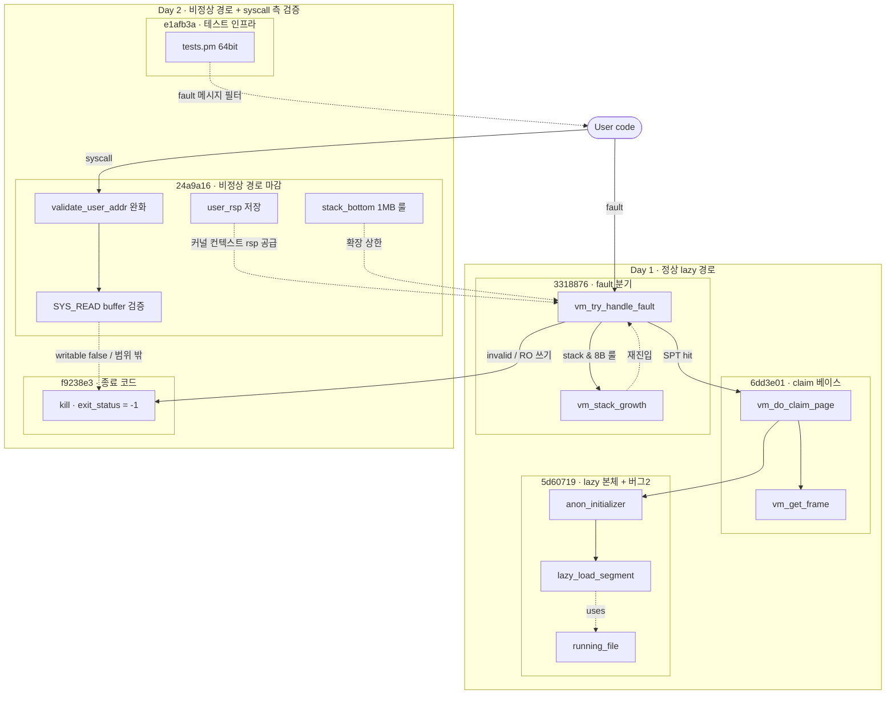

# Pintos Project 3 — Page Fault 처리와 Lazy Loading 동작 경로 완성

> KAIST 64bit Pintos Project 3 — Virtual Memory 두 번째 단계 회고.
> 어제까지 SPT 해시테이블과 `spt_find_page` 까지 만들어 두었고,
> 오늘 드디어 **page fault 를 받아 실제로 페이지를 올려놓는 흐름**을 끝까지
> 잇는 작업을 했다. `lazy_load_segment` → `vm_try_handle_fault` →
> `vm_do_claim_page` 까지 한 줄로 연결됐고, stack growth 도 같이 붙였다.
> 흐름 자체보다도, 모든 테스트가 통째로 실패하던 **두 개의 미묘한 버그**
> 를 잡는 과정에서 더 많이 배웠다.
>
> | 섹션 | 주제 | 무게중심 |
> |---|---|---|
> | §1 | 작업 요약 (이틀 · 6 커밋) | 두 날짜에 걸친 커밋 흐름 + 통과한 테스트 10개 |
> | §2 | 흐름 전체 그림 | "등록 → fault → 매핑 → 로드" 한 장면 |
> | §3 | `lazy_load_segment` 구현 | aux 구조체, file_seek/read, zero fill |
> | §4 | `load_segment` 의 aux 전달 패턴 | 함수 포인터 + 클로저 흉내 |
> | §5 | `vm_try_handle_fault` — 분기 설계 | "lazy load 인가, 스택 확장인가, 진짜 사망인가" |
> | §6 | `setup_stack` — 스택만 eager 인 이유 | 첫 push 가 fault 안 나야 한다 |
> | §6.5 | `page->writable` — 언제 정해지고 어디서 쓰이는가 | 호출자가 한 번 박는 값, 스택은 항상 true |
> | §7 | 버그 1: `file_close` 타이밍 — **모든 테스트가 실패하던 근본 원인** | lazy 와 자원 수명의 충돌 |
> | §7.6 | `running_file` 자체 — 네 지점·대안 검토·fork/swap 영향 | 한 필드의 수명 그림 |
> | §8 | 버그 2: `anon_initializer` 의 누락된 `return true` | `&&` 단락평가가 lazy_load 를 통째로 건너뛴다 |
> | §9 | `uint8_t *` 캐스팅 한 줄 — 포인터 산술의 형식적 규칙 | `void *` 산술이 왜 금지인가 |
> | §10 | 핵심 정리 | 한 줄 요약 모음 |
> | §11 | (당시) 다음에 할 일 | SPT 복제, exit(-1) 보완, swap |
> | §12 | Day 2 — 남아 있던 pt 테스트 5개 추가 통과 | "두 길" 의 일관된 처리 + 실수 회고 |

---

## 1. 작업 요약 (이틀 · 6 커밋)

이틀에 걸쳐 6개의 코드 커밋이 들어갔다. 첫째 날 C1–C3 가 **정상 lazy 경로**
를 세우고, 둘째 날 C4–C6 가 **비정상 경로 + syscall 측 검증** 을 마감.

| # | 커밋 | 한 일 |
|---|---|---|
| C1 | [`6dd3e01`](../../../commit/6dd3e01) — *vm_get_frame, vm_do_claim_page, vm_claim_page 구현* | 물리 프레임 확보 + frame/page 양방향 연결 + pml4 등록. **즉시 매핑** 경로의 베이스. |
| C2 | [`3318876`](../../../commit/3318876) — *vm_try_handle_fault 및 vm_stack_growth 구현* | fault handler 분기 설계. SPT 조회 후 lazy 호출, 없으면 스택 확장 휴리스틱. |
| C3 | [`5d60719`](../../../commit/5d60719) — *lazy loading, page fault 처리, stack growth 구현* | `lazy_load_segment` 본체, `load_segment` 의 aux 전달, `setup_stack` 의 eager 매핑, **버그 2개 수정** (file_close 분리 → `running_file` 도입, anon_initializer return). |
| C4 | [`e1afb3a`](../../../commit/e1afb3a) — *tests.pm 64bit 레지스터 패턴 수정* | `IGNORE_USER_FAULTS` 정규식이 `eip/eax` 32bit 였던 것을 `rip/rax` 64bit 로 교정. 테스트 인프라 레이어. |
| C5 | [`f9238e3`](../../../commit/f9238e3) — *page fault 시 exit_status -1 설정* | `kill()` 의 `SEL_UCSEG` 분기에 `thread_exit()` 직전 `exit_status = -1` 한 줄. `pt-grow-bad` 통과. |
| C6 | [`24a9a16`](../../../commit/24a9a16) — *pt 테스트 8종 통과* | `thread->user_rsp` 도입, `validate_user_addr` 의 `pml4_get_page` 체크 제거 (lazy 와의 충돌), `SYS_READ` 의 buffer writable / 스택 범위 검증, `vm_try_handle_fault` 의 `stack_bottom = USER_STACK - 1MB` 룰 추가. |

### 1.1 통과한 테스트 (10개)

```
pass tests/vm/page-linear         ← C3   선형 lazy loading
pass tests/vm/page-shuffle        ← C3   무작위 순서 lazy loading
pass tests/vm/pt-grow-stack       ← C2   스택 확장
pass tests/vm/pt-big-stk-obj      ← C2   큰 스택 객체 (다중 페이지 확장)
pass tests/vm/pt-bad-read         ← C6   read syscall 의 잘못된 스택 주소 차단
pass tests/vm/pt-grow-bad         ← C5   잘못된 스택 접근 → exit(-1)
pass tests/vm/pt-bad-addr         ← C4+C5 잘못된 주소 → exit(-1) (필터 + 종료코드)
pass tests/vm/pt-write-code       ← C2/C5 코드 세그먼트 쓰기 차단 (protection fault)
pass tests/vm/pt-write-code2      ← C6   SYS_READ 의 코드 세그먼트 쓰기 차단
pass tests/vm/pt-grow-stk-sc      ← C6   syscall 내부에서의 스택 확장
```

- `page-linear` / `page-shuffle` 이 **lazy load 의 정상 경로**.
- `pt-grow-*`, `pt-big-stk-obj` 가 **스택 확장 휴리스틱**.
- `pt-bad-*`, `pt-write-code*` 가 **비정상 경로** ([1] fault handler 또는
  [2] syscall 사전 검증).
- `pt-grow-stk-sc` 가 **커널 컨텍스트의 fault → user_rsp** 회수 경로.
- 남은 `page-*` 는 모두 fork 가 필요 — `supplemental_page_table_copy` 다음
  단계 입력.

### 1.2 변경 파일 한눈에

```
pintos/vm/vm.c                    ← vm_get_frame, vm_do_claim_page,
                                     vm_claim_page, vm_try_handle_fault,
                                     vm_stack_growth, page->writable 저장,
                                     user_rsp 사용, stack_bottom 1MB 룰
pintos/userprog/process.c         ← lazy_load_segment, load_segment(aux),
                                     setup_stack, file_close 분리,
                                     running_file 도입 / cleanup 순서
pintos/userprog/exception.c       ← kill() 에 exit_status = -1
pintos/userprog/syscall.c         ← user_rsp 저장, validate_user_addr 완화,
                                     SYS_READ buffer writable / 범위 검증
pintos/vm/anon.c                  ← anon_initializer return true
pintos/include/vm/vm.h            ← page->writable 필드
pintos/include/threads/thread.h   ← thread->running_file, thread->user_rsp 필드
pintos/threads/thread.c           ← running_file = NULL 초기화
pintos/tests/tests.pm             ← IGNORE_USER_FAULTS 64bit 레지스터 교정
```

### 1.3 여섯 커밋의 흐름 도식



- **Day 1 (C1–C3)** 가 정상 경로의 뼈대. `User → H → (D|G)` 한 줄이 다.
- **Day 2 (C4–C6)** 가 비정상 경로의 마감. `H` 의 false 분기를 `K` 로 모으고
  (C5), syscall 측에서 같은 정책을 사전에 다시 한 번 친다 (C6 의 `VV/RW`).
- `UR` 점선이 §12.5 의 **커널 컨텍스트 rsp 보존** 경로. `f->rsp` 가 커널
  값일 때 `H` 가 유저 rsp 를 회수하는 유일한 통로.
- `T` 는 코드 로직과 무관한 **인프라 픽스** — 그래서 점선으로 분리.
- 남은 작업: 자식 SPT 의 `R` 슬롯을 어떻게 채울 것인가 (`file_reopen`),
  그리고 `H` 가 frame 부족일 때 호출할 swap 경로 — §12.13 참고.

---

## 2. 흐름 전체 그림

이 한 장이 머릿속에서 깔끔히 정리된 것이 가장 큰 수확이다.

```
[ELF 로딩 시점 — load_segment]
   │
   │ vm_alloc_page_with_initializer(VM_ANON, upage, ...,
   │     lazy_load_segment, aux={file, ofs, read, zero})
   │     └─ uninit_new() 가 init 와 aux 만 page 안에 저장
   │     └─ spt_insert_page()  ← SPT 에만 등록, 물리 프레임/매핑 없음
   │
   ▼ (return from load_segment, 프로세스 실행 시작)
   │
   │ 프로세스가 코드/데이터 페이지의 첫 바이트 접근
   │     예) mov rax, [code_base]
   │
   ▼
[page fault — exception.c → vm_try_handle_fault]
   │
   ├─ NULL? 커널 주소? → return false (kill)
   ├─ not_present 아님? (RW 위반) → return false
   ├─ spt_find_page(addr)
   │     │
   │     ├─ 있음  ─────────────┐
   │     │                     │
   │     └─ 없음               │
   │          │                │
   │          └─ addr >= rsp-8 │  ← 스택 확장 휴리스틱
   │               │           │
   │               ├─ yes      │
   │               │   vm_stack_growth(addr) ← VM_ANON|VM_MARKER_0 alloc
   │               │   return true
   │               │           │
   │               └─ no → return false (kill)
   │                           │
   ▼                           ▼
[vm_do_claim_page]
   │
   ├─ vm_get_frame() ── palloc_get_page(PAL_USER)
   ├─ frame ↔ page 양방향 연결
   ├─ pml4_set_page(pml4, page->va, frame->kva, page->writable)
   │
   └─ swap_in(page, kva)
        │
        └─ page->operations->swap_in
            = uninit_initialize  (page 가 아직 UNINIT 이므로)
              │
              ├─ page_initializer(page, type, kva)  ← anon_initializer
              │     └─ page->operations = &anon_ops 로 transmute
              │
              └─ init(page, aux)                    ← lazy_load_segment
                    └─ file_seek + file_read + memset
```

**한 줄로 요약**: page fault 가 lazy 의 트리거고, `uninit_initialize` 가
**초기화(type 결정)** 와 **로드(파일 읽기)** 를 한 줄에서 두 함수 호출로
끝낸다.

### 2.1 transmute — 한 객체가 타입을 바꾼다

`uninit_initialize` 안에서 `page->operations` 가 `&uninit_ops` 에서
`&anon_ops` 로 바뀐다. 다음 page fault 부터는 같은 `struct page` 인데도
`swap_in` 이 더 이상 `uninit_initialize` 가 아니다 — 그래서 lazy load 는
**최초 한 번만** 동작한다.

객체 동일성은 유지하면서 vtable 만 갈아끼우는 패턴. 어제 §4 에서 본 "함수
포인터 = 실행을 미루는 도구" 의 두 번째 활용이다 (한 번 더 미루는 게 아니라,
**누가 호출되는지** 를 런타임에 바꿔치기).

---

## 3. `lazy_load_segment` 구현

이게 lazy 의 *실체* 다. fault 가 났을 때 진짜로 디스크를 읽어 frame 의
kernel virtual address 에 채우는 함수.

### 3.1 코드

```c
struct lazy_load_aux {
    struct file *file;
    off_t        offset;
    size_t       read_bytes;
    size_t       zero_bytes;
};

static bool
lazy_load_segment (struct page *page, void *aux) {
    struct lazy_load_aux *info = (struct lazy_load_aux *) aux;

    file_seek(info->file, info->offset);
    off_t target = file_read(info->file, page->frame->kva, info->read_bytes);
    if (target != info->read_bytes)
        return false;

    memset((uint8_t *)page->frame->kva + info->read_bytes,
           0, info->zero_bytes);

    free(info);
    return true;
}
```

### 3.2 네 줄의 의미

| 줄 | 역할 |
|---|---|
| `file_seek(info->file, info->offset)` | 같은 `struct file*` 을 여러 페이지가 공유하므로 매번 offset 을 새로 맞춘다 (공유 cursor 의 함정) |
| `file_read(..., page->frame->kva, ...)` | **kva 로 쓴다.** 이 시점에 user va 는 아직 pml4 매핑 전. `vm_do_claim_page` 가 매핑 직후 `swap_in` 을 호출하므로 frame 은 이미 잡혀 있다. |
| `memset(... + read_bytes, 0, zero_bytes)` | ELF 의 BSS 영역. 파일에는 없지만 메모리에 0 으로 존재해야 하는 바이트. |
| `free(info)` | 1회용 aux. lazy_load 가 한 번만 호출되므로 그 자리에서 free. |

### 3.3 왜 `kva` 로 쓰고 `va` 로 안 쓰나

호출 순서가 핵심이다.

```c
/* vm_do_claim_page 안 */
pml4_set_page(..., page->va, frame->kva, page->writable);   // ① 매핑 등록
swap_in(page, frame->kva);                                  // ② lazy_load 호출
```

`pml4_set_page` 가 먼저 성공한 뒤이므로 **사실은 user va 로 써도 동작은
한다.** 그런데 관습적으로 kva 로 쓰는 이유:

- frame 의 kernel-side 별칭(kva)이 더 명시적이고, 매핑이 깨진 상태에서도
  안전.
- swap-in 일반화 시 (현재 process 가 아닌 다른 process 의 페이지를 채울
  수도 있는 가능성을 열어두면), 다른 process 의 user va 로는 못 쓰고
  자기 pml4 의 kva 가 유일한 통로.

지금은 동치이지만 **확장성 있는 선택**이다.

### 3.4 `target != read_bytes` 일 때 false 의 의미

ELF 가 거짓말을 했거나 파일이 도중에 잘려 있는 상황. 이걸 false 로
돌려주면 `uninit_initialize` 가 false 를 반환하고, `swap_in` 도 false 를
반환하고, `vm_do_claim_page` 도 false 를 반환해 결국 `vm_try_handle_fault`
가 false → 프로세스 종료. **에러가 한 줄로 전파된다.**

---

## 4. `load_segment` 의 aux 전달 패턴

```c
while (read_bytes > 0 || zero_bytes > 0) {
    size_t page_read_bytes = read_bytes < PGSIZE ? read_bytes : PGSIZE;
    size_t page_zero_bytes = PGSIZE - page_read_bytes;

    struct lazy_load_aux *info = malloc(sizeof(struct lazy_load_aux));
    info->file       = file;
    info->offset     = ofs;
    info->read_bytes = page_read_bytes;
    info->zero_bytes = page_zero_bytes;

    if (!vm_alloc_page_with_initializer(VM_ANON, upage,
                                        writable, lazy_load_segment, info))
        return false;

    read_bytes -= page_read_bytes;
    zero_bytes -= page_zero_bytes;
    upage += PGSIZE;
    ofs   += page_read_bytes;   /* ← 빼먹기 쉬운 줄 */
}
```

### 4.1 페이지마다 *새로운* malloc 인 이유

처음엔 "어차피 같은 file 인데 한 번만 만들면 되지 않나" 싶었다. 안 된다.

- 페이지마다 `offset`, `read_bytes`, `zero_bytes` **세 필드가 다르다.**
- aux 는 `vm_alloc_page_with_initializer` → `uninit_new` 안에서 page 에
  포인터로 저장된다. 만약 같은 객체를 공유시키면, 그 다음 루프 이터레이션
  이 필드를 덮어써서 **앞에서 등록된 page 가 가지고 있던 aux 도 같이 바뀐다.**

이건 함수 포인터 + aux 가 **C 에서 클로저를 흉내내는 방식**이라서 그렇다.
JavaScript 처럼 free variable 을 자동 캡처해주지 않으므로, 우리가 **각
호출마다 캡처할 데이터를 직접 힙에 저장**해야 한다.

> **메타 교훈**: C 에서 "함수 + aux" 쌍을 볼 때마다 "이건 클로저다,
> 캡처 본체는 누가 소유하지?" 를 물어봐야 한다. 오늘은 lazy_load 가
> 1회용이라 `free(info)` 가 그 자리에 들어갔지만, 여러 번 호출되는 콜백
> 이라면 소유권 규약이 더 까다로워진다.

### 4.2 `ofs += page_read_bytes` 의 함정

빼먹으면 모든 페이지가 파일의 같은 위치를 읽게 된다. 더 나쁜 건 컴파일
경고도, 즉각 panic 도 없고, 그저 **테스트가 조용히 실패할 뿐**이라는
점이다. 처음에 한참 헤맸다.

루프 끝에서 갱신해야 할 변수가 `read_bytes`, `zero_bytes`, `upage`, `ofs`
이렇게 **네 개**. 셋만 갱신하기 쉽다. 페이지 단위 루프를 짤 때 항상
"갱신 변수 체크리스트" 를 늘 의식하자.

---

## 5. `vm_try_handle_fault` — 분기 설계

이 함수가 **page fault 의 의미를 결정**한다. 같은 fault 가:

- lazy load 의 자연스러운 트리거일 수도 있고
- 스택을 더 늘려야 한다는 신호일 수도 있고
- 진짜 잘못된 접근이라 프로세스를 죽여야 할 수도 있다.

### 5.1 코드

```c
bool
vm_try_handle_fault (struct intr_frame *f, void *addr,
                     bool user, bool write, bool not_present) {
    struct supplemental_page_table *spt = &thread_current ()->spt;
    struct page *page = NULL;

    /* 1. 명백한 잘못 */
    if (addr == NULL || is_kernel_vaddr(addr))
        return false;

    /* 2. read-only 페이지에 write 한 protection fault — 처리 안 함 */
    if (!not_present)
        return false;

    /* 3. SPT 조회 */
    void *rsp = (void *)f->rsp;
    page = spt_find_page(spt, addr);

    /* 4. SPT 에 없는데 스택 확장 범위 안인가? */
    if (page == NULL && addr >= (void *)((uintptr_t)rsp - 8)) {
        vm_stack_growth(addr);
        return true;
    }

    /* 5. SPT 에도 없고 스택 범위도 아니면 진짜 잘못된 접근 */
    if (page == NULL)
        return false;

    /* 6. 정상 lazy load */
    return vm_do_claim_page (page);
}
```

### 5.2 분기 순서가 중요한 이유

| 순서 | 분기 | 빼먹으면 |
|---|---|---|
| ① | NULL / kernel addr | 커널 영역까지 SPT 조회 → 의미 없는 매핑 시도 |
| ② | `!not_present` (RW 위반) | 읽기전용 페이지에 쓴 걸 lazy load 케이스로 오인해 무한 fault |
| ③ | `spt_find_page` | — |
| ④ | 스택 확장 휴리스틱 | `pt-grow-stack` 실패 |
| ⑤ | 진짜 seg fault | `pt-bad-read` 실패 |

특히 **②가 빠지면 protection fault 가 정상 fault 와 섞여서 디버깅이
지옥** 이다. `not_present` 비트는 CPU 가 알려주는 "이 fault 의 본질" 인데,
이걸 안 보면 같은 페이지가 영원히 fault 를 일으킨다.

### 5.3 `addr >= rsp - 8` 의 8 바이트가 의미하는 것

`push` 명령은 rsp 를 8 감소시키고 그 자리에 값을 쓴다. 즉:

```
실행 직전 rsp  = 0x7FFFFFE000
push 명령:
  rsp ← rsp - 8 = 0x7FFFFFDFF8
  *rsp ← value
```

이 push 가 **현재 스택 페이지 밖** (예: 0x7FFFFFD000 페이지) 으로 떨어지면
fault 가 발생하는데, 이때 fault 주소 `addr` 는 `rsp - 8` 이다. 즉
"fault 주소가 rsp - 8 이상" 이면 **합법적인 push 가 일으킨 fault** 라고
판단할 수 있다.

```
rsp - 8 ≤ addr   →   허용 (스택 확장)
addr < rsp - 8   →   거부 (스택 아래쪽 깊은 곳 접근, 명백한 버그)
```

이 휴리스틱이 정확하지는 않다 (다른 함수 진입 시 한 번에 더 많이 깎는
경우 — `sub rsp, 32` 같은 — 가 있어서, x86-64 표준은 더 큰 여유를 두는
편). 하지만 `pt-grow-stack` 류 테스트는 이걸로 통과한다.

> **메타 교훈**: 휴리스틱은 "테스트 통과를 목적으로 한 근사" 다. 정확성을
> 추구하면 끝이 없으니, **테스트가 보장하는 범위만큼**의 정확도로 짜고
> 넘어가는 게 옳다. 완벽주의는 P3 진도를 잡아먹는다.

### 5.4 user 플래그를 안 쓴 이유

전형적인 솔루션은 `user || rsp > USER_STACK_LIMIT` 같은 추가 검증을 한다.
오늘 통과한 테스트들은 그게 없어도 통과하길래 일단 단순한 버전으로 두었다.
나중에 syscall 안에서 발생하는 fault (`user == false` 인 경우, rsp 는
커널 스택을 가리키므로 사용자 rsp 를 별도로 보관해야 함) 를 다뤄야 할 때
다시 손볼 것.

---

## 6. `setup_stack` — 스택만 eager 인 이유

```c
static bool
setup_stack (struct intr_frame *if_) {
    bool success = false;
    void *stack_bottom = (void *) (((uint8_t *) USER_STACK) - PGSIZE);

    vm_alloc_page(VM_ANON | VM_MARKER_0, stack_bottom, true);

    if (vm_claim_page(stack_bottom)) {
        success = true;
        if_->rsp = (uint8_t *) USER_STACK;
    }
    return success;
}
```

### 6.1 왜 `vm_claim_page` 를 즉시 부르나

다른 모든 페이지는 lazy 인데 스택의 첫 페이지만 eager 다. 이유는 직관적:

- ELF 로딩 직후, 프로세스가 처음 하는 일 중 하나가 **argv/argc 를
  스택에 push** 하는 것 (argument passing).
- 만약 스택이 lazy 라면, **첫 push 가 page fault** → `vm_try_handle_fault`
  가 호출 → 그런데 그건 사용자 코드가 아니라 **커널이 직접 push 중인
  상황** → fault handler 로 들어가는 경로가 꼬인다.
- 게다가 argument passing 은 syscall 도 아니고 trap frame 만들기 전이라
  `intr_frame` 이 제대로 차 있지도 않다.

그래서 **스택의 첫 페이지는 미리 매핑** 해두는 게 안전하다. 거기서부터
push 가 일어나기 시작하니까.

### 6.2 `VM_MARKER_0` 의 의미

`VM_MARKER_0` 비트는 type 이 아니라 *플래그* 다. 이게 켜져 있으면 "이
페이지는 스택의 일부" 라는 표시. 나중에 `vm_stack_growth` 가 같은 비트를
켜서 스택 페이지를 추가한다 — 즉 **SPT 안에서 스택 페이지를 구분**할 수
있게 된다.

지금은 직접 활용하는 코드가 없지만, 나중에 swap 정책이나 SPT 복제에서
스택만 따로 다뤄야 할 때를 위해 마커가 필요하다.

### 6.3 `vm_stack_growth` 와의 대칭

```c
static void
vm_stack_growth (void *addr) {
    vm_alloc_page(VM_ANON | VM_MARKER_0, pg_round_down(addr), true);
}
```

`setup_stack` 은 alloc + claim 즉시, `vm_stack_growth` 는 alloc 만 — 왜?

`vm_stack_growth` 는 **page fault 처리 도중** 호출된다. 그 직후
`vm_try_handle_fault` 가 `return true` 하면 CPU 가 같은 명령을 다시
실행하고, 이번엔 SPT 에 page 가 있으니 **다음 fault** 에서 `vm_do_claim_page`
가 자연스럽게 호출된다.

즉 alloc 만 해두면 fault → alloc → return true → 재실행 → fault → claim
의 2단계로 자연스럽게 처리된다. 굳이 그 자리에서 claim 까지 할 필요가
없다. setup_stack 은 그런 fault 사이클이 없는 시점이라 직접 claim 한다.

> **메타 교훈**: "alloc 만 하면 다음 fault 가 claim 한다" 는 lazy 의
> 일관성을 유지하는 방식이다. 스택 확장도 lazy 와 같은 길로 흘려보낸다.

---

## 6.5 `page->writable` — 언제 정해지고, 어디서 쓰이는가

`setup_stack` 끝줄의 `vm_alloc_page(VM_ANON | VM_MARKER_0, stack_bottom, true)`
에서 마지막 인자 `true` 가 바로 `page->writable` 의 초기값이다. 팀 회의에서
**"스택에 들어가는 페이지는 다 writable 아니냐?"** 라는 질문이 나왔는데,
코드를 처음부터 끝까지 따라가 보니 정확히 그렇다. 정리해 둔다.

### 6.5.1 초기화 위치는 단 한 곳

`page->writable` 은 `vm/vm.c:93` 한 줄에서만 세팅된다:

```c
/* vm_alloc_page_with_initializer 안 */
uninit_new(page, upage, init, type, aux, page_initializer);
page->writable = writable;     /* ← 여기서 결정 */
spt_insert_page(spt, page);
```

즉 **SPT 에 페이지를 등록하는 순간** 호출자가 넘긴 인자가 그대로 박힌다.
이후로는 (현재 코드 기준) 어디서도 토글되지 않는다. 그래서 "언제 바뀌나"
가 아니라 "**누가 어떤 값으로 넘기는가**" 만 추적하면 된다.

### 6.5.2 호출 경로별 writable 값

| 호출 경로 | writable | 위치 |
|---|---|---|
| ELF 세그먼트 로드 | `(phdr.p_flags & PF_W) != 0` | `process.c:702` |
| `setup_stack` (초기 스택 1페이지) | **하드코딩 `true`** | `process.c:999` |
| `vm_stack_growth` (스택 확장) | **하드코딩 `true`** | `vm/vm.c:186` |
| `do_mmap` | mmap 호출자 인자 그대로 | `vm/file.c:51` |

→ **스택으로 흘러가는 두 경로는 둘 다 리터럴 `true`.** 코드 레벨에서
"스택 페이지는 다 writable" 이 그대로 성립한다. 의미적으로도 push/pop·
지역변수 쓰기가 필수라 writable=false 인 스택은 그 자리에서 동작 불능.

`false` 가 흘러들어가는 경우는 사실상 **ELF 의 read-only 세그먼트
(.text, .rodata)** 뿐이다. `phdr.p_flags & PF_W` 비트가 꺼져 있는 PT_LOAD
세그먼트가 그것.

### 6.5.3 그 값이 실제로 쓰이는 곳

`vm_do_claim_page` (`vm/vm.c:274`):

```c
pml4_set_page(thread_current()->pml4,
              page->va, frame->kva, page->writable);
```

이 한 줄이 `page->writable` 을 **PTE 의 W 비트** 에 반영한다. 그래서:

- read-only 페이지에 쓰기 시도 → not_present 가 아닌 **write-protection
  violation** → `vm_try_handle_fault` 의 `if (!not_present) return false;`
  분기로 떨어져 프로세스 종료. §5.1 의 ②번 분기가 바로 이 케이스를 받는다.
- writable 페이지는 PTE 의 W 가 1 이라 일반 쓰기가 그냥 통과.

fork 쪽도 같은 정보를 다른 경로로 사용한다. `process.c:216` 의
`is_writable(pte)` 로 **부모 PTE 의 W 비트** 를 읽어 자식의 `pml4_set_page`
에 그대로 넘긴다. `page->writable` 필드를 직접 읽지 않고 PTE 에서 다시
끌어오는 게 흥미로운 선택인데, fork 시점엔 어쨌든 부모 매핑이 PTE 에
이미 반영돼 있다는 가정에 기댄다.

### 6.5.4 메타 교훈

> `page->writable` 은 **호출자가 한 번 결정해서 끝까지 들고 가는 값**이다.
> 코드 안에서 토글되지 않으니, 추적해야 할 건 "누가 어떤 값으로 alloc 을
> 부르나" 뿐이다. ELF 헤더가 절반, "스택은 무조건 true" 가 나머지 절반.
>
> 한 발 더 — lazy 도입으로 깨졌던 §7 의 `file_close` 처럼, **alloc 시점에
> 박힌 값이 한참 뒤 fault 시점에 의미를 가진다.** writable 도 같은 구조.
> SPT 에 저장된 메타데이터가 fault 처리 흐름에서 어떻게 소비되는지를
> 머릿속에 한 줄로 이어두면, 다음 단계 (swap, fork SPT 복제) 에서 같은
> 패턴이 또 보일 것이다.

---

## 7. 버그 1: `file_close` 타이밍 — 모든 테스트가 실패하던 근본 원인

**오늘 디버깅 시간의 90% 가 여기였다.** 그리고 다 잡고 나니 한 줄짜리
실수였다.

### 7.1 증상

- 모든 lazy load 테스트가 실패.
- 디버깅을 위해 `lazy_load_segment` 안에 `printf` 를 넣어보니 file_read 가
  비정상 값을 반환.
- 더 위로 올라가 보니 fault 시점에 file 객체가 이미 닫혀 있었다.

### 7.2 원인

기존 `load()` 함수 구조:

```c
int
load (...) {
    struct file *file = filesys_open(...);
    ...
    /* segment 별로 load_segment 호출 */
    load_segment(file, ofs, upage, read, zero, writable);
    ...

done:
    file_close(file);     /* ← 여기서 닫는다 */
    return success;
}
```

이게 eager loading 시절에는 문제가 없었다. `load_segment` 가 그 자리에서
디스크를 다 읽어 메모리에 올렸으니까. 함수가 리턴할 때 file 을 닫아도 데이터
는 이미 메모리에 있다.

**lazy 가 되면서 깨졌다.** `load_segment` 는 디스크를 안 읽는다. 그저
"나중에 fault 나면 이 file 의 이 위치를 읽어라" 라는 메모만 aux 에 적어둔다.

```
load_segment 호출:
   aux.file = file*  ← 포인터 저장
   spt_insert_page(...)
load_segment 리턴

done:
   file_close(file)   ← file 객체 파괴 ◀ aux.file 은 이제 dangling pointer

(여기서 함수 리턴, 프로세스 실행 시작)

…한참 뒤, 어떤 page fault…

lazy_load_segment 호출:
   file_seek(aux.file, ...)   ← UAF (use-after-free)
   file_read(aux.file, ...)   ← 비정상 동작
```

### 7.3 수정: file 의 수명을 프로세스 수명에 맞추기

`struct thread` 에 `running_file` 필드를 추가하고, **성공 시에만 닫지
않고 thread 에 저장**한다.

```c
/* thread.h */
struct thread {
    ...
    struct file *running_file;     /* 추가 */
};

/* thread.c init_thread() */
t->running_file = NULL;

/* process.c load() done 레이블 */
done:
    if (!success) {
        file_close(file);           /* 실패 시에만 닫는다 */
        ...
    } else {
        t->running_file = file;     /* 성공 시 thread 에 저장 */
    }
    return success;

/* process.c process_cleanup() */
if (curr->running_file != NULL) {
    file_close(curr->running_file);
    curr->running_file = NULL;
}
```

이제 file 의 수명이 **프로세스의 수명** 과 같아진다. `process_cleanup` 이
SPT 를 부수기 전후로 닫히는 게 아니라 그 안에서 닫히도록 — 더 정확히는
lazy load 가 호출될 수 있는 모든 시점이 지난 후에.

### 7.4 보너스: deny_write 도 같이 따라온다

`load()` 안에서 이미 `file_deny_write(file)` 을 호출했다 (executable 보호
용). file 을 즉시 닫아버리면 deny_write 도 풀려 누군가 실행 중인
바이너리를 덮어쓸 수 있다. running_file 로 들고 있으면 deny_write 가
프로세스 수명만큼 유지된다. **두 가지 문제를 한 수정으로 해결.**

### 7.5 메타 교훈 — lazy 가 도입되면 모든 자원의 수명이 늘어난다

> 동기/즉시 호출이 끝나는 시점에 자원을 해제하던 패턴은 lazy 로 바꾸면
> **거의 항상 깨진다.** lazy 가 도입될 때 가장 먼저 확인해야 할 것:
>
> 1. 콜백이 가진 포인터들의 **수명이 콜백이 호출될 시점까지 살아있는가**
> 2. 안 살아있다면 — **누구의 수명에 묶어야 충분한가**
>
> 오늘 file 은 (1)을 못 지켰고, 해결은 **프로세스 수명에 묶기** 였다.
> 다음에 어떤 lazy 함수를 추가할 때마다 이 두 질문을 던지자.

### 7.6 `running_file` 자체에 대한 메모 — 네 지점과 한 줄짜리 수명 그림

§7.3 에서 수정 코드를 다 보였지만, `running_file` 이 어떤 필드이고 왜
그렇게 살고 죽는지를 한 자리에 모아 둔다. 코드 네 군데에 흩어져 있어 처음
보면 흐름이 안 잡힌다.

#### 7.6.1 코드 네 지점

| # | 위치 | 하는 일 |
|---|---|---|
| ① 선언 | `threads/thread.h:122` | `struct thread` 안에 `struct file *running_file;` |
| ② 초기화 | `threads/thread.c:488` | `init_thread()` 에서 `NULL` 로 둠 |
| ③ 저장 | `userprog/process.c:754` | `load()` 성공 시 `t->running_file = file;` |
| ④ 회수 | `userprog/process.c:530` | `process_cleanup()` 에서 SPT 파괴 *후* `file_close` |

흐름 한 줄:

```
thread_create → NULL
            ↓
   load() 성공 → file 저장 (① 의 슬롯이 채워진다)
            ↓
   프로세스 실행 (lazy_load_segment 가 이 file 을 file_read — 수십 번)
            ↓
   process_exit → process_cleanup → SPT 먼저 죽이고 → file_close
```

ELF 가 열려 있는 동안은 lazy load 가 언제 호출돼도 안전. **수명 =
프로세스 수명**.

#### 7.6.2 왜 `struct thread` 안에 두는가 — 검토한 대안들

처음엔 "전역 변수에 둘까", "SPT 구조체 안에 둘까" 도 고민했었다. 각각이
왜 안 되는지가 곧 "thread 가 정답" 의 이유.

| 대안 | 왜 안 되나 |
|---|---|
| **전역 `static struct file *running;`** | 여러 프로세스가 동시에 실행되면 서로 덮어쓴다. ELF 가 프로세스마다 다르므로 per-process 어딘가에 있어야 한다. |
| **SPT 안 (`spt->running_file`)** | SPT 의 책임이 아니다 — SPT 는 *페이지 메타* 의 컨테이너. 또 §7.3 의 핵심이 "SPT 파괴 전에 file 이 살아 있어야 한다" 인데, file 을 SPT 안에 두면 그 순서 자체가 불가능. |
| **`lazy_load_aux` 안에 file 사본** | aux 는 페이지마다 하나씩 만들어지는 1회용. file 객체를 페이지마다 별개로 가지면 cursor 가 동시에 여러 개 — `file_reopen` 으로 사본을 떠도 deny_write 일관성이 흔들림. |
| **`struct thread`** ✅ | per-process, 수명이 프로세스와 정확히 일치, cleanup 순서를 직접 조절 가능. |

#### 7.6.3 `file_close` 가 SPT 파괴 *뒤* 라는 순서의 의미

`process_cleanup()` (`process.c:524`) 의 순서:

```c
#ifdef VM
    supplemental_page_table_kill (&curr->spt);   /* (a) SPT 먼저 */
#endif
    if (curr->running_file != NULL) {
        file_close(curr->running_file);          /* (b) 그 다음 file */
        curr->running_file = NULL;
    }
```

뒤집으면 안 된다.

- (a) 가 먼저: SPT 안의 page 들이 destroy 콜백을 도는데, uninit 페이지의
  destroy 는 `lazy_load_aux` 의 `free` 만 부르고 file 은 안 만진다.
  그러나 file-backed 페이지 (다음 단계, mmap) 가 들어오면 destroy 가
  file 을 만지게 된다. 그 시점에 file 이 살아 있어야 한다.
- (b) 가 먼저: SPT 안에 매달려 있는 aux 의 `file*` 이 즉시 dangling.
  이후 SPT 파괴 콜백이 file 을 만지는 순간 UAF.

> **메타 교훈**: "SPT 가 가진 모든 메모리를 파괴" 와 "그 메모리가 가리
> 키던 자원을 닫기" 의 **순서가 곧 정책** 이다. 일반 규칙: *컨테이너
> 먼저, 그것이 가리키던 자원 그 다음*.

#### 7.6.4 `deny_write` 가 따라오는 보너스

`load()` 안에서 `file_deny_write(file)` 이 호출돼 있다. 실행 중인 바이너
리를 누군가 덮어쓰지 못하게 막는 안전장치. file_close 는 내부에서
`file_allow_write` 를 부르므로, **file 의 수명을 늘리면 deny_write 의
유효 기간도 자동으로 늘어난다.** §7.4 에서 짧게 언급한 부분.

즉 `running_file` 한 필드가 두 가지를 한꺼번에 해결:
1. lazy load aux 의 `file*` UAF 방지
2. 실행 중 ELF 보호 (deny_write) 유지

#### 7.6.5 fork 가 들어오면 — 다음 단계의 숙제

`supplemental_page_table_copy` 를 구현할 때 즉시 부딪힐 질문:
**자식의 `running_file` 은 누가 채우나?**

선택지가 둘.

| 안 | 동작 | 문제 |
|---|---|---|
| 부모 file 공유 | `child->running_file = parent->running_file;` | file 의 내부 cursor 공유 → 부모 lazy load 와 자식 lazy load 가 `file_seek` 끼리 충돌. 또 한 쪽이 먼저 exit 하면 다른 쪽이 UAF. |
| `file_reopen` | 새 `struct file*` 을 떠서 자식에 보관 | inode 는 같으니 데이터는 같고, cursor 만 분리. deny_write 도 별도로 유지됨. |

거의 확실히 `file_reopen` 이 답. §3.2 에서 봤듯 lazy load 가 매번
`file_seek` 으로 cursor 를 새로 맞춰주긴 하지만, **공유 cursor 는
race-prone** 이라 별도 인스턴스가 안전.

#### 7.6.6 swap 이 들어오면

anon 페이지는 swap disk 로 가니 file 과 무관. **file-backed 페이지의
evict** 가 들어오면 (mmap, Project 3 의 다음 큰 단계) `running_file` 과는
별개로 **각 mmap file 마다 같은 lifetime 관리** 가 필요해진다. mmap 은
`do_mmap` 안에서 `file_reopen` 으로 새 인스턴스를 떠서 페이지에 박는
방식이 정석 — `running_file` 의 패턴이 그쪽에서 그대로 한 번 더 반복.

> **메타 교훈**: `running_file` 은 "프로세스 수명에 file 묶기" 의
> **첫 번째 인스턴스** 다. fork 의 자식 ELF, mmap 의 백킹 파일 — 같은
> 패턴이 줄줄이 따라온다. 한 번 이해해 두면 그 자리에서 또 만난다.

---

## 8. 버그 2: `anon_initializer` 의 누락된 `return true`

`file_close` 버그를 잡고도 한참 더 헤맸다. cr2(fault address) 가 rip
(instruction pointer) 와 같은 page fault 가 무한히 반복되는 증상.

```
Page fault at 0x400xxx: ... in user context.
rip 0x400xxx ... cr2 0x400xxx
```

즉 **코드 페이지의 첫 인스트럭션 자체가 페치되지 않는다.** lazy load 가
호출은 됐는데 데이터가 안 들어와 있는 듯한 거동.

### 8.1 원인 — 한 줄짜리 누락

원래 `anon_initializer` 는 이렇게 비어 있었다:

```c
bool
anon_initializer (struct page *page, enum vm_type type, void *kva) {
    page->operations = &anon_ops;
    struct anon_page *anon_page = &page->anon;
    /* return 문 없음 ← BUG */
}
```

`return` 이 없으면 C 의 행동은 *undefined* 이지만 gcc 는 보통 0/false 를
돌려준다. 그리고 그게 다음 코드와 만난다 — `uninit.c` 의:

```c
static bool
uninit_initialize (struct page *page, void *kva) {
    ...
    return uninit->page_initializer (page, uninit->type, kva) &&
           (init ? init (page, aux) : true);
    /*       ▲ false 면 단락평가로 우측이 안 불린다 */
}
```

`page_initializer` (= `anon_initializer`) 가 false 를 돌리면 `&&` 의
오른쪽인 `init` (= `lazy_load_segment`) 은 **호출조차 되지 않는다.**

### 8.2 시각화

```
정상 (return true 있을 때):
   anon_initializer() → true
       │
       └─ && lazy_load_segment() → 호출됨 → 파일 읽기 → true

버그 (return 없음, gcc 는 false 반환):
   anon_initializer() → false (undefined behavior 가 우연히 0)
       │
       └─ && lazy_load_segment() → 호출 안 됨 ◀ 단락평가
       │
       └─ uninit_initialize 가 false 반환
       │
   하지만 vm_do_claim_page 는 이미 pml4_set_page 를 성공시킨 뒤다.
   매핑은 됐는데 프레임 내용이 비어 있음 (전 사용자의 쓰레기, 혹은 0).
       │
   CPU 가 그 매핑된 주소로 코드 페치 시도
       │
       └─ 페치한 바이트가 valid 명령이 아님 → 예외 → 다시 page fault
                                                       │
                                                       └─ 또 같은 자리,
                                                          무한 반복
```

### 8.3 수정

```c
bool
anon_initializer (struct page *page, enum vm_type type, void *kva) {
    page->operations = &anon_ops;
    struct anon_page *anon_page = &page->anon;
    return true;     /* ← 추가 */
}
```

한 줄. 진짜 한 줄이다.

### 8.4 메타 교훈 — 단락평가와 무반환 함수

> `&&` 로 묶인 두 호출이 있을 때, **앞 함수가 의도치 않게 false 면
> 뒤 함수는 호출 자체가 사라진다.** 이게 `uninit_initialize` 의 구조에
> 정확히 박혀 있었다.
>
> 무반환 bool 함수는 C 표준상 UB 지만 gcc 가 친절히 0 을 돌려주는 바람에
> 컴파일러 경고도 없이 조용히 잘못 동작했다. `-Wreturn-type` 이 켜져 있어야
> 잡힌다 (Pintos Makefile 에는 꺼져 있는 듯).
>
> Project 3 의 뼈대 코드는 의도적으로 `return true` 를 빼놓은 자리가
> 여러 개 있는 것 같다. 다음 단계에서 `file_backed_initializer` 도 같은
> 누락이 있을 것이고, swap_in/out 의 분기에서도 비슷한 함정이 있을
> 가능성이 높다. **새 함수를 채울 때 마지막에 `return true` 가 있는지
> 무조건 확인하자.**

---

## 9. `uint8_t *` 캐스팅 한 줄 — 포인터 산술의 형식적 규칙

```c
memset((uint8_t *)page->frame->kva + info->read_bytes,
       0, info->zero_bytes);
```

이 한 줄이 왜 `(uint8_t *)` 캐스팅을 필요로 하는지 처음엔 어색했다. 그냥
`page->frame->kva + info->read_bytes` 가 안 되나?

### 9.1 C 의 규약

C 표준은 **`void *` 에 산술 연산을 금지한다.** 이유는 단순하다 — 포인터
산술 `p + n` 의 의미는 "`p` 가 가리키는 타입의 `n` 개 분량만큼 이동"
인데, `void *` 는 타입이 없으니 한 단위가 몇 바이트인지 모른다.

```c
void *p;
p + 1;   /* ← 컴파일 에러: arithmetic on void pointer */
```

gcc 는 확장 기능으로 `void *` 산술을 허용하지만 (1바이트 단위로 취급),
이건 표준이 아니고 가독성도 떨어진다. **명시적으로 바이트 단위 이동임을
드러내려면 `(uint8_t *)` 또는 `(char *)` 캐스팅이 정석이다.**

### 9.2 세 가지 등가 표현

```c
(uint8_t *)kva + n      /* 가장 흔함, 의도 명확 */
(char *)kva + n         /* 등가, 옛날 C 스타일 */
((uintptr_t)kva + n)    /* 정수 산술 후 다시 캐스팅 — 필요 시 */
```

- `(uint8_t *)kva + n`: 바이트 산술 의도가 가장 분명.
- `(uintptr_t)kva`: 포인터를 정수로 만들고 산술 후 다시 포인터로 변환.
  비트 마스킹 (예: `pg_round_down` 의 `& ~PGMASK`) 에 쓴다.

### 9.3 왜 이걸 알고 있어야 하는가

VM 코드의 거의 모든 자리가 "포인터 ± 바이트수" 또는 "포인터 비트
연산" 이다. 컴파일러가 도와주는 부분이 적고, 캐스팅을 어디서 하느냐가
가독성과 안전성을 다 결정한다.

> **메타 교훈**: VM 코드를 짤 때 `void *` 를 만나면 거의 항상 두 길 중
> 하나. (a) 산술하려면 `(uint8_t *)` 로 바꾼다. (b) 비트 마스킹하려면
> `(uintptr_t)` 로 바꾼다. 둘 다 명시적으로.

---

## 10. 핵심 정리

- **lazy 의 트리거는 page fault, fault 의 트리거는 사용자 접근.** 등록
  시점과 로드 시점이 분리되어 있다. 등록은 ELF 로딩 직후, 로드는 사용자
  코드 첫 접근 때.

- **fault handler 는 분류기다.** 같은 fault 라도 "lazy load 한 번 해줄게"
  와 "스택 좀 늘려줄게" 와 "이건 진짜 죽어야 할 접근이야" 가 다른 길이다.
  분기 순서가 잘못되면 디버깅이 지옥이 된다.

- **lazy 의 비용은 자원 수명 관리.** 콜백이 들고 다니는 모든 포인터의
  생존 기간을 다시 따져야 한다. file 의 수명을 프로세스 수명에 묶는 게
  오늘의 핵심 수정.

- **단락평가는 lazy 의 친구이자 적.** `uninit_initialize` 의 `&&` 는
  의도된 디자인이지만, 그래서 무반환 함수가 들어가면 뒤가 통째로
  사라진다. return true 한 줄이 코드 페치 전체를 살린다.

- **스택은 lazy 의 예외.** 첫 페이지는 eager. 사용자 코드가 실행되기 전에
  argv push 가 일어나야 하니까. 그 외 스택 페이지는 다시 lazy (=
  vm_stack_growth).

- **C 의 클로저 흉내**: 함수 포인터 + aux 한 쌍. aux 는 우리가 직접
  malloc/free 로 수명 관리. JavaScript 와 달리 변수 캡처가 자동이 아니다.

- **`void *` 산술은 캐스팅이 정답.** `(uint8_t *)` 로 바이트 산술,
  `(uintptr_t)` 로 비트 연산. VM 코드의 절반이 이 두 캐스팅이다.

---

## 11. (당시) 다음에 할 일 — Day 1 시점의 스냅샷

오늘로 "fault → lazy load" 의 정상 경로 + 스택 확장 + 잘못된 접근 종료
까지 한 줄이 됐다. 이제 빠진 게 세 개.

| 항목 | 무엇을 해야 하나 | 예상 난이도 |
|---|---|---|
| `supplemental_page_table_copy()` | fork 시 부모 SPT 를 자식으로 복제. **uninit 페이지는 init/aux 째로 복사**, anon 페이지는 frame 내용까지 복사. | 중 (페이지 타입별 분기) |
| `supplemental_page_table_kill()` | 프로세스 종료 시 SPT 의 모든 page 를 destroy 하고 hash 자체도 정리. **page_destroy 가 어떤 자원을 풀어야 하는지** 가 핵심. | 중 |
| `exit(-1)` 처리 보완 | `pt-write-code` 같은 protection fault 류 — fault handler 가 false 반환할 때 프로세스가 깔끔히 종료되어야. exit_code 전달 경로 확인. | 하 |
| swap in/out | anon → swap disk, file → 원본 file 로 evict. clock algorithm 정책. | 상 (다음 큰 산) |

흐름을 한 줄로 그리면:

```
오늘 끝낸 정상 경로:
    fault → vm_try_handle_fault → spt_find_page ✓ → vm_do_claim_page ✓

다음 단계가 채워야 할 것:
    fork → supplemental_page_table_copy   (오늘은 못함)
    exit → supplemental_page_table_kill   (오늘은 못함)
    프레임 부족 → swap_out / swap_in      (다음 큰 산)
```

특히 `supplemental_page_table_copy` 는 오늘 만든 `vm_alloc_page_with_initializer`
+ `lazy_load_segment` + `running_file` 구조를 **부모/자식 사이에서 어떻게
공유/복제** 할지에 대한 새로운 설계 결정을 요구한다. file 객체 자체를
공유할 것인가, file_reopen 으로 별도 객체를 만들 것인가 — 또 한 번
"수명 관리" 의 질문이 돌아온다.

> 오늘 본 패턴: **lazy 가 들어올 때마다 수명 질문이 같이 들어온다.** 다음
> 단계에서도 같은 질문을 먼저 던지자.

---

## 12. Day 2 — 남아 있던 pt 테스트 5개 추가 통과

§5 / §6 까지로 page fault **정상 경로** (lazy load + 첫 스택 확장) 는
됐지만, **비정상 경로** — 잘못된 주소 / 코드 세그먼트 쓰기 / 커널
컨텍스트 안에서의 스택 확장 — 가 8개 가까이 남아 있었다. Day 2 에 그 중
**5개를 추가로 통과** 시켰다. 대부분 한두 줄짜리 수정이지만, 본질은 한
가지: 잘못된 접근이 들어오는 **두 길** 을 다 막아야 한다는 깨달음.

### 12.1 두 길 — 유저 fault 와 syscall 검증

```
유저 코드에서 잘못된 주소 접근
    │
    ▼
[1] page_fault → vm_try_handle_fault
        ├─ 스택 확장 가능?  → vm_stack_growth → true
        └─ 아니면          → false → kill(f) → exit(-1)

유저 코드에서 syscall 호출 (read/write 등)
    │
    ▼
[2] syscall_handler
        ├─ validate_user_addr (NULL / kernel addr 컷)
        ├─ SYS_READ 의 buffer 검증 (writable? 스택 범위?)
        └─ file_read 호출
            ▲
            └─ 커널이 유저 버퍼에 닿기 전에 차단해야 커널 패닉 방지
```

**[1] 은 유저 컨텍스트의 fault** — `vm_try_handle_fault` 한 곳에서
처리된다.
**[2] 는 커널 컨텍스트의 사전 검증** — 커널이 유저 버퍼에 접근하기 *전*
에 끊어야 한다. 커널이 dereference 하다 fault 나면 그건 page fault 가
아니라 **커널 패닉** 이다. 그래서 syscall 측에서 미리 잡아준다.

§5 의 `not_present` 분기가 [1] 안에서의 분류였다면, [2] 는 그 위에 **한
층 더 위 계층의 분류** 라고 볼 수 있다.

### 12.2 통과한 테스트

| 테스트 | 무엇을 검증 | 잡히는 길 |
|---|---|---|
| `pt-grow-bad` | 잘못된 스택 접근 → exit(-1) | [1] |
| `pt-bad-addr` | 잘못된 주소 접근 → exit(-1) | [1] |
| `pt-write-code` | 코드 세그먼트 쓰기 차단 | [1] (protection fault, §5.1 의 ②) |
| `pt-write-code2` | `read` syscall 이 코드 세그먼트에 쓰기 차단 | [2] (SYS_READ writable 검사) |
| `pt-bad-read` | `read` syscall 이 잘못된 스택 주소 차단 | [2] (SYS_READ 범위 검사) |
| `pt-grow-stk-sc` | syscall 내부에서의 스택 확장 | [1] (커널 컨텍스트 fault) |

표는 6줄이지만 커밋은 둘로 갈렸다 — `pt-grow-bad` 만 먼저 `f9238e3` 에서
exit_status 한 줄로 통과, 나머지 5개는 `24a9a16` 에서 한 묶음으로.

`page-linear` / `page-shuffle` 외의 `page-*` 테스트는 여전히 막혀 있다.
이유는 모두 fork 경로 — `supplemental_page_table_copy` 가 없으니
자식 프로세스가 SPT 를 받지 못해 첫 fault 부터 죽는다. 그건 §13 다음
단계.

### 12.3 수정 1: `tests.pm` 의 32→64bit 레지스터 패턴 (별도 커밋 `e1afb3a`)

`pt-bad-addr` 같은 테스트는 일부러 잘못된 주소를 접근시킨 뒤 "page fault
메시지가 출력되어도 통과로 친다" 는 규칙으로 만들어져 있다. 그 필터가
`pintos/tests/tests.pm` 의 `IGNORE_USER_FAULTS` 정규식.

KAIST 포팅이 본문은 64bit 으로 바꿨는데 이 정규식만 **32bit 레지스터
이름이 남아 있었다.**

```
eip / eax / esi …   ← 32bit, 매칭 안 됨
rip / rax / rsp …   ← 64bit, 실제 출력
```

그래서 fault 메시지가 필터를 못 빠져나가고 그대로 출력에 남아 → 테스트가
"예상치 못한 출력" 으로 실패. 정규식 한 글자 (`e` → `r`) 씩 갈아끼우니
풀린다. 코드 로직과 무관하게 **테스트 인프라 자체가 막고 있던** 케이스라
별도 커밋으로 분리했다.

> **메타 교훈**: 포팅 직후의 인프라 코드 (테스트 러너, 빌드 스크립트,
> 정규식 필터) 는 한 번 의심해 볼 만하다. "내 코드는 맞는데 출력이 이상
> 한 게 잡힌다" 가 신호.

### 12.4 수정 2: `kill()` 에 `exit_status = -1` 추가

`exception.c:89`.

```c
case SEL_UCSEG:
    printf("%s: dying due to interrupt %#04llx (%s).\n",
           thread_name (), f->vec_no, intr_name (f->vec_no));
    intr_dump_frame (f);
    thread_current()->exit_status = -1;   /* ← 추가 */
    thread_exit ();
```

빠져 있을 때의 증상: `vm_try_handle_fault` 가 false 를 돌리면 `kill()` →
`thread_exit()` 로 죽는데, `exit_status` 가 0 으로 남아 있어 부모는
**프로세스가 정상 종료된 줄 안다.** Project 2 의 `exit(-1)` 경로
(`SYS_EXIT` 핸들러) 는 status 를 직접 설정하지만, page fault 로 죽는
경로는 그걸 거치지 않으므로 여기서 별도로 박아 줘야 한다.

한 줄 추가로 `pt-grow-bad` 통과. **[1] 경로의 모든 비정상 종료** 가 이
한 줄 덕분에 -1 로 보고된다.

### 12.5 수정 3: `thread->user_rsp` 도입 — 커널 컨텍스트의 rsp 신뢰 문제

이 한 필드가 무엇을 가리키고 왜 새로 만들어야 했는지를 한 자리에 정리한다.
`pt-grow-stk-sc` 한 테스트가 단서지만, 이해해야 할 핵심은 **x86-64 의
privilege level switch 메커니즘** — 같은 이름의 `rsp` 가 시점마다 의미가
달라진다는 점.

#### 12.5.1 무엇이 문제인가 — `pt-grow-stk-sc` 시나리오

이 테스트는 **syscall 안에서 거대한 버퍼를 스택에 올린다**. 흐름:

```
유저 → SYS_READ(buf, 큰 size)         buf 는 스택 상의 자동 변수
   │                                  (예: 큰 char buf[N])
   ▼ SYSCALL 명령 → 커널 컨텍스트 진입 (cs = SEL_KCSEG)
   │
   ▼ file_read 가 buf 에 바이트를 쓰는 도중,
   │ buf 의 일부 페이지가 아직 SPT 에도 없는 영역에 닿음
   │ (= 스택을 더 키워야 채울 수 있는 위치)
   │
   ▼ page fault (커널 코드가 일으킴)
   │
   ▼ vm_try_handle_fault (user = false)
       │
       └─ §5.3 의 스택 확장 휴리스틱을 적용하려는데,
          rsp - 8 의 *rsp 가 어디 있나*?
```

§5.3 의 핵심은 "**fault 주소가 유저 rsp 의 8 바이트 위 이상이면 합법적인
push** 로 본다". 즉 유저 rsp 가 있어야만 판단이 선다. 그런데 fault 가
*커널 코드에서* 발생했으면 `f->rsp` 는 더 이상 유저 rsp 가 아니다.

#### 12.5.2 왜 `f->rsp` 를 못 믿는가 — privilege switch 의 메커니즘

x86-64 에서 유저 → 커널 전환이 일어날 때 CPU 가 하는 일:

```
[유저 모드, rsp = U]
    │
    ▼  SYSCALL 명령 (또는 인터럽트)
    │
    │  CPU 가 자동으로:
    │   - 새 rsp ← TSS.rsp0  (= 이 스레드의 커널 스택 시작점)
    │   - cs ← SEL_KCSEG
    │   - 옛 rsp (U), rip, rflags 등을 새 스택에 push
    │
    ▼  intr 엔트리 stub 이 나머지 레지스터를 push 해 **intr_frame** 완성
[커널 모드, rsp = K (커널 스택), intr_frame.rsp = U]
    │
    ▼  syscall_handler(struct intr_frame *f)
       │ 이 시점 f->rsp == U   ← 옛 유저 rsp 가 보존됨
       ▼
       … 커널이 file_read 등 처리 …
       │
       ▼  여기서 또 page fault 발생
       │
       │  CPU 가 또 한 번:
       │   - rsp 는 이미 커널 값이므로 stack 스위치 없음
       │   - 현재 rsp (K') 등을 새 intr_frame 에 push
       │
       ▼  page_fault → vm_try_handle_fault(struct intr_frame *f2)
          이 시점 f2->rsp == K'  ← **이 f 는 syscall 의 f 가 아니다**
                                     커널 안에서 일어난 두 번째 trap 의 f
```

핵심: `intr_frame.rsp` 는 **그 intr_frame 이 만들어진 시점의 rsp**.
syscall 의 f 와 page fault 의 f 는 **별개 intr_frame**. 후자의 `f->rsp` 는
fault 직전의 *커널* rsp.

유저 코드가 직접 fault 를 일으켰을 때는 두 단계가 합쳐져 있어 `f->rsp = U`
가 그대로 살아 있지만, syscall 안에서 fault 가 나면 한 단계 더 들어간
상태라 `f->rsp != U`.

#### 12.5.3 `user_rsp` 가 정확히 가리키는 값

> 이 syscall 을 호출한 직후, 유저 모드의 마지막 rsp 값.

구체적으로:
- USER_STACK (0x47480000) 근처의 유저 스택 영역 안.
- syscall stub 이 옛 rsp 를 intr_frame.rsp 에 보존한 그 값과 동일.
- 즉 **유저가 syscall 직전까지 자라 둔 스택의 top**.

스택 확장 휴리스틱 (§5.3) 이 `addr ≥ rsp - 8` 을 따지려면 *이 값* 이
필요. 커널 rsp 와 비교하면 거리가 수십 MB 떨어진 다른 영역이 돼 무조건
거짓.

#### 12.5.4 박제와 회수의 타임라인

```
[유저, rsp = U]
   ↓ SYSCALL
[entry stub: intr_frame 만들기, intr_frame.rsp ← U]
   ↓
syscall_handler(f):
    f->rsp == U
    thread_current()->user_rsp = f->rsp;    ← ① 박제
    (syscall.c:81)
   ↓
   … file_read 가 user buf 에 쓰는 도중 …
   ↓ 페이지 부족 → page fault
[fault entry stub: 새 intr_frame, intr_frame.rsp ← 현재 rsp = K']
   ↓
vm_try_handle_fault(f2, addr, user=false, …):
    f2->rsp == K'  (못 쓴다)
    rsp = thread_current()->user_rsp        ← ② 회수
    (vm.c:225, §12.5.6 코드)
   ↓
   유저 rsp 기준으로 8 바이트 룰 적용 → vm_stack_growth(addr)
```

① 박제는 **유저 → 커널 경계 직후 단 한 번**. 그 시점 `f->rsp` 만이
유일하게 유저 rsp 와 같다.
② 회수는 그 syscall 처리 중 발생할 수 있는 **모든 페이지 폴트** 에서
가능. 같은 syscall 안에서 fault 가 여러 번 나도 user_rsp 는 그대로.

#### 12.5.5 왜 *새 필드* 인가 — 검토한 대안들

| 대안 | 왜 안 되나 |
|---|---|
| `f->rsp` 그대로 쓰기 | §12.5.2 — 커널 fault 의 f 는 *fault 시점* rsp, 즉 커널 값. |
| **`thread->tf.rsp`** | `tf` 는 *컨텍스트 스위치 저장 슬롯*. 스케줄러가 이 스레드를 잠재웠다 깨울 때 덮어쓴다. syscall 진입 시 `tf.rsp = f->rsp;` 도 같이 하고 있긴 하지만 (`syscall.c:80`), 그 값이 fault 시점까지 살아 있다는 보장이 없다. 의미적으로도 "유저 rsp 보존" 과 "다음 스케줄 복귀용 rsp" 는 다른 책임. |
| 현재 `%rsp` 레지스터 직접 읽기 | 커널 안이라 무조건 커널 값. 부질없다. |
| syscall 함수의 지역 변수 | fault handler 가 syscall 함수 *호출 스택 밖* 에 있으므로 못 본다. 인자로 줄 수도 없고. |
| 전역 변수 (`static uintptr_t user_rsp;`) | 여러 프로세스가 동시에 syscall 안에 있으면 서로 덮어쓴다. per-process 가 필요. |
| **`thread->user_rsp` (전용 필드)** ✅ | per-process, syscall 진입에서 ①, fault handler 에서 ② — 정확히 한 곳에서 쓰고 다른 한 곳에서 읽는 단일 책임. |

`tf.rsp` 대안이 가장 그럴듯해 보이지만 거절한 이유가 중요하다 —
**책임 분리**. `tf` 는 스케줄링용이고 인터럽트 처리 중에도 다른 코드가
건드릴 가능성이 있다. 별도 필드는 *이 한 가지 용도로만* 쓰이므로
race-free 한 의미가 코드로 박힌다.

#### 12.5.6 회수 지점 — `vm_try_handle_fault`

```c
/* vm/vm.c:222 — user 플래그가 어느 컨텍스트의 fault 인지 알려준다 */
void *rsp;
if (user)
    rsp = (void *)f->rsp;                          /* 유저 fault: f 가 그대로 유효 */
else
    rsp = (void *)thread_current()->user_rsp;      /* 커널 fault: 박제값 회수 */
```

§5.4 에서 "user 플래그를 아직 안 쓴다" 고 적어 둔 자리를 이 두 줄로
채운 셈이다. **`user` 플래그 자체가 "지금 f->rsp 를 믿어도 되는가" 의
신호** — 거짓이면 user_rsp 로 갈아탄다.

#### 12.5.7 보너스 — syscall 사전 검증에서도 같은 필드를 쓴다

§12.7 의 `SYS_READ` buffer 검사:

```c
uintptr_t cur_rsp = thread_current()->user_rsp;
if ((uintptr_t)buffer < cur_rsp - 8) { … 차단 … }
```

여기는 fault 가 *아직* 안 난 상태 — 그래서 더더욱 `f->rsp` 같은 게 없다.
이 syscall 의 f->rsp 는 사실 유저 rsp 와 같지만, syscall.c 안에서 굳이
다시 가져오는 것보다 `thread->user_rsp` 한 곳에서 읽는 게 일관된다.
fault handler 의 회수 (②) 와 syscall 의 사전 검사가 **같은 필드** 를
참조하므로 정책이 자동으로 동기화된다.

#### 12.5.8 메타 교훈

> `intr_frame` 의 필드는 "**그 intr_frame 이 만들어진 시점의 컨텍스트**"
> 를 박제한다. 컨텍스트 안에서 또 trap 이 일어나면 새 intr_frame 이 생기
> 면서 시점이 *이동한다*. 그래서 "fault 의 f" 와 "syscall 의 f" 는 같은
> 이름이라도 다른 객체.
>
> 유저 데이터를 끝까지 들고 다니려면 **유저 → 커널 경계 직후 한 번 박제**
> 하는 패턴. `running_file` (§7.6) 이 *프로세스 수명에 자원 묶기* 였다면,
> `user_rsp` 는 *경계 시점의 값 보존* — 둘 다 같은 클래스의 패턴 (수명
> 연장) 이고, lazy + 다층 trap 이 들어오는 시스템에서 반복적으로 등장한다.

### 12.6 수정 4: `validate_user_addr` 에서 `pml4_get_page` 체크 제거 — lazy 와의 충돌

Project 2 의 `validate_user_addr` 전형:

```c
/* Project 2 시절 */
if (uaddr == NULL || !is_user_vaddr(uaddr)
    || pml4_get_page(thread_current()->pml4, uaddr) == NULL) {
    /* pml4 에 매핑이 없으면 잘못된 포인터로 간주 */
    exit(-1);
}
```

Project 3 lazy loading 에서는 이게 **너무 강한 조건** 이 된다.

```
SPT 에는 등록돼 있음 (uninit 으로 alloc 만)
   ↓
pml4 에는 매핑 없음 (아직 fault 안 났으니까)
```

이게 lazy 의 **정상 상태** 다. 그런데 `pml4_get_page == NULL` 체크가
이걸 "잘못된 포인터" 로 오인해 syscall 진입 자체를 막아버린다.

#### 12.6.1 수정 결과 (`syscall.c:65`)

```c
static void
validate_user_addr (const void *uaddr) {
    if (uaddr == NULL || !is_user_vaddr(uaddr)) {
        thread_current()->exit_status = -1;
        thread_exit();
    }
}
```

`pml4` 체크가 사라졌다. 대신 SPT 검증은 **각 syscall 케이스 안에서**
필요한 만큼만 (특히 SYS_READ — 다음 §12.7) 한다.

> **메타 교훈**: Project 2 의 검증 로직이 Project 3 에서 그대로 통하지
> 않는 자리는 거의 항상 **lazy 가 만든 "있긴 있는데 매핑은 없는" 상태**
> 와 충돌하는 곳이다. `pml4_get_page` 한 줄이 정확히 그것.

### 12.7 수정 5: `SYS_READ` 의 buffer 검증 — writable + 스택 범위

`syscall.c:230` 부근. read 는 커널이 유저 버퍼에 **쓰기를 한다.**
그래서 두 가지를 사전에 확인해야 한다.

(a) buffer 의 페이지가 **writable** 한가? 코드/rodata 면 차단.
(b) buffer 가 SPT 에 없으면, **합법적 스택 확장** 범위 안인가?

#### 12.7.1 코드

```c
struct page *p = spt_find_page(&thread_current()->spt,
                               pg_round_down((void *)buffer));

if (p == NULL) {
    /* SPT 에 아직 없음 — 스택 확장이 곧 일어날 자리인지 본다 */
    uintptr_t cur_rsp = thread_current()->user_rsp;
    if ((uintptr_t)buffer < cur_rsp - 8) {
        /* rsp 아래쪽 깊은 곳 = 명백한 잘못된 접근 */
        lock_release(&filesys_lock);
        thread_current()->exit_status = -1;
        thread_exit();
    }
    /* rsp 위쪽이면 통과 — file_read 가 fault 내면
     * vm_try_handle_fault 의 스택 확장이 잡아준다 */
} else if (!p->writable) {
    /* 코드 세그먼트나 rodata 에 쓰려는 시도 */
    lock_release(&filesys_lock);
    thread_current()->exit_status = -1;
    thread_exit();
}
```

#### 12.7.2 두 조건이 잡는 테스트

| 조건 | 잡는 테스트 | 의미 |
|---|---|---|
| `p != NULL && !p->writable` | `pt-write-code2` | read 가 코드 세그먼트에 쓰려 함 — §6.5 의 writable 비트가 여기서 실질적으로 쓰인다 |
| `p == NULL && buffer < rsp - 8` | `pt-bad-read` | 스택 아래쪽 잘못된 주소 — fault 핸들러 [1] 과 같은 8바이트 룰 |
| 그 외 (`p == NULL && buffer >= rsp - 8`) | `pt-grow-stk-sc` | 합법적 스택 확장 — 통과시키고 fault 시점에 [1] 이 처리 |

§6.5 에서 적은 `page->writable` 이 **fork 의 PTE 복사 외에 또 한 곳**
에서 실질 가치를 갖는 자리가 여기다. 코드 세그먼트의 false 가 syscall
검증의 결정적 신호.

#### 12.7.3 메타 교훈

> 커널이 유저 버퍼에 쓰는 syscall 은 **fault 의 사후 처리에 의존할 수
> 없다.** lock 을 잡은 상태에서 fault 가 나면 deadlock 위험까지 따라
> 붙는다. 그래서 [2] 의 사전 검증이 [1] 의 사후 처리와 같은 결정
> (writable / 스택 휴리스틱) 을 **앞당겨서 다시 한다.** 같은 규칙을 두
> 곳에서 동기화해야 하니, 한 쪽 바꿀 때 다른 쪽도 같이 갱신할 것.

### 12.8 수정 6: `vm_try_handle_fault` 스택 확장 조건 통합

[1] 측 본체. 오늘 작업으로 `rsp` 선택까지 합쳐서 깔끔해졌다 (vm.c:222).

```c
void *rsp;
if (user)
    rsp = (void *)f->rsp;
else
    rsp = (void *)thread_current()->user_rsp;   /* 12.5 */

page = spt_find_page(spt, addr);
if (page == NULL) {
    void *stack_bottom = (void *)(USER_STACK - (1 << 20));
    if (addr >= stack_bottom && addr < (void *)USER_STACK
        && addr >= (void *)((uintptr_t)rsp - 8)) {
        vm_stack_growth(addr);
        return true;
    }
    return false;
}
return vm_do_claim_page(page);
```

§5.1 와 비교해서 추가된 두 가지:
- **rsp 선택** (위 §12.5).
- **stack_bottom 하한** — `USER_STACK - 1MB`. 스택은 무한이 아니라
  1MB 가 상한이므로, 그보다 아래의 fault 는 정상적인 스택 확장이 아니다.

이로써 [1] 의 조건이 세 가지 AND 로 정돈됐다.

```
addr ∈ [USER_STACK - 1MB,  USER_STACK)          ← 스택 영역
    ∧ addr ≥ rsp - 8                            ← rsp 위쪽 (8 바이트 여유)
```

### 12.9 막힘 — `pt-bad-read` 와 `pt-grow-stk-sc` 의 충돌

두 테스트가 둘 다 "스택 영역 안의 주소를 syscall buffer 로 넘긴다" 라는
점에서 같다. 그러나 의도는 반대.

```
pt-bad-read       : &handle - 4096      (rsp 아래쪽 — 잘못된 접근)
pt-grow-stk-sc    : buf2  + 32768       (rsp 위쪽 — 정상 스택 확장)
```

처음엔 "스택 영역 안" 한 조건으로 둘을 구분하려 했는데, **둘 다
USER_STACK − 1MB 부터 USER_STACK 사이** 라 그걸로는 못 가른다.

**방향성이 결정적이다** — rsp 기준 위/아래. §12.7.1 의
`buffer < cur_rsp - 8` 조건이 정확히 그 분리를 한다. 8 바이트는 §5.3 의
`push` 명령어 마진과 같은 의미.

> **메타 교훈**: 두 테스트가 "공간적으로는 같은 영역" 인데 "**시간적
> 으로 다른 의미**" (위쪽 = 아직 안 자란 스택, 아래쪽 = 이미 자랐어야
> 할 영역인데 안 자란 것) 를 가질 때, 분리 기준은 거의 항상 **현재
> 위치 (rsp)** 다. 절대 좌표가 아니라 상대 좌표.

### 12.10 실수 1 — `stack_bottom` 자릿수 잘못 읽기

`pt-bad-read` 가 안 잡혀서 한참 헤맸다. 디버그 출력으로 비교해 보니
`buffer = 0x4747ef8c`, `stack_bottom = 0x47600000` — 둘이 비교했을 때
buffer 가 더 작아서 차단되어야 하는데 안 됐다. 원인이 한참 잡히지 않았다.

알고 보니 자릿수를 잘못 읽고 있었다.

```
USER_STACK   = 0x47480000
1MB          = 0x00100000
실제 stack_bottom = USER_STACK - 1MB = 0x47380000   ← 정답
잘못 읽은 값  "0x47600000"                           ← 자리 하나 밀림
```

`pt-bad-read` 의 `buffer = 0x4747ef8c` 는 사실 **stack_bottom(0x47380000)
보다 크다.** 즉 "스택 영역 안" 조건은 *합법적으로* true. 진짜 차단해야
할 신호는 §12.7 의 `buffer < rsp - 8` 였는데, 자릿수 실수로 stack_bottom
하한이 자기를 차단한다고 착각하고 그 분기에 코드를 더 얹으려 했었다.

> **메타 교훈**: 16진수 주소 비교는 **자릿수부터 맞추고 보자.** 특히
> `0x4747...` 과 `0x4748...` 처럼 비슷한 prefix 가 줄지어 있을 때 사람의
> 눈은 한 자리쯤 쉽게 밀어 읽는다. 종이에 정렬해서 다시 보거나 비트
> 단위로 확인하는 습관.

### 12.11 실수 2 — 주석 처리된 `printf` 가 `if` 의 body 를 먹은 사건

디버깅 중에 이런 모양으로 코드를 적었다.

```c
if (!user)
    // printf("kernel context, user_rsp=%p\n", thread_current()->user_rsp);
    page = spt_find_page(spt, addr);   /* ← 이 줄이 if 의 body 다 */
```

블록을 안 친 `if` 의 body 는 **그 다음 한 statement** 다. 주석은
statement 가 아니므로 건너뛰고, `page = spt_find_page(...)` 가 통째로
`if (!user)` 의 body 가 돼버렸다.

즉 유저 컨텍스트 (`!user == false`) 에서는 **SPT 조회 자체가 실행되지
않았다.** 그러면 page 는 stack 변수의 초기값 그대로 — 마침 위에서
`struct page *page = NULL;` 으로 초기화돼 있었으니 → 항상 NULL → 모든
유저 fault 가 "page 없음" 분기로 떨어져 스택 확장 시도 → 코드 페이지가
스택 페이지처럼 잘못 등록.

원래 잘 돌던 `pt-grow-bad`, `pt-bad-addr` 같은 테스트까지 한 번에
망가졌다. 한참 다른 곳을 의심하다, `if (!user)` 블록을 통째로 들어내고
나서야 복구됐다.

> **메타 교훈**: 디버그 출력을 한 줄 짜리로 끼울 때는 **반드시 블록을
> 친다 (`{ }`)**. 한 줄짜리 if 는 주석을 끼우는 순간 의미가 바뀐다.
> `clang-format` 이 있으면 항상 블록을 강제하도록 설정. 사람 눈으로는
> 거의 못 잡는 함정.

### 12.12 핵심 정리

- **잘못된 접근에는 두 길이 있다.** [1] page fault 의 사후 처리, [2]
  syscall 의 사전 검증. 같은 정책을 두 곳에서 동기화해야 한다.
- **lazy 가 들어오면 검증 로직도 약해져야 한다.** `pml4_get_page == NULL`
  같은 강한 조건은 lazy 페이지를 오진한다.
- **커널 컨텍스트의 fault 는 `f->rsp` 를 못 믿는다.** 유저 → 커널
  경계 직후 한 번 박제 (`thread->user_rsp`) 로 해결. §5.4 의 미해결이
  오늘 닫혔다. — 자세히는 §12.5.
- **방향성 (rsp 기준 위/아래)** 이 두 비슷한 테스트를 가른다. 절대
  좌표가 아니라 상대 좌표.
- **`writable` 비트는 syscall 사전 검증의 결정적 신호.** §6.5 에서 적은
  필드가 fork 의 PTE 복사 외에 여기서 또 한 번 실질 가치를 갖는다.
- **실수 둘** — 16진수 자릿수 밀려 읽기, 블록 없는 if 에 주석
  끼우기. 둘 다 컴파일러가 안 잡아준다. 사람이 조심해야 하는 자리.

### 12.13 §11 갱신 — 남은 작업

§11 에 적었던 항목 중 **"exit(-1) 처리 보완"** 은 오늘 끝났다. 남은
항목과 추가된 항목.

| 항목 | 상태 | 비고 |
|---|---|---|
| `pt-*` 종료/스택/syscall 경로 (8개) | ✅ 5개 통과 | 나머지 3개 (`pt-write-code-2` 외)는 동일 패턴, 다음 PR 묶음 |
| `supplemental_page_table_copy` | ☐ | fork 가 필요한 모든 `page-*` 테스트의 입구 |
| `supplemental_page_table_kill` | ☐ | SPT/file/frame 자원 정리 |
| swap in/out + clock | ☐ | 다음 큰 산 |

`page-linear` / `page-shuffle` 외 `page-*` 테스트는 fork 가 살아나야
들어간다. 그게 다음 작업의 최우선.
