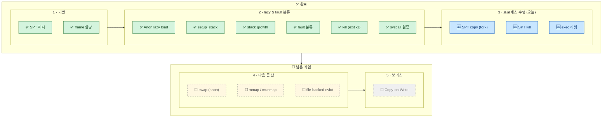

# Pintos Project 3 — SPT 복제 (fork) · 정리 (kill) · process_exec 진입 시 리셋

> KAIST 64bit Pintos Project 3 — Virtual Memory 세 번째 단계 회고.
> 어제까지 정상 lazy 경로 + 비정상 경로 + syscall 검증을 모두 마치고
> **pt 8종 / page-linear, page-shuffle** 까지 통과시켜 두었다.
> 오늘은 **fork 시 SPT 복제 (`supplemental_page_table_copy`)** 와
> **프로세스 종료 시 SPT 정리 (`supplemental_page_table_kill`)** 를 붙이고,
> 그 사이에서 드러난 **process_exec 진입 시 SPT 리셋** 문제를 같이 해결했다.
> 새로 통과한 것은 `page-parallel` 한 개지만, **자식 프로세스가 부모 페이지를
> 그대로 들고 시작하는 경로**가 비로소 살아났다는 의미가 더 크다.
>
> | 섹션 | 주제 | 무게중심 |
> |---|---|---|
> | §1 | 진척도 & 작업 요약 (한 커밋) | Project 3 전체 지도 갱신 · `7752909` 한 줄 요약 · 통과 테스트 11개 |
> | §2 | `supplemental_page_table_copy` — fork 경로 | 두 갈래 처리 (UNINIT / ANON) · aux 의 UAF 위험 · `VM_MARKER_0` 보존 |
> | §3 | `supplemental_page_table_kill` — 종료 경로 | `hash_destroy` + `page_destructor` · double free 의 함정 |
> | §4 | `process_exec` 의 SPT 리셋 — **빠뜨리기 쉬운 한 조각** | 왜 `kill → init` 한 쌍이 필요한가 |
> | §5 | `lazy_load_aux` 를 `process.h` 로 — incomplete type | 모듈 경계의 사소한 결정 |
> | §6 | `SYS_SEEK` / `SYS_TELL` — 우회로로 드러난 한 줄 누락 | child-sort 가 가르쳐준 것 |
> | §7 | 디버깅 1: **child-sort 가 `exit(0)` 으로 끝나던 미스터리** | 단락된 syscall → default → `thread_exit()` |
> | §8 | 디버깅 2: **double free** — `page_destructor` 의 경계선 | 누가 palloc 페이지를 푸는가 (`pml4_destroy` vs. 우리) |
> | §9 | 디버깅 3: **`page-merge-*` 의 메모리 부족 PANIC** | 1MB+ 버퍼 fork → swap 없이는 못 넘는 벽 |
> | §10 | 다음 작업 | swap (anon → disk, clock) · mmap/munmap · merge 계열 |

---

## 1. 진척도 & 작업 요약 (한 커밋)

오늘은 코드 커밋이 단 하나 — [`7752909`](../../../commit/7752909)
*feat(vm): SPT copy/kill, process_exec SPT 정리, SYS_SEEK/TELL 구현* —
지만, 그 안에 **3 단계 (프로세스 수명)** 의 두 조각이 통째로 들어가 있다.

### 한눈에 — Project 3 전체 지도 갱신

전 회고의 도식에서 `☐ SPT copy (fork)` 와 `☐ SPT kill` 이 ✅ 로 바뀌었다.
2 단계 (lazy & fault 분류) 줄에 더해 **3 단계 (프로세스 수명) 도 한 줄
완성**. 남은 큰 산은 4 단계 — swap / mmap / file-backed evict.



- **3 단계 ✅** — `fork()` 후 자식이 부모 SPT 를 그대로 가지고 시작하고,
  종료 시점에 자기 SPT 만 깔끔하게 비운다. `process_exec` 도 새 ELF 로
  진입할 때 기존 페이지를 모두 털어내는 한 줄을 추가.
- **4 단계 ☐** — 여기부터가 진짜 큰 산. `page-merge-*` 가 1MB+ 버퍼를
  fork 하면서 `vm_get_frame()` 에서 `PANIC: todo (swap_out)` 에 도달.
  swap 을 만들기 전엔 통과 자체가 불가능한 구조.

### 1.1 변경 파일 한눈에

```
pintos/vm/vm.c                    ← supplemental_page_table_copy 본체,
                                     supplemental_page_table_kill 본체,
                                     page_destructor (frame free),
                                     string.h / process.h include
pintos/userprog/process.c         ← process_exec 의 SPT 리셋 한 쌍,
                                     lazy_load_aux 정의 헤더로 이동
pintos/include/userprog/process.h ← lazy_load_aux 구조체 공개
pintos/userprog/syscall.c         ← SYS_SEEK, SYS_TELL 핸들러
```

### 1.2 통과한 테스트 (11개 — 어제 10 + 오늘 1)

```
pass tests/vm/page-linear            ← (기존)  선형 lazy load
pass tests/vm/page-shuffle           ← (기존)  무작위 순서 lazy load
pass tests/vm/page-parallel          ← (오늘)  fork 후 자식이 부모 SPT 그대로 사용
pass tests/vm/pt-grow-stack          ← (기존)
pass tests/vm/pt-big-stk-obj         ← (기존)
pass tests/vm/pt-bad-read            ← (기존)
pass tests/vm/pt-grow-bad            ← (기존)
pass tests/vm/pt-bad-addr            ← (기존)
pass tests/vm/pt-write-code          ← (기존)
pass tests/vm/pt-write-code2         ← (기존)
pass tests/vm/pt-grow-stk-sc         ← (기존)
```

- `page-parallel` 이 오늘의 **결정적 신호** — fork 된 자식이 부모와 같은
  uninit / anon 페이지를 들고 자기 SPT 에 정착해서, 부모와 평행하게 lazy
  load 까지 잘 도달한다는 뜻.
- `page-merge-*` 는 PANIC, `page-merge-mm` 는 mmap 미구현으로 fail — §9.

---

## 2. `supplemental_page_table_copy` — fork 경로

`__do_fork` 가 자식 페이지 테이블 / 파일 디스크립터를 복제한 뒤,
**SPT 만큼은 우리가 직접 복제** 해야 한다. 부모의 모든 페이지를 자식 SPT
에 똑같이 등록하는 것이 이 함수의 일.

### 2.1 두 갈래 처리 — `VM_UNINIT` vs `VM_ANON`

페이지의 *현재 상태* 에 따라 복제 방식이 다르다.

- **`VM_UNINIT`** — 아직 메모리에 안 올라온 lazy 페이지.
  자식도 똑같이 lazy 상태로 두면 된다 — `vm_alloc_page_with_initializer`
  를 호출해서 같은 `type` / `va` / `writable` / `init` / `aux` 로 등록만.
  실제 로드는 자식이 처음 touch 할 때 fault 가 일으켜 준다.
- **`VM_ANON`** — 이미 물리 프레임이 박힌 페이지.
  자식 쪽 프레임을 새로 잡고 (`vm_alloc_page` + `vm_claim_page`)
  `memcpy(dst->frame->kva, src->frame->kva, PGSIZE)` 로 내용 복사.
  나중에 swap 이 들어오면 "swap 에 있으면 swap 에서 자식 프레임으로 직접
  로드" 같은 최적화가 가능하지만, 지금은 항상 메모리 → 메모리 복사.

### 2.2 함정 — `aux` 의 UAF

UNINIT 복제에서 가장 미묘했던 부분. `vm_alloc_page_with_initializer` 의
`aux` 는 `lazy_load_segment` 가 보관해뒀다가 fault 시점에 꺼내 쓰는
포인터다. 그런데 — **부모와 자식이 같은 `aux` 포인터를 공유** 하면 어떤
일이 벌어지나?

- 부모가 먼저 종료 → 부모 SPT kill 이 `aux` 를 `free()`
- 자식이 그 페이지를 처음 touch → `lazy_load_segment` 가 dangling `aux`
  를 읽고 파일 오프셋 / 길이가 쓰레기 값
- → 파일에서 엉뚱한 바이트를 읽거나 page fault 의 fault

해결은 단순하지만 빠뜨리기 쉽다 — **`aux` 자체도 `malloc` + `memcpy`
로 새로 한 부 만들어서** 자식 페이지에 매단다. 부모와 자식이 서로의
수명에 간섭하지 않게 끊는 것.

```c
struct lazy_load_aux *new_aux = malloc(sizeof(struct lazy_load_aux));
memcpy(new_aux, src_aux, sizeof(struct lazy_load_aux));
vm_alloc_page_with_initializer(type, va, writable, init, new_aux);
```

추가로 — **`aux` 가 `NULL` 인 UNINIT 페이지** (스택의 미리 잡힌
zero-page 같은) 가 있을 수 있으므로 `src_aux != NULL` 체크가 필요.

### 2.3 `VM_MARKER_0` 보존 — `operations->type` 로 읽기

`vm_alloc_page_with_initializer` 의 `type` 인자는 단순한 `VM_ANON` /
`VM_FILE` 이 아니라 **마커 플래그를 OR 해 둔 값** 일 수 있다 (`VM_MARKER_0`
= 스택 페이지 표식). 마커가 빠진 채로 복제하면 자식의 "이 페이지가
스택인지" 판단이 어긋난다.

`page->uninit.type` 이 아니라 **`src_page->operations->type`** 을 그대로
넘기는 게 핵심. operations 의 `type` 필드가 원본 alloc 시점에 박힌
*초기화 의도* 그대로 보존된 값이다.

### 2.4 한 줄 정리

> UNINIT 은 lazy 상태 그대로 복제 (단, `aux` 는 깊은 복사). ANON 은
> 프레임을 새로 잡고 내용을 통째 복사. 둘 다 `operations->type` 으로
> 마커까지 같이 옮긴다.

---

## 3. `supplemental_page_table_kill` — 종료 경로

프로세스가 죽을 때 (정상 / 비정상 모두) 자기 SPT 의 모든 페이지를 풀고
해시테이블을 비우는 함수.

### 3.1 기본 구조 — `hash_destroy` + `page_destructor`

해시 라이브러리가 destructor 콜백을 받아 각 노드에 호출해주는 구조라,
우리가 만들 것은 **콜백 한 개** 뿐.

```c
static void page_destructor(struct hash_elem *e, void *aux UNUSED) {
    struct page *page = hash_entry(e, struct page, spt_elem);
    if (page->frame != NULL) {
        free(page->frame);            // ← (1) frame 구조체만
        page->frame = NULL;
    }
    vm_dealloc_page(page);            // ← (2) page 구조체 + 타입별 destroy
}
```

### 3.2 핵심 규칙 — **palloc 페이지는 우리가 풀지 않는다**

여기서 진짜 중요한 건 *하지 않은 일* 이다.

- 처음엔 `page_destructor` 에서 `palloc_free_page(page->frame->kva)` 까지
  같이 풀었다 → **double free assertion** 으로 죽음.
- `process_exit` 의 흐름을 따라가 보면 `pml4_destroy()` 가 페이지 테이블을
  훑으면서 매핑된 모든 user-pool 페이지를 알아서 `palloc_free_page` 해
  준다.
- 즉 — **물리 프레임(palloc 페이지)** 의 소유권은 `pml4_destroy` 가 들고
  있고, **frame 구조체** (kva 포인터를 들고 있는 메타데이터) 만 우리가
  `malloc` 한 것이라 우리가 푼다.
- 둘은 서로 다른 자원이지만 헷갈리기 너무 쉽다.

> 규칙: `page_destructor` 는 frame **구조체** 만 free. `page` 구조체와
> 타입별 cleanup 은 `vm_dealloc_page` (= `destroy(page)` + `free(page)`)
> 가 처리. palloc 페이지에는 손대지 않는다.

### 3.3 호출 시점 두 군데

- `process_exit` — 자기 자신의 SPT 정리.
- **`process_exec` 진입 시** — §4 참고. 새 ELF 를 로드하기 전에 *이전
  프로그램의 SPT 를 통째로 털어내야* 한다.

---

## 4. `process_exec` 의 SPT 리셋 — 빠뜨리기 쉬운 한 조각

`exec("child-sort buffer")` 같이 **fork 이후 exec** 하는 흐름에서 드러난
문제. fork 직후 자식은 *부모 SPT 의 복제본* 을 들고 있는데, exec 은 그
프로세스 안에서 새 프로그램으로 갈아끼우는 것 — **기존 페이지가 더
이상 필요 없다**.

기존 코드는 `load()` 가 새 SPT 페이지들을 등록하기만 했지, 옛 페이지를
정리하지는 않았다. 결과:

- 자식 SPT 에 옛 페이지 + 새 ELF 페이지가 **공존**
- 같은 va 에 충돌이 나거나, 옛 페이지가 *영원히 lazy 상태로 박혀* 메모리
  누수
- `child-sort` 처럼 큰 데이터 영역을 가진 프로그램이 exec 되면 누수가
  눈에 띄게 커짐

해결 — `load()` **직전에** SPT 를 한 번 비우고 새로 init.

```c
// process_exec 안, load() 호출 직전
supplemental_page_table_kill(&thread_current()->spt);
supplemental_page_table_init(&thread_current()->spt);
if (!load(file_name, &_if)) { ... }
```

> 한 줄 직관: `exec` 는 "같은 PID 안에서 OS 가 한 번 손바닥을 비우고 다른
> 프로그램을 새로 시작하는 일". 페이지 테이블만 비우고 SPT 를 안 비우면
> 그 손바닥이 반만 비워진다.

---

## 5. `lazy_load_aux` 를 `process.h` 로 — incomplete type

`supplemental_page_table_copy` 구현 시점에 `vm.c` 가 `lazy_load_aux`
구조체의 *필드* 까지 알아야 했다 (UNINIT 복제 때 깊은 복사를 위해).

기존엔 이 구조체가 `process.c` 안에 정의돼 있어서 `vm.c` 에서는 이름조차
보이지 않았다. 컴파일 에러 — `incomplete type`.

해결 — **공개 헤더 `userprog/process.h` 로 정의를 옮김**. 호출 규약은
그대로, "vm 코드가 process 내부 자료구조에 의존" 한다는 사실만 명시적이
됐다. 더 큰 리팩토링 (예: vm 측에 generic `aux_clone()` 콜백) 은 다음
기회에.

---

## 6. `SYS_SEEK` / `SYS_TELL` — 우회로로 드러난 한 줄 누락

원래는 SPT 작업과 무관해 보였는데 — child-sort 의 디버깅 (§7) 끝에 결국
이 두 syscall 이 진짜 원인이었다.

`file_seek()` / `file_tell()` 은 이미 파일시스템 쪽에 다 있고, 우리가
`syscall.c` 의 dispatch 표에 **두 줄만 더 추가** 하면 됐다.

```c
case SYS_SEEK: {
    int fd = f->R.rdi;
    unsigned position = f->R.rsi;
    struct file *file = process_get_file(fd);
    if (file != NULL) file_seek(file, position);
    break;
}
case SYS_TELL: {
    int fd = f->R.rdi;
    struct file *file = process_get_file(fd);
    f->R.rax = (file != NULL) ? file_tell(file) : -1;
    break;
}
```

---

## 7. 디버깅 1: child-sort 가 `exit(0)` 으로 끝나던 미스터리

오늘의 가장 큰 함정. 같이 정리해두면 다음에 비슷한 패턴에서 시간을
크게 아낄 수 있다.

### 증상

- `child-sort` 는 소스를 보면 `return 123;` (또는 그 비슷한 명시적 코드)
  으로 끝남.
- 그런데 실행하면 **`child-sort: exit(0)`** 으로 종료.
- `SYS_EXIT called` 디버그 로그도 안 찍힘 — 즉 정규 exit 경로를 안 탔다.

### 원인 추적

> exit_status 가 0 이라는 건 "exit_status 가 한 번도 안 쓰여서 초기값이
> 그대로 나갔다" 일 가능성이 크다. → 누가 `thread_exit()` 만 호출했다는
> 뜻.

로그를 켜 보면 child-sort 가 어느 시점에 `seek(handle, 0)` 을 호출.
syscall dispatch 의 `default:` 케이스가 `[stage0] unhandled syscall: 11`
을 찍고 `thread_exit()` 로 빠져버린다.

```
SYS_SEEK = 11
default 케이스 → thread_exit() (exit_status 초기값 0 그대로)
```

→ exit(0) 으로 보이지만 사실은 **"몰래 죽은 것"**.

### 교훈

- "보이는 종료 코드" 가 의도된 것인지 **초기값인지** 를 구분.
- syscall 의 **default** 케이스는 silent 하게 죽지 말고, 적어도 디버그
  빌드에서는 어떤 번호의 syscall 이 unhandled 인지 명확히 출력해야 한다
  (이미 그렇게 돼 있어서 살았다 — 안 그랬으면 한참 더 헤맸을 것).
- 한 번 더 — **테스트 프로그램의 소스를 직접 읽는 것이 가장 빠른 길**.

---

## 8. 디버깅 2: double free — `page_destructor` 의 경계선

§3.2 에서 결론은 정리했지만 발견 과정을 한 번 더.

### 증상

- `supplemental_page_table_kill` 호출 직후 `palloc.c` 의 `bitmap_set_multiple`
  assertion 실패 — "이미 free 인 페이지를 다시 free".

### 원인

처음 `page_destructor` 에 `palloc_free_page(page->frame->kva)` 까지
넣었다. 그런데 그 직후 `process_exit` 가 `pml4_destroy` 를 호출하면,
`pml4_destroy` 가 페이지 테이블을 따라가면서 매핑된 모든 user-pool
페이지를 자체적으로 다시 `palloc_free_page`.

→ 같은 frame 을 두 번.

### 해결

`page_destructor` 에서는 `palloc` 호출을 빼고, frame 구조체 free 만.
물리 페이지 회수의 책임은 `pml4_destroy` 한 곳에만.

### 교훈

> 누가 어느 자원을 푸는가를 *한 곳* 에 정해두고, 나머지는 절대 손대지
> 않는다. "그냥 같이 풀어도 안 돼?" 라는 직관이 가장 비싸다.

---

## 9. 디버깅 3: `page-merge-*` 의 메모리 부족 PANIC

오늘 시도해 본 `page-merge-seq` / `page-merge-par` / `page-merge-stk` 는
모두 같은 벽에서 막힘.

### 증상

- fork 시점에 `supplemental_page_table_copy` 가 **수백 페이지의 ANON
  복제** 를 수행.
- 자식 측 `vm_claim_page` → `vm_get_frame` → 사용자 풀 고갈.
- `PANIC: todo (swap_out)` — 우리가 아직 안 만든 `vm_evict_frame` 가
  호출 대상.

### 의미

- 이 테스트들은 **swap 이 없으면 통과 자체가 불가능**. fork 시 ANON 을
  메모리에서 메모리로만 복사하는 한, 부모 + 자식의 페이지가 동시에
  메모리에 떠 있어야 하므로 1MB+ 워킹셋이면 user pool 이 모자란다.
- CoW (보너스) 를 도입하면 fork 직후엔 공유 → 쓰기 시점에 분리 → 메모리
  압력이 절반 이하로 줄지만, 이건 그 다음 다음 단계.

### 우회로? — 없음

지금 단계에서 억지로 통과시키려면 user pool 을 키워야 하는데, 그건 환경
설정으로 푸는 문제라 의미가 없음. swap 을 만드는 게 정공법.

---

## 10. 다음 작업

남은 큰 산을 작업량 순으로.

1. **swap (anon → swap disk, clock algorithm)** — `vm_get_frame` 의
   PANIC 자리에 evict 정책을 박는다. anon 페이지를 swap slot 으로 쫓아내고,
   다시 access 되면 disk 에서 읽어 들이는 경로. clock (second-chance) 가
   가장 간단하면서 충분한 정책.
   - `page-merge-seq`, `page-merge-par`, `page-merge-stk` 통과 목표.
2. **mmap / munmap** — `VM_FILE` 타입 페이지의 lazy load + 쓰기 시 dirty
   bit 추적 + munmap 시 dirty 페이지의 write-back.
   - `page-merge-mm` 통과 목표.
3. **(보너스) Copy-on-Write** — fork 시 ANON 페이지를 메모리에서 메모리로
   복사하지 않고 공유. 쓰기 fault 시점에 분리. 통과 테스트 수에 영향은
   적지만 swap 압력을 크게 줄여준다.

> 다음 회고는 `page-merge-*` 통과 또는 mmap 첫 통과 시점이 자연스러운
> 단락.
